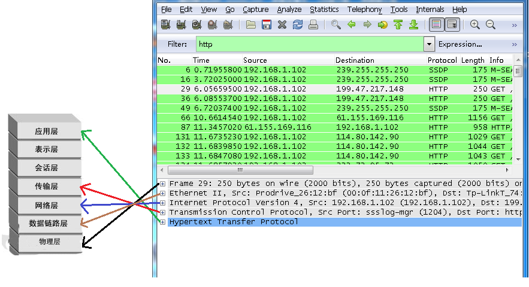
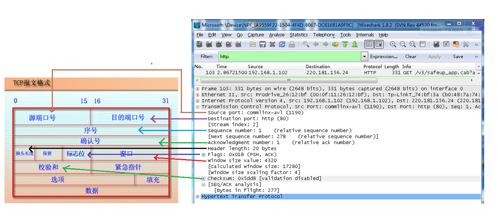

# WireShark使用

## 参考

- https://www.wireshark.org/

## 常见网络帧

- PPP帧 - PPP协议
- MAC帧 - CSMA/CD协议
- IP数据包 - IP协议
- ICMP报文 - ICMP协议
- RIP报文 - RIP协议
- UDP数据报 - UDP协议
- TCP报文 - TCP协议
- FTP
- HTTP
- SMTP

## 过滤器

- 捕捉过滤器
- 显示过滤器
- 捕捉过滤器规则
  - 1.协议过滤
    - 直接指定协议即可，eg:tcp,udp,http
  - 2.IP过滤
    - 指定源地址：ip.src==192.168.0.1
    - 指定目的地址：ip.dst==192.168.0.1
    - 方向,默认为 src or dst
    - eg："host 10.0.50.1" 等价于 "host src or dst 10.0.50.1"
  - 3.Http模式过滤
    - 只显示Http Get方法：http.request.method=="GET"
  - 4.逻辑运算符 NOT OR AND
    - 只显示TCP和UPD协议：TCP OR UDP
    - 限定源地址和目标地址：ip.src==192.168.0.1 AND ip.dst==192.168.0.1
- eg：
 - tcp dst port 3128  //捕捉目的TCP端口为3128的封包。
 - ip src host 10.1.1.1  //捕捉来源IP地址为10.1.1.1的封包。
 - host 10.1.2.3  //捕捉目的或来源IP地址为10.1.2.3的封包。
 - ether host e0-05-c5-44-b1-3c //捕捉目的或来源MAC地址为e0-05-c5-44-b1-3c的封包。如果你想抓本机与所有外网通讯的数据包时，可以将这里的mac地址换成路由的mac地址即可。
 - src portrange 2000-2500  //捕捉来源为UDP或TCP，并且端口号在2000至2500范围内的封包。
 - not imcp  //显示除了icmp以外的所有封包。（icmp通常被ping工具使用）
 - src host 10.7.2.12 and not dst net 10.200.0.0/16 
   - //显示来源IP地址为10.7.2.12，但目的地不是10.200.0.0/16的封包。
 - (src host 10.4.1.12 or src net 10.6.0.0/16) and tcp dst portrange 200-10000 and dst net 10.0.0.0/8  
   - //捕捉来源IP为10.4.1.12或者来源网络为10.6.0.0/16，目的地TCP端口号在 200至10000之间，并且目的位于网络 10.0.0.0/8内的所有封包。
 - src net 192.168.0.0/24
 - src net 192.168.0.0 mask 255.255.255.0  //捕捉源地址为192.168.0.0网络内的所有封包。

- 显示过滤器
- eg：
  - snmp || dns || icmp //显示SNMP或DNS或ICMP封包。
  - ip.addr == 10.1.1.1  //显示来源或目的IP地址为10.1.1.1的封包。
  - ip.src != 10.1.2.3 or ip.dst != 10.4.5.6  
    - //显示来源不为10.1.2.3或者目的不为10.4.5.6的封包。换句话说，显示的封包将会为：来源IP：除了10.1.2.3以外任意；目的IP：任意 以及来源IP：任意；目的IP：除了10.4.5.6以外任意
  - ip.src != 10.1.2.3 and ip.dst != 10.4.5.6  
    - //显示来源不为10.1.2.3并且目的IP不为10.4.5.6的封包。换句话说，显示的封包将会为：来源IP：除了10.1.2.3以外任意；同时须满足，目的IP：除了10.4.5.6以外任意
  - tcp.port == 25  //显示来源或目的TCP端口号为25的封包。
  - tcp.dstport == 25  //显示目的TCP端口号为25的封包。
  - tcp.flags  //显示包含TCP标志的封包。
  - tcp.flags.syn == 0×02  //显示包含TCP SYN标志的封包。

## 包解析

