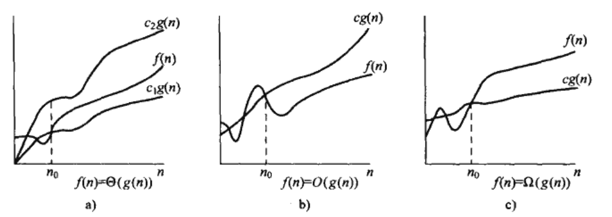

# 第一部分 基础知识

- 算法导论

## 第一章 算法在计算中的应用

- 什么是算法 algorithm
- 数据结构
- NP完全问题
- 作为一种技术的算法
  - 1.算法的效率计算与衡量

## 2 算法基础

- 伪代码约定
  - 1.缩进表示块结构
  - 2.循环结构：while，for,repeat-until;条件结构：if-else;
  - 3.注释：//
  - 4.数组访问：数组名[下标],从1开始

### 2.1 循环不变式loop invariant

- 循环不变式的三条性质：
  - 1.初始化：在第一次迭代前，是正确的；
  - 2.保持：若某次迭代前是正确的，则下次迭代前仍为正确；
  - 3.终止：循环终止时，不变式提供有用的性质，证明算法正确性；
- 类似于数学归纳法
  - 初始条件基本情况证明
  - 归纳步骤证明

```C
//插入排序算法
void InsertSort(int *a, int len)
{
    int i = 1;
    while (i < len)
    {
        int key = a[i];//取出要插入的Key
        int j = i - 1;
        while (j >= 0 && a[j] > key)//向前遍历和移动已排序队列
        {
            a[j + 1] = a[j];
            j--;
        }
        a[j + 1] = key;//插入已找到的位置i
        i++;
    }
}
```

- 插入排序的循环不变式证明
  - 初始化：第一次迭代开始前，A=A[1],结果成立
  - 保持：对于外层循环变量所有元素，针对每个元素key,在该key之前排好序的数组中找到合适的位置，然后插入该位置，结果正确
  - 终止：内层循环终止条件为遍历到第一个元素或者找到一个元素比Key小（即找到插入位置），外层循环终止条件为遍历到结束，输出数组为已排序的A[1..n]

### 2.3 算法的分析

- 假定模型：RAM
  - 假设每条代码的运行时间相同
- 运行时间分析:指定输入规模时，算法的运行时间 = 所有的代码运行时间总和
  - 最佳情况与最坏情况
- 时间复杂度：最坏情况运行时间

### 2.4 算法设计

- 增量方法：插入排序:$O(n^2)$；
- 分治法：归并排序:$O(n\log_2{n})$
  - 分治模式：
    - 分解Divide
    - 解决Conquer
    - 合并Combine

- 插入排序
  - 时间复杂度:$\Theta(n^2)$
- 归并排序算法
  - 时间复杂度:$\Theta(n\lg(n))$

```C
//p<=q<r
//合并子数组a[p,q],a[p+1,r]
//p<=q<r
//合并子数组a[p,q],a[p+1,r]
void Merge(int *a, int p, int q, int r)
{
    int k = 0;
    int *ret = (int *)malloc((r - p + 1) * sizeof(int));
    for (k = p; k <= r; k++)
    {
        ret[k - p] = a[k];
    }
    int i = 0;
    int j = q - p + 1;
    for (k = p; k < r + 1; k++)
    {
        if (i == q + 1 - p)
        {
            a[k] = ret[j];
            j++;
            continue;
        }
        if (j == r + 1 - p)
        {
            a[k] = ret[i];
            i++;
            continue;
        }
        if (ret[i] < ret[j])
        {
            a[k] = ret[i];
            i++;
        }
        else
        {
            a[k] = ret[j];
            j++;
        }
    }
    free(ret);
}
void MergeSort(int *a, int p, int r)
{
    if (p < r)
    {
        int q =(p + r) / 2;
        MergeSort(a, p, q);
        MergeSort(a, q + 1, r);
        Merge(a, p, q, r);
    }
}
void MergeSortIn(int *a, int len)
{
    MergeSort(a, 0, len - 1);
}
```

### 2.5 思考

- 在归并排序中对小数组采用插入排序
  - 对n/k个长度为k的子列表进行排序，然后采用标准的合并方式进行合并k为待定值
  - a.证明：在最坏情况下，n/k个子列表(每个子列表长度为k)可以采用插入排序在$\Theta(nk)$时间内完成
  > $$总时间 = \frac{n}{k} \cdot \Theta(k^2) =\Theta(nk) $$
  - b.证明：子列表可以在$\Theta(n\lg(n/k))$最坏情况时间内完成
  - c.若修改后的合并算法的最坏情况的运行时间为$\Theta(nk+n\lg(n/k))$,若使该算法与标准合并算具有一样的渐进时间，则k的最大近似值？
  > $$
  \begin{aligned}
  &\Theta(nk+n\lg(n/k)) = \Theta(n\lg(n))\\
  &nk +n\lg(n/k) = n \lg(n)\\
  &k +\lg(n) -\lg(k) = \lg(n)\\
  &k-\lg(k)=2\lg(n)\\
  &\lg(2^k)-\lg(k)=\lg(n^2)\\
  &\lg(\frac{2^k}{k})=\lg(n^2)\\
  &2^k/k=n^2\\
  \end{aligned}
  $$
  - d.实际取值问题？
- 冒泡排序算法的正确性
  - 冒泡排序的伪代码
  - 采用循环不变式证明冒泡排序的正确输出
  - 运行时间$\Theta(n^2)$
- 霍纳规则的正确性
  - 计算多项式的值$P(x) = \sum_{k=0}^n(a_kx^k) = a_0 + x(a_1+x(a_2+\cdots+x(a_{n-1}+xa_n)\cdots))$
  ```C
  int p_x(int* a,int len,int x){
    int y=0;
    int i=0;
    while(i < len){
      y = a[i]+x*y;
      i++;
    }
    return y;
  }
  ```
  - 运行时间：$\Theta(n)$
  - 写出朴素多项式求值算法，运行时间
  - 采用循环不变式证明
- 逆序对inversion
  - 定义：数组A[1...n]包含不同数组，若对于任意i < j时，存在A[i]>A[j],则(i,j)称为A中的一个逆序对
  - a.列出[2,3,8,6,1]中的5个逆序对
  - b.若数组取自集合{1,2,..n},则在降序时，逆序对最多数量为$n*(n-1)+(n-1)*(n-2)+...+2*1$
  - c.插入排序的运行时间与输入数组中逆序对数量之间的关系：
  - d.写出运行时间为nlgn求n个元素数组的逆序对数目的算法

## 3 函数的增长

- 简化算法分析的渐进分析

### 3.1 渐进记号



- $\Theta 记号$
  - $渐进紧确界：f(n) = \Theta(g(n))$
    - 舍弃低阶项，忽略最高项系数
  - $渐进上界：f(n) = \Omicron(g(n))$
  - $渐进下界：f(n) = \Omega(g(n))$
- 渐进紧缺界：
  - $f(n) = \Theta (g(n)) \{f(n):存在正常量c_0,c_1,存在n_0>0,当n>n_0时,有0 \leq c_0g(n) \leq f(n) \leq c_1g(n)\}$
- 渐进上界：
  - $f(n) = \Omicron (g(n)) \{f(n):存在正常量c,存在n_0>0,当n>n_0时,有0 \leq f(n) \leq cg(n)\}$
- 渐进下界：
  - $f(n) = \Omega (g(n)) \{f(n):存在正常量c,存在n_0>0,当n>n_0时,有0 \leq cg(n) \leq f(n)$
- `定理`:$对任意的两个函数f(n) g(n),若f(n)=\Theta (g(n)) ,当且仅当f(n) = \Omicron(g(n))且f(n) = \Omega (g(n))$
- 非渐进紧缺的上界：
  - $f(n) = o(g(n))\{f(n):对任意正常量c,存在n_0>0,当n>n_0时,有0 \leq f(n) \leq cg(n)\}$
- 非渐进紧缺的下界：
  - $f(n) = \omega(g(n))\{f(n):对任意正常量c,存在n_0>0,当n>n_0时,有0  \leq cg(n) \leq f(n) \}$
- 性质：
  - 传递性:
    - $f(n)=\Theta(g(n)) \qquad g(n)=\Theta(h(n)),则f(n)=\Theta(h(n))...$
  - 自反性:
    - $f(n)=\Theta(f(n)) \quad f(n)=\Omicron(f(n)) \quad f(n)=\Omega(f(n))$
  - 对称性:
    - $f(n)=\Theta(g(n)) \quad g(n)=\Theta(f(n))$
  - 转置对称性：
    - $f(n)=\Omicron(g(n)) \quad g(n)=\Omega(f(n))$
    - $f(n)=\omicron(g(n)) \quad g(n)=\omega(f(n))$

### 3.2 标准记号与常用函数

- 概念：单调性、向上取整、向下取整、模运算、多项式、指数、对数、阶乘、多重函数、斐波那契数列、黄金分割
  - 取模运算：$a mod n =  a - [a/n](向下取整)n \qquad a/n的余数$
  $$ 
  a>1: n^b = o(a^n) \\
  指数标记:e^x = 1 + x+ \frac{x^2}{2!}+ \cdots + \frac{x^n}{n!} = \sum_{i=0}^{\infty}{\frac{x^i}{i!}} \qquad e^x = 1 + x + \Theta(x^2) \qquad \lim_{n \to \infty}{(1 + \frac{x}{n})^n} = e^x \\
  对数标记：\lg{n} = \log_2{n} \qquad \ln{n} = \log_e{n} \qquad a^{\log_b{c}} = c^{\log_b{a}} \\
  \ln(1 + x) = x - \frac{x^2}{2} + \frac{x^3}{3} - \cdots + (-1)^{n-1}\frac{x^n}{n} \qquad \text{x>-1} \\
  \frac{x}{1+x} \leq \ln(1 + x) < x \qquad \lg^bn = o(n^n)\\
  阶乘：n! = \sqrt{2\pi n}(\frac{n}{e})^n(1 + \Theta(\frac{1}{n})) \qquad n! = o(n^n) \qquad n! = \omega(2^n) \qquad \lg(n!) = \Theta(n\lg{n}) \qquad n \geq 1\\
  n! = \sqrt{2\pi n}(\frac{n}{e})^ne^{\alpha_n} , \frac{1}{12n+1} < \alpha_n < \frac{1}{12n}\\
  $$
  $$
  多重函数定义：\\
  f^{(i)}(n) = 
  \begin{cases} 
  n,& \text{ i = 0 } \\
  f(f^{(i-1)}(n)), & \text{ i > 0 }\\
  \end{cases} 
  $$
  $$
  多重对数函数 \lg^*n \quad定义： \\
  \lg^*n = min\{i \geq 0:lg^{(i)}n \leq 1\} \\
  (解释：多重函数\lg^{(i)}{n}结果小于等于1时的最小i值)
  $$
  $$
  增长非常缓慢：\\
  \lg^*2 = 1 \qquad \lg^*4 = 2 \qquad \lg^*16 = 3 \quad (\lg^*{2^4}) \\
  \lg^*65536 = 4 \quad (\lg^*{2^16}) \qquad \lg^*{2^{65536}} = 5 
  $$

### 渐进标记总结

| 函数                                           | 条件    |
| ---------------------------------------------- | ------- |
| $n = \Theta{(1)}$                              |         |
| $c_0n^a+c_1n^{a-1}+\cdots+ c_a= \Theta{(n^a)}$ | $a>0$   |
| $n^a = o{(n^b)}$                               | $b>a>0$ |
| $n^b = o(a^n)$                                 | $a>1$   |
| $n! = o(n^n)$                                  |         |
| $n! = \omega{(2^n)}$                           |         |
| $\lg{ n!} = \Theta{(n\lg{n})}$                 | $n>1$   |
| $\lg^b{n} = o(n^n)$                            |         |
| $\ln{(1+n)} = o(n)$                            | $n>-1$  |
| $\ln{(1+n)} = \omega{(\frac{n}{1+n})}$         | $n>-1$  |

## 第四章 递归式

- 求解递归式：
$$
\begin{aligned} 
&T(n) =
\begin{cases}
\Theta(1),&n=1\\
2T(n/2)+\Theta(n),&n>1\\
\end{cases}\\
&其解：T(n)=\Theta(n \lg{n})
\end{aligned}
$$

- 三种求递归式的方法：
  - 代入法：猜测一个边界然后使用数学归纳法证明此边界的正确性
  - 递归树：将递归式转换为一颗树，结点表示不同层次的递归调用的代价，采用边界和技术求解
  - 主方法：$T(n)=aT(n-1)+f(n),a\geq 1,b>1,f(n)为给定的函数，生成a个子问题，每个子问题的求解规模为原问题的1/b，分解与合并的花费时间总和f(n)$

- 两个问题：
  - 1.求解最大子数组问题；
  - 2.求解$n \times n$矩阵乘法问题；
- 最大子数组问题Maximum Subarray:
  - 问题分析:
  - 问题变换:
  - 求解策略:
  - 算法分析：暴力破解：$\Theta(n^2)$,分治算法:$\Theta(n\lg{n})$
- $n \times n$矩阵乘法:
  - 矩阵基础算法：
    - $$C = A \cdot B \qquad {c_{ij} =\sum_{k=1}^{n}{a_{ik}\cdot b_{kj}}}$$
    - 时间：$T(n) = \Theta(n^3)$
  - 简单归并算法：
    - 1.分解矩阵：A,B,C 分解为12个$n/2 \times n/2$的子矩阵;
    - 2.递归计算子矩阵乘法,得到8个子结果矩阵;
    - 3.相加结果矩阵得到结果矩阵C的子矩阵;
    - 运行时间：$T(n) = \Theta(n^3)$
    $$T(n) =
    \begin{cases}
    \Theta(1),& n=1 \\
    8T(n/2)+\Theta(n^2),&n>1
    \end{cases}$$
  - **Strassen算法**
    - 1.分解矩阵：A,B,C分解为n/2子矩阵;
    - 2.创建10个子矩阵$S_i，S_i为步骤1子矩阵的加减所得$;
    - 3.通过$S_i$子矩阵的运算，递归计算7个矩阵积$P_i$;
    - 4.通过$P_i$矩阵的不同运算，计算结果矩阵C的子矩阵$C_{11},C_{12},C_{21},C_{22}$
    $$T(n) =
    \begin{cases}
    \Theta(1),& n=1 \\
    7T(n/2)+\Theta(n^2),&n>1
    \end{cases}$$
    - 运行时间：$T(n) = \Theta(n^{\lg7}) \qquad 2.80<\lg7<2.81$
    - 细节揭示：
    $$
    \begin{aligned}
    Step1:\\
    &A=\begin{vmatrix}
        A_{11} &A_{12} \\
        A_{21} &A_{22} \\
    \end{vmatrix}\qquad
    B=\begin{vmatrix}
        B_{11} &B_{12} \\
        B_{21} &B_{22} \\
    \end{vmatrix}\qquad
    C=\begin{vmatrix}
        C_{11} &C_{12} \\
        C_{21} &C_{22} \\
    \end{vmatrix}\\
    Step2:\\
    & S_1 =B_{12} - B_{22} \qquad S_2 =A_{11} + A_{12}\\
    & S_3 =A_{21} + A_{22} \qquad S_4 =B_{21} - B_{11}\\
    & S_5 =A_{11} + A_{22} \qquad S_6 =B_{11} + B_{22}\\
    & S_7 =A_{12} - A_{22} \qquad S_8 =B_{21} + B_{22}\\
    & S_9 =A_{11} - A_{21} \qquad S_{10} =B_{11} + B_{12}\\
    Step3:\\
    & P_1 = A_{11}\cdot S_{1}  \qquad P_2 = S_{2} \cdot B_{22}\\
    & P_3 = S_{3} \cdot B_{11} \qquad P_4 = A_{22}\cdot S_{4}\\
    & P_5 = S_{5} \cdot S_{6}\\
    & P_6 = S_{7} \cdot S_{8}\\
    & P_7 = S_{9} \cdot S_{10}\\
    Step4:\\
    & C_{11} = P_5 + P_4 - P_2 + P6\\
    & C_{12} = P_1 + P_2\\
    & C_{21} = P_3 + P_4\\
    & C_{22} = P_5 + P_1 - P_3 - P7\\
    \end{aligned}
    $$

### 4.1 代换法

- 递归式的求解方法
- 分两步：
  - Step1 猜测解的形式
  - Step2 用数学归纳法求解中常数，证明解的正确
- 注意：
  - 1.要求边界条件成立
  - 2.猜测：可以从较松的上下界，逐渐缩小不确定范围
  - 3.从猜测界减去较低项
  - 4.证明结果需与归纳假设一致
  - 5.变量代换
    - 通过变量代换将不熟悉的递归式变换为熟悉的递归式形式

### 4.2 递归树

- 递归树结构
  - 每个结点代表递归函数调用集合中一个子问题的代价
  - 总代价 = 计算每层的代价和+计算所有层的代价和
  - 表示分治算法时，较有效
- 举例：
  - $T(n) = 3T(n/4) + \Theta(n^2)$
  - $T(n) = 3T(n/4) + cn^2$
- 第0层代价：$cn^2$
- 第一层代价：$c(\frac{n}{4})^2 \qquad c(\frac{n}{4})^2 \qquad c(\frac{n}{4})^2$
- 最后一层：$T(1)$
- 分析：
  - 1.问题规模每一步减少上一步规模的四分之一：
    - 深度为i的子节点对应问题规模为:$n/4^i,最底层问题规模为1，即n/4^i=1,因此总深度为：i = \log_4{n} + 1$
  - 2.问题每一层的节点数都是上一层的3倍，因此第k层总节点数为：$3^k,且深度为i的每个节点的代价为：c(n/4^i)^2,因此深度为i层的所有节点总代价为：3^ic(n/4^i)^2$
  - 3.整颗树总代价：

$$
\begin{aligned}
T(n) & = cn^2 + \frac{3}{16}cn^2+(\frac{3}{16})^2cn^2+\cdots+(\frac{3}{16})^{\log_4{n}-1}cn^2+\Theta(n^{\log_43})\\
     & = \sum_{i=0}^{\log_4{n}-1}(\frac{3}{16})^icn^2 + \Theta(n^{\log_43})\\
     & = \frac{(3/16)^{\log_4{n}}-1}{(3/16)-1}cn^2 + \Theta(n^{\log_43}) < \sum_{i=0}^{\infty}(\frac{3}{16})^icn^2 + \Theta(n^{\log_43})\\
     & = \frac{1}{1- (3/16)}cn^2 + \Theta(n^{\log_43})\\
     & = \frac{16}{13}cn^2 + \Theta(n^{\log_43})\\
     & = O(n^2)\\
\end{aligned}
$$

### 4.3 主方法

- 递归式形式：$T(n) = aT(n/b)+f(n),a \geq 1,b>1,f(n)为渐进正函数$
- 描述：
  - 将规模为n的问题分解为a个子问题，每个子问题的规模为n/b,a个子问题递归求解，花费时间为T(n/b);f(n)表示问题分解和问题合并的代价
- `主定理`：

$$
\begin{aligned}
&T(n) = aT(n/b) + f(n),令a \geq 1,b>1,f(n)为一个函数，T(n)定义在非负整数上的递归式\\
&其中n/b解释为[n/b]，向上或向下取整\\
&T(n)=
  \begin{cases}
  \Theta(n^{\log_b{a}}) &1.若对某个常数\epsilon>0,有f(n)=O(n^{\log_b{a} - \epsilon})\\
  \Theta(n^{\log_b{a}}\log_b{n}) &2.若f(n) = \Theta(n^{\log_b{a}})\\
  \Theta(f(n)) &3.若对某个常数\epsilon>0,有f(n)=O(n^{\log_b{a} + \epsilon}),且对某个常数c>0和足够大的n有af(n/b) \leq cf(n)\\
  \end{cases}
\end{aligned}
$$

- 函数$f(n)$与$n^{\log_b^a}$进行比较：
  - 第一种情况$n^{\log_b^a}$，条件：必须是多项式小于差$n^\epsilon,\epsilon >0$
  - 第三种情况$f(n)$较大,条件：必须是多项式大于，同时满足$af(n/b) \leq cf(n)$
  - 第二种情况两者相等
- 注意：在情况1和情况2之间的一定间隙 和 情况2和情况3之间的一定间隙 不能使用主定理
- EG:
  - $T(n) = 9T(n/3) + n,适用于情况1，T(n) = \Theta(n^2)$
    - $[f(n)=\Omicron(n^{\log_3^9-\epsilon})]$
  - $T(n) = T(2n/3) + 1,适用于情况2，T(n) = \Theta(\lg{n})$
    - $[f(n)=\Theta(n^{\log_{3/2}1})]$
  - $T(n) = 3T(n/4) + n\lg{n},适用于情况3，T(n) = \Theta(n\lg{n})$
    - $f(n)=n\lg{n} < n^{\log_4{3}+\epsilon}, \log_4{3} \approx 0.793,f(n)=\Omega(n^{\log_4{3}+\epsilon}),af(n/4)=3/4n\lg{(n/4)} <3/4n\lg{n},c=3/4$
  - $T(n) = 2T(n/2) + n\lg{n},不适用于任何情况，在情况2和3之间$
    - $n^{\log_b{a}} =n,f(n)=n\lg{n},但是不是多项式大于,n^\epsilon$

### 4.4 主定理的证明

- 1.分析主递归式，并假设T(n)在b的整数幂上,即$n=1,b,b^2,b^3,\cdots$
  - a.将解原递归式的问题归约为一个含和式的求值问题
  - b.确定含和式的边界
  - c.证明当n为b的正合幂时主定理成立
- 2.将分析从整数幂扩展到所有正整数
- **引理4.2** (可采用递归树进行证明)

$$
\begin{aligned}
  &设常数a \geq 1,b>1,f(n)为定义在b正合幂上的非负函数,定义T(n):\\
  &T(n)=
    \begin{cases}
      \Theta(1) &n=1\\
      aT(n/b)+f(n) & n=b^i \quad(i为正整数)\\
    \end{cases}\\
  &则有：T(n)=\Theta(n^{\log_b{a}}) + \sum_{j=0}^{\log_b{n}-1}{a^i}{f(n/b^i)}
\end{aligned}
$$

- **引理4.3**
>
$$
\begin{aligned}
  &设常数a \geq 1,b>1,f(n)为定义在b正合幂上的非负函数,定义g(n):\\
  &g(n)=\sum_{j=0}^{\log_b{n}-1}{a^j}{f(n/b^j)}\\
  &对b的整数幂，该函数的渐进限界为：\\
  &\qquad g(n)=\Omicron(n^{\log_b{a}}) \quad 条件：存在常数\epsilon,使f(n)=\Omicron(n^{\log_b{a}-\epsilon})\\
  &\qquad g(n)=\Theta(n^{\log_b{a}}\lg{n}) \quad 条件：f(n)=\Theta(n^{\log_b{a}})\\
  &\qquad g(n)=\Theta(f(n)) \quad 条件：存在常数\epsilon <1,对所有n \geq b,af(n/b) < cf(n)\\
\end{aligned}
$$

- $T(n)=aT(a/b)+f(n)=\Theta(n^{\log_b{a}})+\sum_{j=1}^{\log_b{a}-1}{a^jf(n/b^j)}$
  - 两个部分中的阶数较高者决定和式的上界，第一部分为叶子的总和，第二部分为除叶子节点外各层节点和
  - 若第一部分阶数较高，则递归树总代价由叶子代价决定
  - 若两者阶数相同，则递归树总代价由叶子节点和其他节点共同决定
  - 若第二部分阶数较高，则递归树总代价由内层叶子决定，即划分问题代价总和决定
- 参考(https://my.oschina.net/u/240275/blog/232763?p={{currentPage-1}})
- **主定理证明 第一阶段(b正整数幂)**：
- $T(n)=aT(a/b)+f(n)=\Theta(n^{\log_b{a}})+\sum_{j=1}^{\log_b{a}-1}{a^jf(n/b^j)}$
$$
\begin{aligned}
  & 在b的正整数幂上\\
  & 令g(n)=\sum_{j=0}^{\log_b{n}-1}{a^jf(\frac{n}{b^j})}\\
  & 情况1：\\
  & 因为f(n)=\Omicron(n^{\log_b{a}-\epsilon}),所以\\
  & 代入n=\frac{n}{b^j},可得f(\frac{n}{b^j})=\Omicron(\frac{n^{\log_b{a}-\epsilon}}{b^j})\\
  & 根据渐进上界性质，可得f(\frac{n}{b^j}) \leq c(\frac{n^{\log_b{a}-\epsilon}}{b^j})\\
  & 同乘a^j后，可得a^jf(\frac{n}{b^j}) \leq a^jc(\frac{n^{\log_b{a}-\epsilon}}{b^j})\\
  & 合并j项与常数项后得：a^jf(\frac{n}{b^j}) \leq cn^{\log_b{a}-\epsilon} \cdot (\frac{a}{b^{\log_b{a}-\epsilon}})^j = cn^{\log_b{a}-\epsilon} \cdot (b^\epsilon)^j \\
  & 所以g(n) \leq cn^{\log_b{a}-\epsilon} \cdot \sum_{j=0}^{\log_b{n}-1}{(b^\epsilon)^j}\\
  & 等比数列求和：g(n) \leq cn^{\log_b{a}-\epsilon} \cdot \frac{1(1-(b^\epsilon)^{\log_b{a}})}{1-b^\epsilon} = cn^{\log_b{a}-\epsilon} \cdot \frac{1-n^\epsilon}{1-b^\epsilon}\\
  & 即：g(n) \leq \frac{c}{1-n^\epsilon}[n^{\log_b{a}-\epsilon} - n^{\log_b{a}}]\\
  & 所以：T(n)=\Theta(n^{\log_b{a}}) + \Omicron(n^{\log_b{a}})\\
  & 所以：T(n)=\Theta(n^{\log_b{a}})\\
  & 情况2：\\
  & 因为：f(n)=\Theta(n^{\log_b{a}}),所以将\frac{n}{b^j}代入后\\
  & f(\frac{n}{b^j})=\Theta((\frac{n}{b^j})^{\log_b{a}}),根据渐进紧缺界\Theta性质有\\
  & c_1(\frac{n}{b^j})^{\log_b{a}} \leq f(\frac{n}{b^j}) \leq c_2(\frac{n}{b^j})^{\log_b{a}}\\
  & 同时乘a^j后：a^jc_1(\frac{n}{b^j})^{\log_b{a}} \leq a^jf(\frac{n}{b^j}) \leq a^jc_2(\frac{n}{b^j})^{\log_b{a}}\\
  & 合并j项后：c_1n^{\log_b{a}}\cdot(\frac{a}{b^{\log_b{a}}})^j = c_1n^{\log_b{a}} \leq a^jf(n/b^j) \leq c_2n^{\log_b{a}}\\
  & 等差数列求和后可得（共\log_b{n}项）：\log_b{n} \cdot c_1 n^{\log_b{a}} \leq g(n) \leq \log_b{n} \cdot c_2 n^{\log_b{a}}\\
  & 采用\lg换底公式后，\frac{\lg{n}}{\lg{b}} \cdot c_1 n^{\log_b{a}} \leq g(n) \leq \frac{\lg{n}}{\lg{b}} \cdot c_2 n^{\log_b{a}}\\
  & 即：\frac{c_1}{\lg{b}} \cdot \lg{n} \cdot n^{\log_b{a}} \leq g(n) \leq \frac{c_2}{\lg{b}} \cdot \lg{n} \cdot n^{\log_b{a}}\\
  & 令c_3 =\frac{c_1}{\lg{b}},c_4 =\frac{c_2}{\lg{b}}\\
  & 所以:c_3\lg{n} \cdot n^{\log_b{a}} \leq g(n) \leq c_4 \cdot \lg{n} \cdot n^{\log_b{a}}\\
  & 所以:g(n)=\Theta(\lg{n} \cdot n^{\log_b{a}})\\
  & 从而：T(n)=\Theta(n^{\log_b{a}}) + \Theta(n^{\log_b{a}}\lg{n})\\
  & T(n)=\Theta(n^{\log_b{a}}\lg{n})\\
  & 情况3：\\
  & 因为：af(n/b) < cf(n)\\
  & 将n=n/b^{j-1},代入后，同时两边同乘a^{j-1}后可得\\
  & a^jf(n/b^j) < ca^{j-1}f(n/b^{j-1}) \qquad (1),\\
  & 根据(1)式，可得ca^{j-1}f(n/b^{j-1}) < c^2a^{j-2}f(n/b^{j-2}),\cdots ,依次递归j-1次\\
  & c^{j-1}af(n/b) < c^ja^0f(n/b^0)=c^jf(n),\\
  & 所以：a^jf(n/b^j) < c^jf(n)\\
  & 对j求和后可得：g(n) \leq f(n)\sum_{j=0}^{\log_b{n}-1}{c^j} \leq f(n)\sum_{j=0}^{\infty}{c^j} = \frac{1}{1-c}f(n)\\
  & 所以：g(n)=\Omicron(f(n))\\
  & 根据定义展开g(n) = f(n)+af(n/b)+a^2f(n/b^2)+\cdots+a^{\log_b{n}-1}f(\frac{n}{b^{\log_b{n}-1}})\\
  & 所以g(n) \geq f(n),所以g(n)=\Omega(f(n))\\
  & 所以g(n) = \Theta(f(n))\\
  & T(n) = \Theta(n^{\log_b{a}})+\Theta(f(n))\\
  & 又因为：f(n)=\Omicron(n^{\log_b{a}+\epsilon}),所以f(n)是高阶项\\
  & 所以T(n)=\Theta(f(n))\\
\end{aligned}
$$

- **主定理证明 第二阶段(扩展到所有整数)**=
- $T(n)=aT(\lceil \frac{n}{b} \rceil) + f(n) \quad or \quad T(n)=aT(\lfloor \frac{n}{b} \rfloor) + f(n)$
- 令：$g(n)=\sum_{j=0}^{\lfloor \log_b{n} \rfloor -1}{a^jf(\lceil \frac{n}{b^j} \rceil)}$
$$
\begin{aligned}
  & 情况1：\\ 
  & 
\end{aligned}
$$

## 第五章 概率分析和随机算法

- 概率分析 probabilistic analysis
- 随机算法 randomized algorithm

### 5.1 雇佣问题

- 面试费用：$c_i$,雇佣费用：$c_h$,雇佣人数：$m$,面试人数：$n$
- 总费用：$\Omicron(nc_i+mc_h)$
- 最坏情况：$雇佣n次\Omicron(nc_h)$
- 随机分析：分析描述一个合理的输入分布
- 随机算法：算法的行为不仅由输入决定，而是由随机数生成器产生的数值决定

### 5.2 指示器随机变量

- 指示器随机变量(indicator random variable)$I\{A\}$定义:

$$
I\{A\} =
\begin{cases}
&1 \qquad 如果A发生\\
&0 \qquad 如果不A发生\\
\end{cases}
$$

- EG:定义样本空间S={H,T},H发生的概率为p,随机变量为Y,指示器随机变量为$X_H$表示事件H,则

$$
X_H=I\{Y=H\}=
\begin{cases}
  &p \qquad 若H发生\\
  &1-p \qquad 若T发生\\
\end{cases}
$$
期望$E[X_H]$:
$$
E[X_H]=E[I\{Y=H\}]=1 \cdot P_r\{Y=H\}+0 \cdot P_r\{Y=T\}=pP_r\{H\}
$$
- **引理5.1**
> $一个事件A对应的指示器随机变量的期望值 等于 事件A发生的概率,即 E[X_A]=P_r\{A\}$
- 雇佣问题分析：
- 
- **引理5.2**
> 假设应聘者以随机次序出现，算法Hire-Assistant的总雇佣费用平均情形下为:
> $(c_h\ln{n}),E(x)=\sum_{i=1}^{n}{1/i} = \ln{n}+\Omicron{(1)}$

```C
Hire-Assistant(n)
    best = 0
    for i = 0 to n
        interview candidate i
        if candidate i is better than candidate best
            best = i
            hire candidate i
```

### 5.3 随机算法

```C
Randomize-Hire-Assistant(n)
    rendomly permute the list of candidates
    best =0 //candidates 0 is least-qualified dummy candidate
    for i = 0 to n
        interview candidate i
        if candidate i is better than candidate best
            best = is
            hire candidate i
```

- 概率分析和随机算法的区别
- **引理5.3**：$过程Randomize-Hire-Assistant的期望雇佣费为:O(c_h\ln{n})$
  - 5.2引理与5.3引理的区别：
    - 5.2 在输入上进行假设，5.3没有，而是采用随机化输入
    - 5.2 采用平均情形下的雇佣费用，5.3 采用期望雇佣费用
- 随机排列数组
  - 目标：将给定1-n的数组构造为1-n的的随机数组
  - 方法：
    - Permute-by-Sorting:
      - 给每一个元素赋予一个随机的优先级($1-n^3$)，然后按照优先级进行排序，排序后是数组即为随机数组
    - Randomize-in_place:原址排列给定数组：
  - 均匀随机排列：每种排列都是等可能被产生的
- **引理5.4**:若所有的优先级都是唯一的，那么过程Permute_by_Sorting可以产生输入的均匀随机排列

- 均匀随机排列:等可能的产生1-n的每一种排列；
- n元素的k排列(k-permutation):n个元素中的k个元素的子序列，并且不重复，共有n!/(n-k)!种可能;

```C
void permute_by_sorting(int * a,int len) {
  int* ap=(int*)malloc(len*sizeof(int));
  int l = 0, max = n*n*n;
  //产生优先级序列
  while(l < len){
    ap[l]=random(1,max);
    l++;
  }
  //根据优先级进行排序
  for(l=1;i < len;l++){
    int key=ap[l];
    int v =a[l];
    int j = l;
    for(;j > 0;l--){
      if(ap[j] < ap[j-1]){
        ap[j]=ap[j-1];
        a[j]=a[j-1];
      }
    }
    ap[j]=key;
    a[j]=v;
  }
}
void randomize-in-place(int* a ,int len) {
    for(int i=0;i< len;i++){
      int r = random(i,len-1);
      a[i]^=a[r];
      a[r]^=a[r];
      a[i]^=a[r];
    }
}
```

- 证明：假设所有的优先级都是唯一的,优先级排序的随机数组是均匀随机数组.
> $令X_i是元素A[i]得到第i个优先级的事件，则对所有i,事件X_i发生的概率为$：
$$
\begin{aligned}
& P_r\{X_1 \cap X_2 \cap X_3 \cap \cdots \cap X_{n-1} \cap X_n \} \\
& = P_r\{X_1\} \cdot P_r\{X_2 | X_1 \} \cdot P_r\{X_3 | X_1 \cap X_2 \} \cdots \\
& P_r\{X_i|X_{i-1} \cap X_{i-2} \cap \cdots X_2 \cap X_1 \} \cdot P_r\{\cdot X_n|X_{n-1} \cap \cdots X_2 \cap X_1 \}\\
&X_1为从n个元素选择一个，所以P_r\{X1\}=\frac{1}{n}，同理P_r\{X2|X_1\}=\frac{1}{n-1},\cdots \\
&P_r\{X_i|X_{i-1} \cap X_{n-1} \cdots X_2 \cap X_1 \}=\frac{1}{n-i+1}\\
&P_r\{X_1 \cap X_2 \cap \cdots X_n\}=(\frac{1}{n})\cdot(\frac{1}{n-1})\cdots(\frac{1}{1})=\frac{1}{n!}\\
\end{aligned}
$$

- 证明：randomize-in-place可以产生一个均匀随机排列.
$$
\begin{aligned}
 &采用循环不变式证明:\\
 &初始化：\\
 &\qquad 第一次迭代前，排列未含任何元素，其概率为1，i=1,(n-i+1)!/n! =1\\
 &保持：\\
 &\qquad 第i次迭代，每种可能的(i-1)排列出现在A[1..i-1]中的概率为\frac{(n-i+1)!}{n!},\\
 &\qquad E_1表示在A[1..i-1]的事件，则P_r\{E1\} =\frac{(n-i+1)!}{n!},E_2标识在A[i]位置放置元素x_i,则P_r\{E_2 \cap E_1 \} = P_r\{E_2 | E_1\} \cdot P_r\{E_1\} = \frac{1}{n-i+1} \cdot \frac{(n-i+1)!}{n!} = \frac{(n-i)!}{n!}\\
 &终止：\\
 &\qquad 当结束时，i=n-1,因此数组A[1...n]的一个给定的n排列的概率为：\frac{1}{n!}\\
\end{aligned}
$$

- 问题：
  - 1.如何证明一个随机算法是可以产生均匀随机排列？
  - 2.如何设计一个可以产生均匀随机排列的随机算法？

### 5.4 概率分析和指示器随机变量的进一步应用

- 生日悖论
  - 问题：一年总天数n=365，假设生日均匀分布于全年，如何确定k个人中，至少有某两人生日相同的概率
  > 概率分析：

$$
\begin{aligned} 
&某人b_i生日在某天r的概率为：P_r\{b_i = r\}=\frac{1}{n} \\
&两人生日在某天r的概率为:P_r\{b_i=r\ and\ b_j=r\}=\frac{1}{n^2}\\
&两人生日在同一天概率：\\
&P_r\{b_i=b_j\}=\sum_{r=1}^{n}{P_r\{b_i=r\ and\ b_j=r\}}=\sum_{r=1}^{n}{\frac{1}{n^2}}=\frac{1}{n}\\
\end{aligned}
$$

  - 概率分析求解：
  > $采用事件的补方法，k个人至少有两人同一天生日的概率 = 1 - k个人生日都不同的概率B_k$:
$$
\begin{aligned}
&B_k = \bigcap_{i=1}^{k}{A_i},A_i指对于所有j<i,i与j不同生日的事件\\
&B_k = A_k \bigcap B_{k-1},因此:P_r\{B_k\} = P_r\{A_k|B_{k-1}\}P_r\{B_{k-1}\} \\
&且P_r\{B_1\} = P_r\{A_1\} = 1,且P_r\{A_k|B_{k-1}\} = \frac{n-k+1}{n}\\
\end{aligned}\\
$$

$$
\begin{aligned}
    P_r\{B_k\}
    & = P_r\{A_k|B_{k-1}\}\\
    & = P_r\{B_{k-2}\}P_r\{A_{k-1}|B_{k-2}\}P_r\{A_k|B_{k-1}\}\\
    & = 1 \cdot (\frac{n-1}{n}) \cdot (\frac{n-2}{n}) \cdots (\frac{n-k+1}{n})\\
    & = 1 \cdot (1 - \frac{1}{n})(1 - \frac{2}{n})\cdots (1 - \frac{k-1}{n})\\
\end{aligned}
$$
  > 由于$1+x \leq e^x$,所以：
$$
\begin{aligned}
& P_r\{B_k\} \leq e^{-1/n}e^{-2/n}\cdots e^{-(k-1/n)}\\
& = e^{-\sum_{i=1}^{k-1}{i/n}} = e^{-k(k-1)/2n} \leq 1/2\\
\end{aligned}
$$
> 即:$k(k-1) \geq 2n\ln{2},即k \geq (1+\sqrt{1=(8\ln{2})n})/2$,对于：n=365，求解得:$k \geq 23$

- 指示器随机变量求解：

$$
\begin{aligned}
&k个人的每一对(i,j),对于1 \geq i < j \geq k,定义指示器随机变量X_{ij}:\\
&X_{ij} = I\{i,j生日相同\} = 
  \begin{cases}
  & 1 \quad 若i,j生日相同\\
  & 0 \quad 其他
\end{cases}\\
&E[X_{ij}] = P_r\{i,j生日相同\} = 1/n\\
&定义X表示计数生日相同两人对数目的随机变量，\\
&X = \sum_{i=1}^{k}\sum_{j=i+1}^{k}X_{ij}\\
&E[X] =E [\sum_{i=1}^{k}\sum_{j=i+1}^{k}X_{ij} ] = \sum_{i=1}^{k}\sum_{j=i+1}^{k}E[X_{ij}]  = \frac{k(k-1)}{2n}\\
&令期望数至少为1则k=\sqrt{2n}+1=28
\end{aligned}
$$

>总结，虽然两种分析的结果不一样，但是在渐进意义上是相同的都是$\Theta(\sqrt{2n})$

- 球与箱子
  - 问题：向b个箱子随机投球，每次投球独立，每次投球，等可能落入每一个箱子，需要投多少次球，才能使每个箱子里至少有一个球？
> 解决：<br>
命中：一次投球落入一个空箱子，称为一次命中<br>
假设b次命中所需投球次数n;n次投球划分b个阶段，第i个阶段包括从第i-1次命中到第i次命中所需的投球数，第i阶段每次投球有i-1个非空箱子，b-i+1个空箱子，即第i阶段每次的命中概率为(b-i+1)/n;<br>
则
$$
\begin{aligned}
&n_i表示第i阶段总的投球次数，即E[n_i] = \frac{b}{b-i+1};\\
&那么总投球次数n=\sum_{i=1}^b{n_i},总期望E[n]=\sum_{i=1}^b{E[n_i]},由期望的线性性质：\\
&E[n] = E[\sum_{i=1}^{b}{n_i}]\\
&\qquad =\sum_{i=1}^{b}{\frac{b}{b-i+1}} = \sum_{i=1}^{b}{\frac{1}{i}} = b(\ln{b}+O(1))
\end{aligned}
$$

- 礼券收集者问题：若想要收集b种不同的礼券中的每一种，大约需要 $b\ln{b}$ 张随机礼券.

- 特征序列

- 问题：抛一枚标准硬币n次，连续正面的最长序列的期望长度是多少？
- A:$\Theta (\lg{n})$
- 证明：<br>
> 证明上界为$\Omicron(\lg{n})$，下界为$\Omega(\lg{n})$<br>
> 上界$\Omicron(\lg{n})$:<br>
$$
\begin{aligned}
&令A_{ik}为长度至少为k的正面特征序列开始于第i次抛掷事件\\
&即第i,i+1,i+2,\cdots ,i+k-1次都是正面\\
&1 \leq k \leq n,1 \leq i \leq n-k+1,P_r\{A_{ik}\} = \frac{1}{2^k}\\
&取k = \lceil \lg n \rceil,\quad P_r\{A_{i,[\lg n]}\} = \frac{1}{2^{[\lg n]}} \leq \frac{1}{2^{\lg n}} = \frac{1}{n^2}\\
&i的起始位置数量：n-2[\lg n]+1个，长度至少为2[\lg n]的正面特征序列开始于任一位置的概率：\\
&根据布尔不等式：一组事件并集的概率最多是各个事件的概率之和;\\
&P_r\{ \bigcup_{i=1}^{n-2[\lg n]+1}{A_{i,2[\lg n]}} \} \leq \sum_{i=1}^{n-2[\lg n]+1}{\frac{1}{n^2}} < \sum_{i=1}^{n}{\frac{1}{n^2}} = \frac{1}{n}\\
&最长正面序列的界，L_j表示最长序列长度是j的事件,最长序列长度为L，期望值：\\
&期望值的定义：期望值=\sum(每次可能的结果*结果概率)\\
&E[L] = \sum_{j=0}^{n}{(j \cdot P_r\{L_j\})}\\
&\qquad = \sum_{j=0}^{2 \lceil \lg{n} \rceil-1}{jP_r\{L_j\}}+\sum_{j=2\lceil \lg{n} \rceil}^{n}{jP_r\{L_j\}}\\
\end{aligned}
$$ 

$$
\begin{aligned} 
&且\sum_{j=2\lceil \lg{n} \rceil }^{n}{P_r \{ L_j \}} < 1/n,
\sum_{j=0}^{n}{P_r\{L_j\}}
=1,\sum_{j=0}^{2\lceil \lg{n} \rceil -1}{P_r\{L_j\}} \leq 1\\
&j<2 \lceil \lg{n} \rceil -1,j < n\\
\end{aligned}
$$

$$
\begin{aligned}
&所以,原式\\
&\qquad < \sum_{j=0}^{2\lceil \lg{n} \rceil-1}{2\lceil \lg{n} \rceil P_r\{L_j\}}+\sum_{j=2\lceil \lg{n} \rceil}^{n}{nP_r\{L_j\}}
= 2\lceil \lg{n} \rceil\sum_{j=0}^{2\lceil \lg{n} \rceil-1}{P_r\{L_j\}}+n\sum_{j=2\lceil \lg{n} \rceil}^{n}{P_r\{L_j\}}\\
&\qquad < 2\lceil \lg{n} \rceil+n(1/n)
= \Omicron(\lg{n})\\
\end{aligned}
$$

<script type="text/javascript" src="http://cdn.mathjax.org/mathjax/latest/MathJax.js?config=TeX-AMS-MML_HTMLorMML"></script>
<script type="text/x-mathjax-config">
  MathJax.Hub.Config({ tex2jax: {inlineMath: [['$', '$']]}, messageStyle: "none" });
</script>
