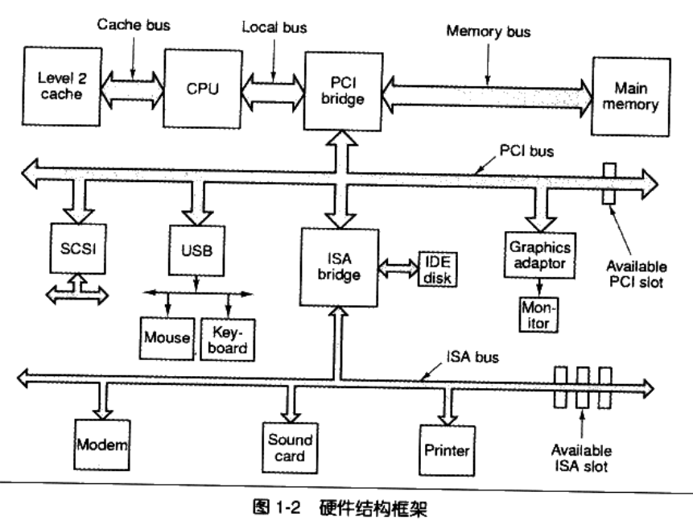

# 程序员的自我修养 链接、装载与库

- 《Linker and Loader》 by John R Levine
- 《Intel 64 and IA-32 Architectures Software Developer's Manuals》
- 《Linux内核源代码情景分析》
- 《深入理解计算机系统》
- 《深入理解Windows 操作系统系统》 4th
- 《Advanced Programming in the UNIX Environment》 3th

## 第一部分 温故而知新

```C
#include <stdio.h>
int main()
{
  printf("Hello World!");
  return 0;
}
```

- 计算机硬件结构
  - CPU、内存、存储设备、IO设备、总线
- 总线bus结构:CPU、内存、IO控制芯片都是连接到同一根总线上
- 南北桥结构：
  - 北桥芯片（NorthBridge 使用PCI结构）：一端连接CPU、主存、高速图像设备，另一端连接南桥芯片
  - 南桥芯片（SouthBridge 使用ISA总线）：连接低速IO设备

- 单核CPU频率瓶颈：4G Hz
  - 对称多处理器 SMP Symmetrial Multi-Processing:
  - 多核处理器Multi-Processing：
- 软件结构
  - 应用程序 --> 应用程序编辑接口API --> 运行库 -->系统调用接口 -->操作系统内核 --> 硬件接口 -->硬件驱动-->硬件设备
  - API:Application Programming Interface
  - 系统调用接口：往往通过软件中断（software interrupt）方式提供
  
- 操作系统：
  - 1.为应用程序层提供抽象接口
  - 2.管理硬件资源：主要为CPU、存储器（内存、磁盘等）、IO设备
  - CPU使用：
    - 多道程序的设计，调度策略：分时系统、多任务系统（抢占式分配CPU）
  - 设备驱动：
    - 操作系统->硬件驱动->硬件设备
    - 硬件的抽象：windows：
  - 内存分配
    - 内存使用问题
    - 进程内存的隔离
    - 内存分段使用:segement
    - 内存分页使用：paging,分页大小固定（通常为4K），虚拟页Virtual Page VP 物理页 Physical Page PP 磁盘页 Disk Page DP
      - 虚拟存储依赖CPU的MMU（Memory Management Unit）部件进行页映射


  - 线程Thread
    - LWP 轻量级进程Lightweight Process
    - 组成：线程ID、当前指令指针PC、寄存器集合、堆栈
    - 进程内线程共享：内存空间（代码段、数据段、堆）、进程级资源（全局变量、句柄、信号等）
    - 线程的访问权限：进程内所有数据、其他线程的堆栈
      - 线程的私有存储空间：栈、线程局部存储TLS（Thread Local Storage）、寄存器
      - C中线程私有：局部变量、函数参数、TLS数据
      - C中线程共享：全局变量、堆数据、函数内的静态变量、程序代码、打开的文件

    - 线程的调度与优先级
      - 线程的状态：运行、就绪、等待
      - 线程调度算法：优先级调度、转轮法
    - 线程安全
      - 竞争与原子操作
        - 原子操作：单指令的操作（该操作执行时，不会被其他系统调度中断）
        - 同步与锁：
          - 锁：线程访问资源前尝试获取锁，线程访问资源后是否锁
            - 锁的类型：
              - 二元信号量Binary Semaphore、多元信号量 --- 其他线程可释放 任何进程可见
              - 互斥量Mutex --- 仅能由创建线程释放 任何进程可见
              - 临界区（Critical Section）--- 仅能由创建线程释放 其他进程不可见
              - 读写锁：两种获取方式共享的（share）、独占的（Exclusive）:锁处于自由状态任何方式都可以获取（并将锁置于对应的获取状态）、若锁在共享状态，其他线程可以已共享方式获取，但不能以独占方式获取

| 读写锁状态 | 共享方式获取 | 独占方式获取 |
| ---------- | ------------ | ------------ |
| 自由       | 成功         | 成功         |
| 共享       | 成功         | 等待         |
| 独占       | 等待         | 等待         |

## 第二部分 静态链接

### 2 编译和链接

- C/C++源代码到可执行文件
  - 预处理Preprocessing:源代码到预处理的.i文件
  - 编译Compilation:预处理的.i文件到汇编代码
  - 汇编Assembly:汇编代码到机器指令
  - 链接Linking:多文件链接到最终可执行文件

- 词法分析
  - 输入：源代码
  - 输出：记号Token
  - 工具：扫描器，EG:lex
- 语法分析
  - 输入：记号Token
  - 输出：语法树Syntax tree
  - 语法分析器
  - 工具：ycc
- 语义分析
  - 输入：语法树
  - 输出：语法树
  - 语义分析器
- 中间语言生成
  - 输入：语法树
  - 输出：中间代码（三地址码、P-代码）
- 目标代码生成与优化
  - 代码生成器Code Generator : 将中间代码 转换为 目标机器代码
  - 目标代码优化器Target Code Optimizer ： 对目标代码进行优化
  - 其他模块的绝对地址的确定 需要 链接器


flow
st=>start:开始
sub_src=>subroutine:源代码
op_pre=>operation:预处理
sub_i=>subroutine:.i/.ii
op_com=>operation:编译(词法分析、语法分析、语义分析、优化产生汇编代码)
sub_s=>subroutine:.s
op_asm=>operation:汇编
sub_a=>subroutine:目标文件(.o)
op_link=>operation:链接
sub_e=>subroutine:最终可执行文件
e=>end:结束
sub_src->op_pre
op_pre->sub_i
sub_i->op_com
op_com->sub_s
sub_s->op_asm
op_asm->sub_a
sub_a->op_link
op_link->sub_e
sub_e->e

- 链接器
  - 链接过程：地址和空间的分配（Address and Storage Allocation）、符号决议（Symbol Resolution）、重定位(Relocation)
  - 静态链接：

### 目标文件内部

#### 3.1 目标文件的格式

- 可执行文件格式：
  - windows：PE
  - linux:ELF
- 目标文件：源代码编译后未进行链接的中间文件（.obj/.o）,与可执行文件的内容结构相似
- 动态链接库（DLL）(windows /.dll,linux /.so)和静态库(windows .lib,linux .a)
- 在windows下 安装windowsPE格式存储，在linux安装ELF格式存储
- 静态链接库：将多个目标文件捆绑在一起形成一个文件，加上索引
- ELF文件格式

| ELF文件类型                      | 说明                                                                                              | 实例                  |
| -------------------------------- | ------------------------------------------------------------------------------------------------- | --------------------- |
| 可重定位文件(Relocation File)    | 包含代码和数据，被用于链接成目标文件或共享目标文件，静态链接库属于此类                            | linux .o/windows .obj |
| 可执行文件(Excutable File)       | ELF可执行文件                                                                                     | windows .exe          |
| 共享目标文件(Shared Object File) | 含代码和数据，1.被链接器使用与可重定位文件、共享目标文件链接;2.与可执行文件结合，作为进程映像运行 | windows dll/linux .so |
| 核心转储文件(Core Dump File)     | 进程意外终止时，系统产生的该进程地址空间内容和其他信息放入核心转储文件                            | dump                  |

#### 3.2 目标文件的内容

- 目标文件将内容信息根据不同属性(程序指令，程序数据)，进行分区域存储（段、块、节）
- 常见的段：
  - .text : 代码段，保存程序指令数据
  - .data : 数据段,保存已初始化的全局静态变量和局部静态变量
  - .bss : 符号起始段 Block Started by Symbol,存放未初始化的全局变量和局部静态变量，编译单元内部可见的静态变量
  - .rdata:只读数据段，存放只读数据，一般为只读变量和字符串
  - .comment：注释信息段
  - .note.GUN-stack:堆栈段
- 存储分段的用途
  - 1.不同区域设置不同的读写权限
  - 2.提高缓存命中，CPU缓存设计为数据缓存、指令缓存
  - 3.可以共享指令
- SimpleSection.c实例
  - GCC编译生成目标文件：`gcc -c simplesection.c`
  - 查看目标文件内容和结构：`objdump -h simplesection.o`
  - 查看代码段、数据段、BSS段长度：`size simplesection.o`
  - 显示代码段内容：`objdump -s -d simplesection.o`
  - 查看常量存放情况：`objdump -x -s -d simplesection.o`
  - 将二进制文件作为目标文件的一个段：`objcopy -I binary -O elf32-i386 -B i386 90.png 90.o`
  - 查看目标文件内容：`objdump -ht 90.o`
- 自定义段
  - 希望变量或者部分代码放到指定的段中
  - `__attribute__((section("Name"))) int global_int=64`
  - `__attribute__((section("Name"))) int func(int r){}`

#### 3.4 ELF文件结构描述

- ELF基本文件结构：
  - ELF Header/.text/.data/.bss/.../Section Header Table/String Table/Symbol Table/...
  
  
- ELF头文件结构以及数据
  - 'usr/include/elf.h' --->Elf32_Ehdr/Elf64_Ehdr
- ELF Header
  - Magic:16byte整型，0x7f开始,'E','L','F',32/64位标识,大/小端标识,ELF主版本号,无定义（后面9字节）,

    - 不同的格式的文件Magic不同：
      - a.out : Magic->0x01,0x07;PE/COFF:Magic->0x4d,0x5a;
  - 数组的存放方式：定义一个固定长度的结构，然后依次存放数据
- 段表
  - 常见段表：.text/.data/.bss/.rdata/.comment/.stack
  - 其他段表：符号表、字符串表、段名称字符串表、重定位表
  - 段表结构：段描述符--->Elf32_Shdr/Elf64_Shdr

- 重定位表
- 字符串表
  - 段表字符串表

#### 3.5 链接的接口---符号

- 符号Symbol:函数与变量
- 符号名Symbol Name:函数名与变量名
- 符号值Symbol Value：每个定义放符号对应的值，一般为函数或者变量的地址
- 符号分类：
  - 定义在本目标文件的符号，可以被其他目标文件使用
  - 外部符号
  - 段名
  - 局部符号
  - 行号信息
- 查看符号表
  - `nm [a.o]`
- 符号表结构
  - Elf32_Sym结构的数组，每个结构对应一个符号
  - 符号名：指向字符串表的下标
  - 符号值：符号具体值跟符号类型相关
  - 符号大小：符号值的数据类型的大小
  - 符号类型和绑定信息：低4位类型信息:NONE/OBJECT/FUNC/SECTION/FILE;高28位绑定信息：LOCAL/GLOBAL/WEAK;
  - 符号所在段:若符号定义在当前目标文件，则该值为所在段表的下标，特殊值
    - 0xfff1 - SHN_ABS :包含绝对的值，eg：文件名
    - 0xfff2 - SHN_COMMON :未初始化的全局变量
    - 0 - SHN_UNDEF :定义在其他目标文件中
  - 特殊符号
    - 为ld链接器的链接脚本中定义的符号，无需声明即可使用
    - `__executable_start`:程序起始地址
    - `__etext/_etext/etext`：代码段结束地址，代码段最末尾地址
    - `_edata/edata`:数据段结束地址
    - `_end/end`:程序结束地址
- 符号修饰与函数签名
  - 解决符号名冲突问题
  - 函数签名（Function Signature）:函数名、参数类型、名称空间
  - 编译器和链接器 依据函数签名进行名称修饰得到修饰后的名称
  - 不仅仅限于函数、全局变量静态变量同样可以被修饰
  - 解析被修饰的名称：`c++filt [被修饰的名称]`
  - 不同的编译器修饰方法可能不同
  - VC++提供了将修饰后名字转换为函数签名的API：`UnDecorateSymbolName()`
- extern "C"
  - C++为了与C兼容，提供了声明或定义C的符号【extern "C"】

```C++
extern "C"{
  // process as C
  int func(int);
  int var;
}
extern "C" int func(int);
extern "C" int var;
```

- C++编译器的默认宏：`__cplusplus`
- 用于兼容C和C++定义的头文件问题

```C
#ifdef __cplusplus
extern "C" {
#endif
void* memset(void *,int,size_t);
#ifdef __cplusplus
}
#endif
```

- 弱符号与强符号
  - 符号重复定义问题,针对定义
  - C/C++：
    - 强符号（Strong Symbol）：函数和初始化的全局变量
    - 弱符号（weak symbol）：未初始化的全局变量，或者使用GCC标记的“__attribute__((weak))”
  - 链接器处理规则：
    - 1.不允许强符号被多次定义
    - 2.若一个符号在某个目标文件中是强符号，在其他文件中是弱符号，则选择强符号
    - 3.若一个符号在所有目标文件中都是弱符号，则选择其中占空间最大的一个
  - 弱引用与强引用
    - 强引用：符号被链接器进行符号决议时，未找到该符号则报错
    - 弱引用:符号决议时未找到该符号时不报错
  - 声明弱引用：`__attribute__((weakref))`
  - 现代编译器语法：`static __attribute__((weakref("swap43"))) void swap43proxy(int *, int *);`
    - 别名("swap43")为弱引用实质查找的名称

#### 3.6 调试信息

- GCC可以通过参数`-g`生成附加调试信息的可执行文件

#### 3.7 总结

- 目标文件类型、内容、结构
- 目标文件的格式：文件头、段表、字符串表（段表字符串表）、重定位表、符号表、调试表、自定义段表等
- 文件头结构信息、段表结构信息
- 符号修饰与符号名称冲突问题的解决
- 如何查看目标文件内容、查看段表内容
- 强符号与弱符号、强引用与弱引用
