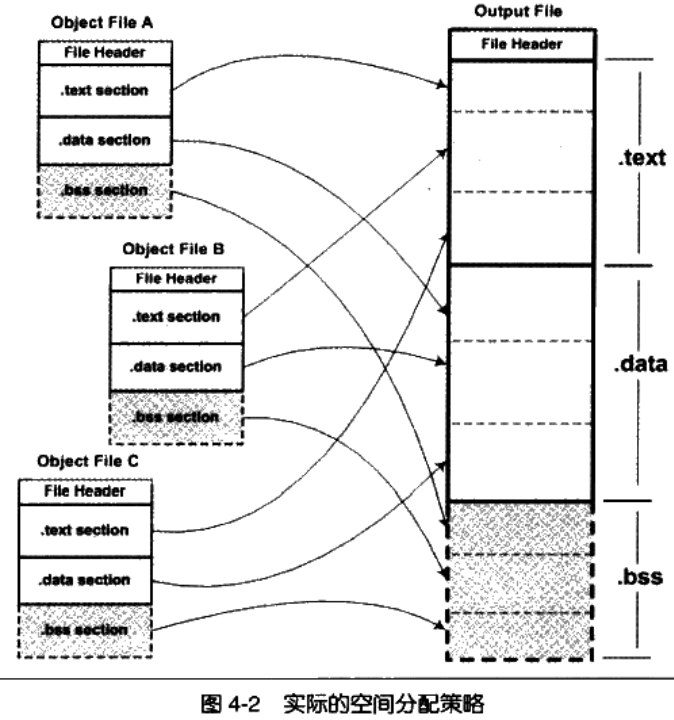
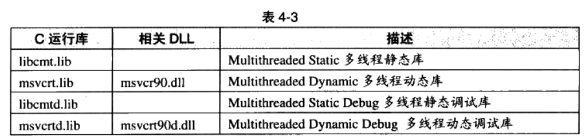
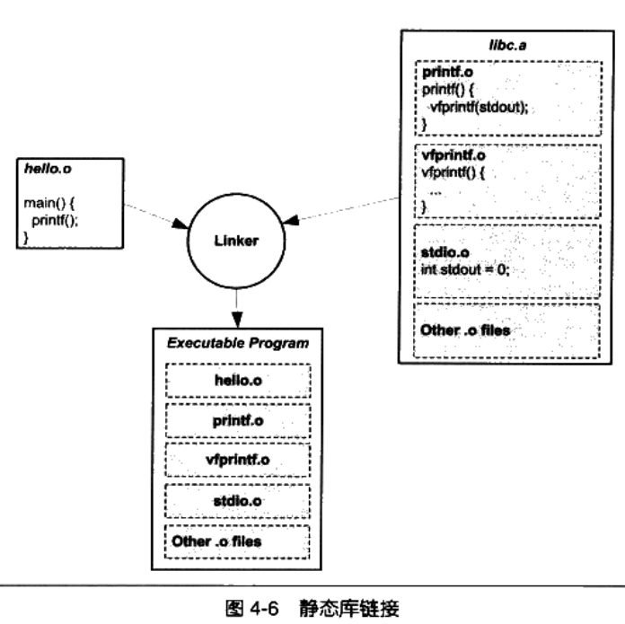
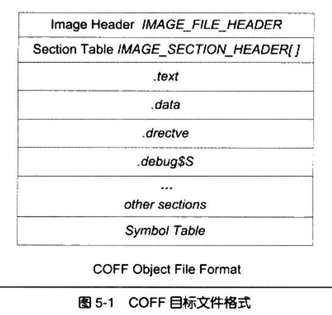
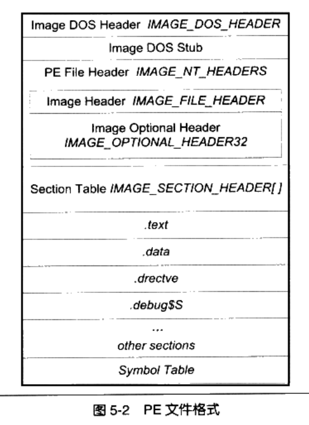

# 静态链接

## 4 静态链接

- 链接
  - 1.空间分配：分配段虚拟地址
  - 2.确定符号地址

### 4.1 空间与地址分配

- 链接：多个目标文件合并为一个可执行文件
- 问题：可执行文件的代码和数据由所有的输入目标文件合并得到，如何合并各个输入文件的段到输出文件？输出文件中的空间如何分配给输入文件？
- 解决：
  - 1.按序叠加：将输入的目标文件按照次序叠加合并
    - 问题：在大量输入文件时，会出现大量的零散的段，导致浪费空间（对齐要求）
  - 2.相似段合并：将输入文件的相同性质的段合并到一起
  
    - 链接器的空间和地址分配：输出的可执行文件中的空间分配；装载后虚拟地址空间的分配；（目前的空间分配只关注于虚拟地址空间分配）
    - 一般采用：两步链接方法 Two-pass Linking
      - 1.空间与地址分配
      - 2.符号解析与重定位
- 编译命令：`gcc -c a.c b.c`
- 链接命令：`ld a.o b.o -e main -o ab`
  - `-e main`:指定程序入口，ld默认程序入口为`_start`
  - `-o ab`:指定输出文件
- 符号地址确定
  - 符号地址=段虚拟地址+偏移

### 4.2 符号解析与重定位

- 重定位
  - 主要是外部符号的重定位
  - 编译：函数的起始地址都是0x0000;外部符号都是临时假地址
  - 链接：函数起始地址变成真实虚拟地址；外部符号地址修正为真正虚拟地址或者指令修正
- 重定位表
  - 用途：告知链接器哪些指令的哪些部分需要被调整，以及如何调整
  - 重定位表（重定位段）：`.rel.[被重定位段名]`
  - 查看目标文件重定位表：`objdump -r a.o`
- 符号解析
  - 未定义的符号 应在全局符号表中查找，未找到则报错
- 指令修正方式
  - 不同指令具有不同的寻址方式
    - 近址寻址 远址寻址
    - 绝对寻址 相对寻址
    - 寻址长度：8位 16位 32位 64位
    - 绝对近址32位寻址 相对近址32位寻址
  - 重定位入口类型x86
    - R_386_32 : 1 绝对寻址修正 S+A
    - R_386_PC32: 2 相对寻址修正 S+A-P
      - S:符号实际地址;A：保存在被修正位置的值；P：被修正位置（相对于段开始的偏移或虚拟地址）
- COMMON块
  - 链接器如何处理同一符号定义在不同文件中，而且类型不同的时的结果符号的类型问题？
  - 本质：编译器允许不同类型的弱符号存在，编译器不支持符号类型
    - 两个以上的强符号类型不一致--->链接报错：多重定义错误
    - 一个强符号多个弱符号类型不一致：结果类型与强符号相同
    - 多个弱符号类型不一致：结果类型与弱符号中占空间最大的符号相同
  - 将未初始化的变量不以COMMON形式存在：
    - 1.GCC编译参数：`-fno-common`
    - 2.__attribute__扩展:`__attribute__((nocommon))`，EG:`int gloabl_int_var __attribute__((nocommon))`

### 4.4 C++相关问题

- 重复代码消除
  - 模版处理：每个模版实例单独放到一个段里，每个段只包含一个模版实例
  - 虚函数、外部内联函数、默认构造函数、默认拷贝构造函数、赋值操作符等
- 函数级别链接
  - VC++，让所有的函数都单独保存到一个段里，在链接用到时合入输出文件，否则抛弃该段
  - GCC 编译项：`-ffuntionsections` `-fdata-sections`
- 全局构造与析构
  - ELF特殊段
    - .init:可执行指令，进程初始化代码
    - .fini：进程终止代码
- C++与ABI
  - 问题：不同的编译器产生的目标文件能进行互相链接吗？
    - 1.链接器支持不同类型的目标文件的文件格式，PE/COFF与ELF
    - 2.其他限制：同样的目标文件格式、同样的符号修饰标准、变量的内存分布方式、函数调用方式，即ABI兼容性问题
  - ABI：application binary interface,执行代码二进制兼容性相关内容
    - ABI与API
      - 1.接口层面不一样：API值源代码级别的接口；ABI：二进制层面接口
  - ABI兼容性问题：
    - 硬件、编程语言、编译器、链接器、操作系统等

### 4.5 静态链接



- ar压缩程序：将多个目标文件压缩到一个文件中，并进行编号和索引
- `ar`
- 查看压缩文件内容：`ar -t [zip].a`
- VC++提供了lib.exe功能与ar类似；`lin /LIST [zip].lib`
- 解压目标文件：`ar -x [zip].a`
- GCC显示编译过程：`gcc -static--verbose -fno-builtin hello.c`,'-fnobuiltin':关闭内置函数优化
- linux GCC编译过程：
  - 1.使用cc1将源代码编译成临时汇编文件
  - 2.使用as程序将临时汇编文件汇编成临时目标文件
  - 3.调用collect2（ld链接器包装）程序对临时目标文件进行链接
- 通常静态运行库内一个目标文件只有一个函数

### 4.6 链接过程控制

- 默认情况下使用默认的链接规则对目标文件进行链接，但是特殊的程序需要对链接过程进行控制
- 特殊程序：操作系统内核、BIOS、引导程序、无操作系统运行的程序、脱离操作系统硬盘分区的软件、内核驱动等
- 链接控制：指定各个段虚拟地址、指定段名、指定段存放顺序
- 内容控制：输出格式、调试信息、库文件、目标文件等

- windows操作系统内核：
  - ntoskrnl.exe - windows/system32/ntoskrnl.exe
- 常见的三种控制链接过程的方法：
  - 1.命令行参数
  - 2.链接指令放入目标文件中
  - 3.使用链接控制脚本
- 通常ld在没有指定链接脚本时，会使用默认脚本，查看默认脚本：`ld -verbose`,指定脚本链接：`ld -T a.script`
- 命令行编译最小脚本：
  - `gcc -c -fno-builtin TinyHello.c`
  - `ld -static -e nomain -o tinyHello.exe TinyHello.o`
- ld链接脚本
  - ld链接脚本语言(脚本以.lds作为扩展名)：
  - 输入段（Input Sections）:输入文件中的段
  - 输出段（Output Sections）：输出文件中的段

```C
ENTRY(nomain)

SECTIONS
{
  .=0x08048000 + SIZEOF_HEADERS;
  tinytext : { *(.text) *(.data) *(.rodata)}
  /DISCARD/ : { *(.comment) }
}
```

- ld链接器脚本语法：
  - 只有赋值语句跟命令语句
  - 通常使用';'分隔语句（命令语句可以使用换行分隔）
  - 注释：/**/
  - 文件名、格式名、段名含有';'应使用双引号，不支持含有引号内容
  - 命令语句
    - ENTRY(symbol) : 指定程序入口，ld指定程序入口优先级：ld -e 参数 > 链接脚本ENTRY命令 > _start符号值 > .text段第一个字节地址 > 使用0
    - STARTUP(filename):指定第一个输入的文件名，链接顺序的第一个文件
    - SEARCH_DIR(patn):将指定路径添加到ld链接器库查找目录
    - INPUT(filename)/INPUT(filename,filename...):将指定文件作为链接输入文件
    - INCLUDE filename：将指定文件包含进链接脚本
    - PROVIDE(symbol):在链接脚本中定义某个符号，该符号可以在程序中引用
    - SECTIONS：指定输出文件的段如何构成

### 4.7 BFD库

- 问题：由于硬件和软件平台的差异导致出现不同格式的目标文件，编译器和链接器如何统一的处理不同格式的目标文件的方案？
- BFD库(Binary File Descriptor library):用于提供一种统一的接口处理不同格式的目标文件
- GCC通过BFD库来操作目标文件，GCC--->BFD--->目标文件

### 4.8 总结

- 主要将链接器的静态链接过程以及控制
- 空间和地址分配问题：如何将多个目标文件合并为一个可执行文件？
- 重定位和符号解析问题：如何处理多个目标文件之间的符号引用问题？
  - 重定位、指令修正、COMMON块
- 举例：C++链接的相关问题
  - 代码消重问题、
- 如何控制链接过程：命令行参数、链接控制脚本、目标文件中的特殊段
- 如何采用统一的方式处理不同格式的目标文件链接问题：BFD库

## 5.Windows PE/COFF

### 5.1 Windows的二进制文件格式PE/COFF

- PE:Protable Executable,是COFF的扩展，基于DEC，基于段的结构
- 64位PE文件结构称为：PE32+
- 基于段的结构（不同的编译器产生的段名不同）
  - .code:代码段
  - .data:数据段
- 可以在程序中指定段名：
  - (VC++)：`#pragrma data_seg("Foo")`

```C
#pragrma data_seg("Foo")
int global_int_v1 =90;
#pragrma data_seg(".data")
int global_int_v2 =91;

```

### 5.2 PE前身--COFF



- VC++操作
  - 1.汇编（.obj的目标文件）：`cl /c /Za hello.c`
    - /c:只编译不链接；/Za:禁用扩展（使用该参数时，自动定义宏"__STDC__"）
  - 2.查看目标根据结构：`dumpbin /ALL hello.obj > hello.txt`
- COFF文件结构
  - 文件头(映像头+段表信息)+段表+符号表+调试表
    - 映像头一个结构体：IMAGE_FILE_HEADER（WinNT.h）
    - 段表结构体数组：IMAGE_SECTION_HEADER
  - 链接指示信息：.drectve
  - 调试信息：.debug

### 5.3  Windows下的ELF-PE



- 与COFF相比的变化：
  - 文件最开始不是COFF文件头，而是DOSMZ可执行文件格式文件头和桩代码
  - IMAGE_FILE_HEADER扩展为IMAGE_NT_HEADERS
  - DOS可执行文件与Windows下可执行文件区别：
    - DOS下可执行文件格式是MZ格式
- 文件结构：
  - IMAGE_DOS_HEADER --->e_magic:魔数“MZ”，elfanew---> DOS可执行文件永远为0，PE可执行文件为IMAGE_NT_HEADERS在文件中的偏移
  - DOS STUB ---> PE文件执行DOS兼容的错误输出提示代码
  - IMAGE_NT_HEADERS --->fileHeader + optionHeader
  - IMAGE_FILE_HEADER --->映像头结构
  - IMAGE_OPTIONAL_HEADER32 --->PE数据目录
  - IMAGE_SECTION_HEADER[] --->段表信息数组
  - .text
  - .data
  - .drectve
  - .debug$S
  - [...other sections]
  - Symbol Table

### 5.4 总结

- COFF格式的文件结构
- DOS/PE格式文件结构