# 装载与动态链接

## 6.可执行文件的装载与进程

### 6.1 进程的虚拟地址空间

- 程序与进程的区别？
  - 程序是静态概念，是一个预编译好的指令和数据的集合的文件
  - 进程是动态概念，是程序运行的过程
- 进程的虚拟地址空间大小和可用范围问题：
  - 虚拟地址空间大小取决于硬件CPU位数确定，即寻址能力
  - 程序角度，即依据指针所占的空间范围计算虚拟地址空间
  - 使用范围：整个指针可访问的范围 去掉操作系统的占用部分
- 如何扩展程序的使用空间，即扩展指针可访问的常规范围?
  - PAE:物理地址扩展，使用操作系统提供的窗口映射方法，根据需要将同一块虚拟内存映射到多个不同的内存

### 6.2 装载的方式

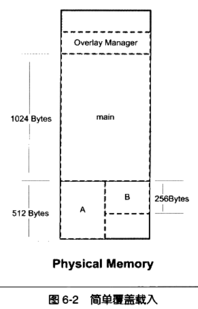
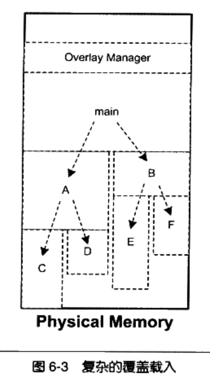
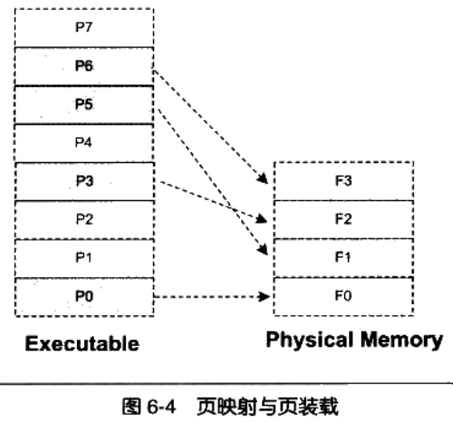

- 覆盖装载:覆盖管理器
  - 将程序进行分块，并决定何时该块被加载和替换，调用目标必须在内存中程序才能执行
- 页映射：映射管理器
  - 将内存和磁盘中的数据按照页进行分割，实现以页为单位的数据加载
  - 页置换算法：LUR

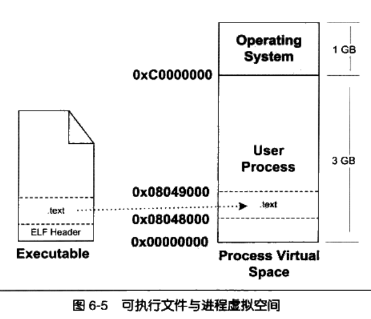

### 6.3 从操作系统看可执行文件的装载

- 进程建立
  - 1.创建独立的虚拟地址空间
    - 虚拟空间：一组页函数将各个页映射到相应的物理空间，创建虚拟地址空间实质为创建映射函数所需的数据结构
  - 2.读取可执行文件，建立虚拟地址空间与可执行文件的映射
    - 可执行文件与页的映射关系：ELF文件段与页映射问题
    - VMA 虚拟内存区域（VMA）或虚拟段：虚拟空间中的一个段
  - 3.将CPU寄存器设置为可执行文件的入口地址
- 页错误

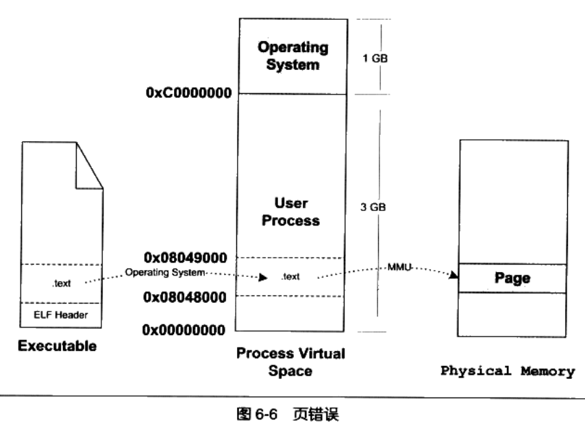

  - 进程建立后，真正的指令和数据并没有加载到内存中，仅仅是建立映射关系，
  - 当CPU根据入口地址开始执行指令时，根据映射关系查找虚拟页
  - 若该页为空（即未加载数据），CPU将控制权交给操作系统，操作系统查询虚拟映射数据结，查找空页面VMA，计算页在可执行文件中的偏移，物理内存分配物理页面并与虚拟页建立映射，加载数据
  - 继续执行原CPU指令，随着指令执行不断出现页错误，操作系统不断进行处理，因此出现虚拟内存管理

### 6.4 进程虚拟存储空间分布

- ELF文件链接视图和执行视图

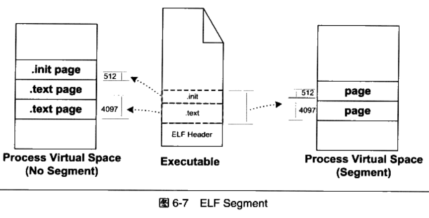

- ELF文件映射单位：系统的页长度（每个段的映射时长度都是系统也长度的整数倍，若不是整数倍多余部分也将占用一个页）
- 多个不同长度的段出现导致内存空间浪费问题
- ELF文件段长度大小不一，读写权限不一
- 方案一：
  - 相同权限的段，合并到一起进行页映射，成为一个段，Segment，（注意：此处合并后的每个段的长度也不一定是系统也长度的整数倍，即仍存在内存空间浪费的问题）
  - ELF文件是按照Segment存储
  - ELF可执行文件中含有一个专门用于保存Segment信息的数据结构：程序头表Program Header Table，Elf32_Phdr,类似于段表
  - 查看ELF文件的段(Segment):`readelf -S a.elf`
- 链接视图：`Section划分ELF`
- 执行视图：`Segment划分ELF`
- 针对"段"：
  - 装载时，段指Segment
  - 其他情况下指Section
- 堆和栈
  - 通常，一个进程中的堆和栈 分别对应一个VMA
  - 匿名虚拟内存区域：指没有映射到ELF文件中的VMA，通常指Heap\Stack\vdso
  - vdso:内核模块(位于内核空间)
- VMA类型划分：
  - 代码( 指令、程序)VMA：只读、可执行、有文件映射
  - 数据VMA：读写、可执行、有文件映射
  - 堆VMA：读写、可执行、无文件映射，匿名，向上扩充
  - 栈VMA：读写、不可执行、无文件映射，匿名，向下扩充

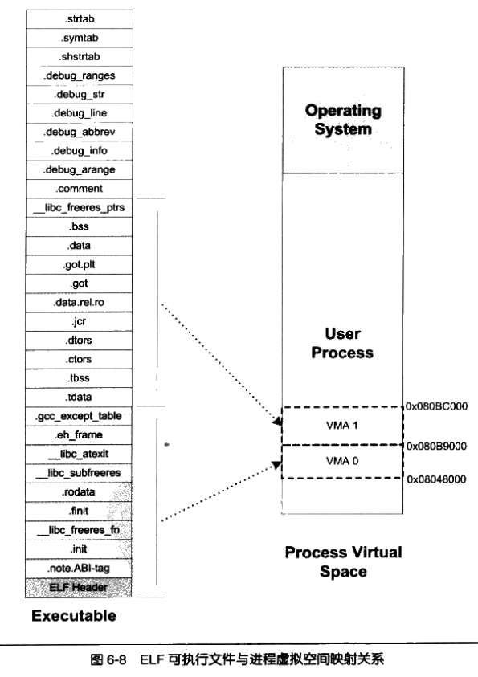

- [堆最大申请数量](./3.loading_process.c)
- 段地址对齐
  - 原因：操作系统通过虚拟内存的页映射完成可执行文件的加载，页映射中，页是最小单位
  - 在映射时，即将一段物理内存与虚拟内存建立映射关系，内存空间的长度必须是页大小的整数倍，而且映射的起始地址也必须是页大小的整数倍
  - 限制：映射空间的长度、映射空间的起始地址
  - 简单的映射方式：
    - 每个段(segment)分别映射,长度不足一个页的仍占有一个页，对于多个段仍存在较多的内存碎片
  - UNIX改进：
    - 各个段的接壤部分共享同一个页，然后系统将该共享也分两次映射，并且将ELF文件头看做是一个段（segment）
  - 段必须是4字节的整数倍
  - 规律：`在ELF文件中，对于任何一个可装载的Segment，p_vaddr除以对齐属性的余数等于p_offset除以对齐属性的余数`
- 进程栈的初始化
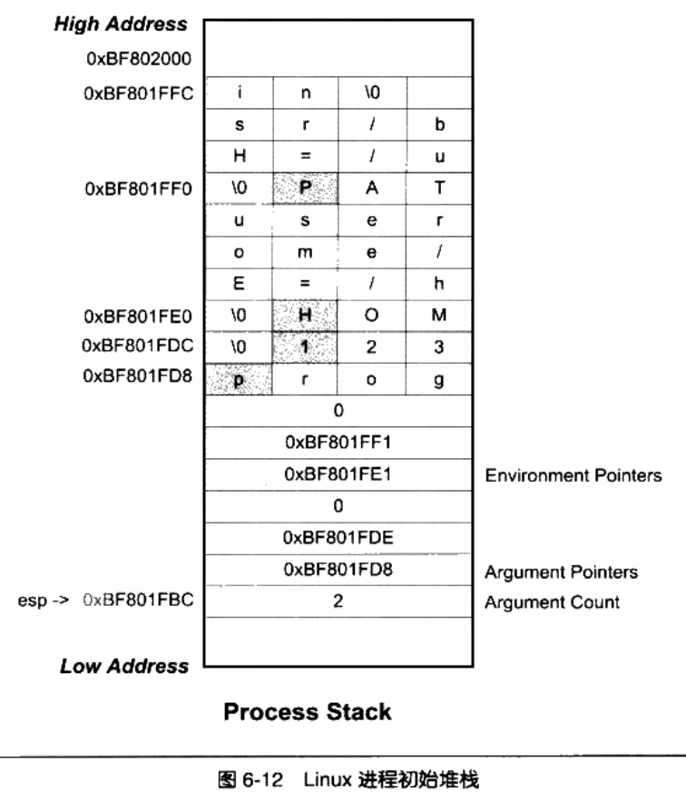
  - 进程开始启动时，需要知道进程运行的环境（系统环境变量和进程运行参数）
  - 常见做法：将环境信息提前保存到进程空间的栈中 Stack VMA
  - main()函数中的argc,argv参数值的由来

### 6.5 Linux内核装载ELF过程

- Linux bash输入命令执行某个ELF程序
- 1.（用户层面）bash进程调用fork()系统调用，创建一个新进程，新进程调用execve()系统调用执行指定的ELF文件，原bash进程等待新进程结束
- 2.execve()系统调用定义在unistd.h中，函数原型：`int execve(const char * filename,char *const argv[],char *const envp[])`,三个参数：程序文件名、执行参数、环境变量
- 3.进入execve()系统调用后，Linux内核开始进行装载工作：调用sys_execve()：进行参数检查复制，调用do_execve():查找可执行文件，若找到文件则读取前128字节（用于判断文件格式），调用search_binary_handle():搜索和匹配合适的可执行文件装载处理程序并调用相应的装载处理程序（针对ELF文件为load_elf_binary()）
- 4.load_elf_binary()处理过程：
  - a.检查ELF文件的有效性
  - b.寻找动态链接的".introp"段，设置动态链接器路径
  - c.根据ELF文件的程序头表的描述，对ELF文件进行映射
  - d.初始化ELF进程环境
  - e.将系统调用的返回地址修改为ELF文件的入口点（对于静态链接ELF文件，入口点为文件头中的e_entry所指地址，对于动态链接ELF文件入口地址为动态链接器）
- 5.load_elf_binary()执行完毕，返回do_execve(),然后返回sys_execve(),此时系统调用的返回地址已修改为被装载的ELF程序的入口地址
- 6.sys_execve()系统调用从内核态返回用户态时，EIP寄存器直接跳转到ELF程序的入口地址，并开始执行，即ELF文件装载完成

### 6.6 Windows PE的装载

- PE与ELF文件的不同：所有段的起始地址都是页的整数倍，段长度不是页整数倍时，映射时向上补齐到页的整数倍（PE文件中段数量较少）
- RVA（Relative Virtual Address）:相对虚拟地址，相对于PE文件装载的基地址的偏移地址
- 每个PE文件在装载时都会有一个装载目标地址即基地址（RVA的基地址）：绝对地址= 基地址+RVA，基地址是每次装载都是不同的但是RVA是固定的
- PE文件装载过程
  - 1.读取文件的第一个页，该页包含：DOS头、PE文件头、段表
  - 2.检查进程地址空间，目标地址是否可用（不可用是另选目标地址，主要是DLL装载）
  - 3.使用段表提供的信息将PE文件中的段映射到地址空间中
  - 4.若装载地址不是目标地址，则进行Rebasing
  - 5.装载所有PE文件所需的DLL文件
  - 6.对PE文件中的所有导入符号进行解析
  - 7.根据PE头指定的参数，建立初始化堆和栈
  - 8.建立主线程并启动进程
- PE扩展头装载相关的成员属性介绍

### 6.7 总结

- 1.进程虚拟地址空间的概念和意义
- 2.程序装载方式介绍
- 3.进程的建立与程序的装载关联，VMA
- 4.进程的虚拟地址空间分布，段的内存映射方案、堆与栈VMA、段地址对齐、进程栈的初始化
- 5.Linux装载ELF的过程
- 6.Windows PE装载的过程

## 7.动态链接

### 7.1 动态链接的意义

- 动态链接的优点：
  - 节省内存空间（共享指令和数据），减少物理页的换入换出：多进程操作系统中，静态链接浪费内存空间
  - 灵活的程序更新和发布：只需更新变动个模块即可
  - 动态链接：对于需要的目标文件仅在需要时进行链接
  - 程序的可扩展性和兼容
- 动态链接的基本实现：
  - 将程序按照模块拆分为各个相对独立的部分，在程序运行时将他们链接在一起形成一个完成的程序
- Linux:ELF动态链接文件为.so文件，动态共享对象
- Windows:动态链接文件为.dll文件，动态链接库
- 使用性能损失换取空间和灵活性

### 7.2 动态链接示例

- ELF动态链接
- 编译共享对象：`gcc -fPIC -shared -o lib.so lib.c`
- 使用共享对象：`gcc -o Pro.exe Pro.c lib.so`

### 7.3 地址无关代码

- 问题：共享对象在被装载时，如何确定共享对象在进程的虚拟地址空间中的位置？
- 静态共享库（Static Shared Library）：将程序的各种模块统一交给操作系统来管理，操作系统在某个特定的区域划分地址空间用于加载共享库
- 链接时重定位：静态链接时重定位
- 问题：如何解决共享模块中的绝对地址的问题？
  - 装载时重定位（基址重置Rebasing）:共享对象的程序模块可以加载到任意地址，指令地址在装载时进程重定位，动态链接库中的可修改的数据部分在不同进程中有多个副本
- gcc仅使用-shared参数时，输出的共享对象为装载时重定位
- 问题：如何让共享模块的指令部分在多个进程之间共享？
- 目的：共享对象中的指令部分在装载时不因装载地址的改变而改变
- 解决：将共享对象中的指令中需要修改的部分分离出来，跟数据部分放到一起，在每个进程中创建自身的副本，即地址无关代码（PIC,Position-independent Code）技术
- 模块中的地址的引用方式：

| 方式   | 函数调用/跳转     | 数据访问                      |
| ------ | ----------------- | ----------------------------- |
| 模块内 | 相对地址调用      | 当前PC值+偏移量(相对地址访问) |
| 模块外 | 间接跳转和调用GOT | 全局偏移表GOT（间距访问）     |

- -fPIC与-fpic区别
  - -fPIC产生代码较大，-fpic在某些硬件平台受限制
- 如何区分DOS是否为PIC
  - `readlef -d lib.so | grep TEXTREL`
  - 若有任何输出说明不是PIC，否则为PIC
- PIC与PIE
  - PIE：指以地址无关方式编译的可执行文件，**地址无关可执行文件**（PIE Position-independent Executable）
  - 产生参数：-fPIE / -fpie
- 共享对象的全局变量问题
  - 如何处理定义在模块内的全局变量问题？一个模块引用了一个共享对象的全局变量时，如何处理？
  - ELF共享库在编译时，默认都把定义在模块内的全局变量当做定义在其他模块的全局变量，即通过GOT实现变量访问
  - 在共享库装载时，若某个全局变量在可执行文件中有副本，则动态链接器将GOT中的对应地址指向该副本，
  - 若该变量在共享模块中被初始化，则动态链接器将该初始化值复制到程序主模块的副本中
  - 若该全局变量在程序模块没有副本，则GOT地址指向模块内部的该变量副本
- 数据段的地址无关性
  - 针对数据段中的存在的绝对地址的处理方式
  - 装载时重定位的方法，重定位表

### 7.4 延迟绑定PLT

- 动态链接比静态链接慢的原因：
  - 1.动态链接对于全局和静态的数据访问都要进行GOT定位，然后间接访问；模块间调用也要进行GOT和间接调用
  - 2.动态链接的链接工作在运行时完成
- 优化动态链接性能的方法：
  - 1.延迟绑定（Lazy Binding）:当函数第一次被用到时才进行绑定
  - 2.延迟绑定实现：调用函数并不直接通过GOT跳转，而是通过PLT项的结构进行跳转，每个外部函数都有一个PTL项
  - 3.GOT中第一次保存的值为PLT第二条指令地址，第一次执行时会根据函数在重定位表".rel.plt"的下标，以及函数ID，调用地址查找与绑定函数
  - 4.地址查找与绑定函数会查找模块中的函数地址，并将该地址放入GOT中，替换掉原有的地址，实现函数解析
  - 5.函数解析完毕后，再次调用PLT时，跳转到执行函数，执行函数返回时，根据堆栈内的EIP直接调用者，不用执行之后的PLT指令

```C
bar@plt:
jmp *(bar@GOT) //跳转到 bar@GOT
push n
push moduleID
jump _dl_runtime_rsolve //地址绑定函数
```

- 实际PLT的实现：
  - 1.GOT拆分为两个表"got","got.plt","got":保存全局变量引用地址,"got.plt":保存函数引用地址
  - 2.got.plt表的前三项为特殊项，分别为：
    - .dynamic段地址：用于描述本模块动态链接相关信息（后两项在动态链接器装载共享库时初始化）
    - 本模块ID
    - _dl_runtime_resole()地址
  - 3.got.plt第一条指令为"push moduleID jump _dl_runtime_resole",每一项的长度为16字节（刚好存放3条指令）

```C
PLT0:
push *(GOT+4)
jump *(GOT+8)
...
bar@plt:
jmp *(bat@GOT)
push n
jump PLT0
```

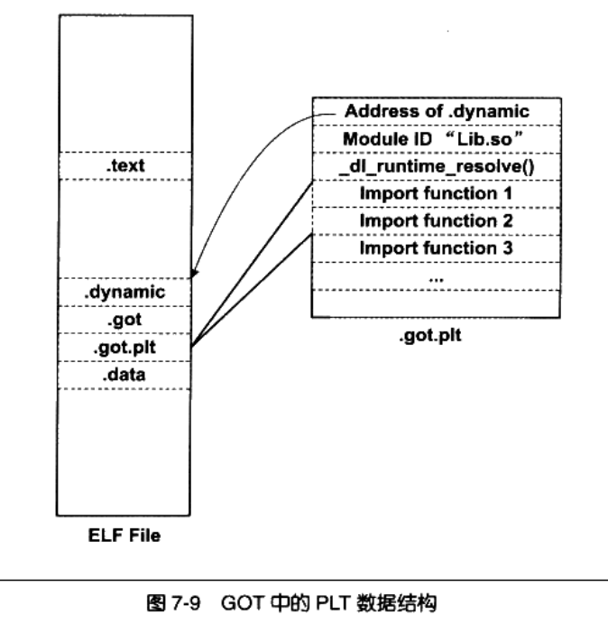

### 7.5 动态链接相关结构

- ELF动态链接的具体实现
  - 1.操作系统读取可执行文件的头部，检查文件的合法性
  - 2.操作系统从头部“Program Header”提取每个Segment的虚拟地址、文件地址、属性，映射到进程虚拟空间
  - 3.操作系统启动一个动态链接器(是一个共享对象)，加载完动态链接器后，将控制权交给动态链接器;（对于静态链接，操作系统将控制权转移给可执行文件的入口地址，程序开始执行）；
  - 4.动态链接器执行自身的初始化操作，然后根据当前环境参数，对可执行文件进行动态链接工作
  - 5.动态链接器的链接工作完成后，将控制权交给可执行文件的入口地址，程序开始执行
- ".interp"段
  - 该段内容指定动态链接器的位置
  - 查看动态链接器路径:`readelf -l a.out | grep interpreter`
- ".dynamic"段
  - 保存动态链接器所需要的基本信息：共享对象、动态链接符号表位置、动态链接重定位表位置、共享对象初始化代码地址
  - 是一个Elf32_Dyn结构的数组，该结构定义在“elf.h”中
  - 查看命令：`readelf -d lib.so`
  - Linux查看依赖共享库：`ldd a.out`
- 动态符号表".dynsym"
  - 导入函数、导出函数
  - 动态符号表：表示模块间符号的导入导出关系，段名：".dynsym"
  - ".dynsym"仅保留动态链接相关的符号，".symtab"会保存所有的符号
  - 辅助表：动态符号字符串表“.dynstr”、符号哈希表".hash"
- 动态链接重定位表
  - 导入符号需要在运行时被重新引用修正
  - PIC模式也需要重定位，原因虽然以PIC模式编译的共享库的代码段不需要重定位当时数据段需要重定位（数据段可能包含了绝对地址的引用）
  - 动态链接重定位的相关结构
    - 重定位表:`.rel.dyn`:数据引用的修正，位于got以及数据段；`.rel.plt`:函数引用的修正，位于got.plt
    - 查看动态链接文件的重定位表：`readelf -r lib.so`
    - 重定位入口类型：不同的类型代表不同的地址计算方法
      - R_386_GLOB_DAT\R_386_JUMP_SLOT:被修正位置只需填入符号地址即可，动态链接器找到符号真实地址后，将该真实地址直接填入GOT对应的条目
      - R_386_RELATIVE:基址重置，用于重定位绝对地址的数据，指针变量，结果 = 相对于共享对象的实际偏移+共享对象的装载地址
- 动态链接时进程堆栈的初始化信息
  - 进程是初始化的堆栈信息（进程执行环境、命令行参数等）里包含动态链接器所需的一些辅助信息数组（结构体数组）
  - [打印堆栈初始化信息实例](./3.loading_process.c)
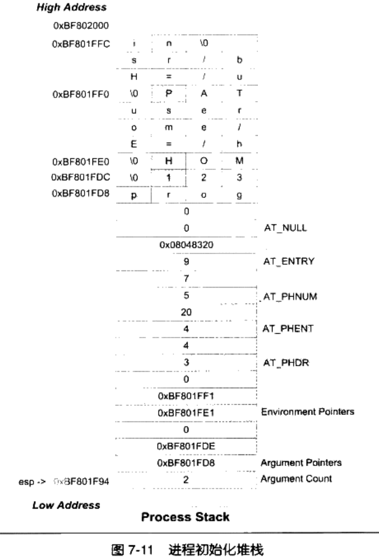

### 7.6 动态链接的步骤和实现

- 1.启动动态链接器
  - 链接器运行自举程序，查找自身GOT，通过GOT找到自身的重定位表和符号表
  - 将链接器符号表与可执行程序符号表合并为全局符号表
- 2.装载所有需要的共享对象
  - 链接器根据可执行程序的".dynamic"找到所依赖的共享对象，加入装载集合
  - 遍历装载集合，加载每一个共享对象，合并其符号表到全局符号表，并查找其依赖的共享对象，直到加载完所有依赖对象
- 3.重定位和初始化  
  - 链接器重新遍历可执行程序和共享对象的重定位表，修正GPT/PLT位置
  - 若共享对象具有".init",则动态链接器执行".init"段代码，以实现共享对象的初始化
  - 可执行程序的".init"则不在此时执行，有程序负责初始化的代码执行
  - 链接器将控制权交给可执行程序的入口

- 动态链接器自举
  - 动态链接器本身也是一个共享对象
  - 动态链接器本身不依赖于其他共享对象
  - 动态链接器本身的全局变量和静态变量的重定位工作由自己完成（要求链接器启动时的代码不使用全局和静态变量也不能调用内部函数，称为自举Bootstrap）
    - 自举代码(Glibc elf/rtld.c)：
      - 1.自举代码入口为链接器入口地址
      - 2.自举代码首先查找自身的GOT，GOT第一项保存段".dynamic"偏移地址，通过".dynamic"找到自身的重定位表和符号表
      - 3.链接器重定位后，方可使用自身内部的全局变量和静态变量
- 装载共享对象
  - 全局符号表（Global Symbol Table）:可执行文件的符号表和动态链接器的符号表的合并
  - 查找可执行文件所依赖的共享对象，并进行递归加载，将其符号表合并入全局符号表
  - 符号的优先级问题
    - 两个不同的模块定义了同一种符号的问题
    - 全局符号介入：当一个符号已经加入到全局符号表时，若相同名称的符号名已存在，则后加入的符号被忽略
    - 可通过将函数标记为“static”提高内部函数的调用效率
  - Linux动态链接的实现
    - Linux动态链接器：/lib/ld-linux.so.2，实际指向/lib/ld-x.y.z.so,实际为一个ELF文件，具有与可执行文件一样的ELF头
    - 不仅仅是一个共享对象，也是一个可执行程序
    - Linux内核指向execve()不关心目标文件是否可执行，仅仅是按照程序头表里的结构对文件进行装载，然后将控制权转给入口地址（没有“.intrep”就是ELF文件的e_entry,有的话就是动态链接器e_entry地址）
    - 因此共享库和可执行程序文件实质上没有区别
    - windows上的DLL也可以执行：rundll32.exe工具可以将一个DLL当做可执行文件运行
    - 源代码位置：
      - sysdeps/i386/dl-machine.h 中的_start
      - sysdeps/i386/elf/start.S _start()
      - _start调用 elf/rtld.c _dl_start()函数 Line:444
        - 1.首先对ld.so（ld-x.y.z.so）进行重定位,完成自举
        - 2.调用_dl_start_final,收集运行基本参数 Line:369
        - 3.进入_dl_sysdep_start,进行平台相关处理 elf\dl-sysdep.c Line:85
        - 4.进入_dl_main,动态链接器的主函数 rtld.c Line:867
- 问题：
  - 动态链接器本身是静态链接还是动态链接？
    - 本身是静态链接
  - 动态链接器本身必须是PIC？
    - 实际上ld-linux.so.2是PIC的，但本身可以是PIC也可以不是PIC的
  - 动态链接器作为可执行文件执行是，本身的装载地址是多少？
      - ld.so装载地址与其他共享对象一样，都是0x0000 0000 (无效地址)

### 7.7 显式运行时链接

- Explicit Run-time Linking：程序在运行时控制共享对象的加载和重定位，并且在不需要时进行卸载
- 动态装载库
- 动态库的装载有动态链接器提供的API进程操作(实现位置：`/lib/libdl.so.2` 头文件：`<dlfnc.h>`)：
  - 打开动态库:dlopen `void* dlopen(const char* filename,int flag)`
  - 查找符号:dlsym `void* dlsym(void *handle,char *symbol)`
    - 符号的优先级问题：对全局符号表为装载序列查找，对某个打开的共享对象采用依赖序列查找
  - 错误处理:dlerror `char * dllerror()`
    - 返回NULL表示上一次调用成功
  - 关闭动态库:dlclose `void dlclose(void* handle)`
    - 维持一个加载引用计数，dlopen增加计数值，dlclose递减计数值，计数为0时模块真正卸载

### 7.8 本章总结

- 动态链接库存在的意义
  - 节省空间、程序灵活
- 动态链接库代码调用的实现：PIC
  - 相对地址 - 模块内数据访问、函数调用，GOT - 模块间数据访问、函数调用
- 动态链接库的性能优化---延迟绑定PLT
  - 延迟绑定结构、调用过程
- 动态链接库的数据结构
  - ".introp"/".dynmic"/".dynsym"/".rel.dyn"/".rel.plt"/".dynstr"/".hash"
- 动态链接的步骤和实现
  - 启动链接器、加载共享对象、重定位和初始化
- 如何进行显式运行时的链接 --- 共享库的运行时加载、调用、卸载

## 8 Linux共享库的组织

- 共享库(Shared Library):普通的ELF共享对象

### 8.1 共享库版本

- ABI（二进制接口）兼容问题
  - 接口变更：导出函数签名变更、导数数据结构变更、导出函数内部逻辑变更
- 共享库版本命名规则：`libname.so.x.y.z x:主版本号;y:次版本号;z:发布版本号`
- 如何确定共享库依赖的共享库？
  - SO-NAME命名机制：共享库的文件名去掉次版本号和发行号，保留主版本号的名称
  - 为SO-NAME建立软链接，该链接指向主版本号相同、次版本号和发行号最新版本的共享库
  - 将SO-NAME保存到".dynamic"中
- 链接名
  - 在编译器使用命令行指定所使用的共享库时，指定的名称：`-l xxx`

### 8.2 符号版本

- 次版本号交会问题
  - 运行环境具有相同主版本号、低次版本号时程序的运行问题
  - SO-NAME不会解决次版本号问题：次版本号只保证向后兼容，不保证向前兼容（可能产生缺少符号的问题）
- 基于符号的版本机制：SO-NAME保持不变，给新的次版本号的符号添加标记
  - Solaris中的符号版本机制：
    - 版本机制：定义符号集合，集合可以包含另一个集合，符号版本脚本的文件指定符号
    - 范围机制：控制共享库的使用者访问的函数/符号范围

```C
VERS_1.2 {
  global:
    pop;
    push;
  local:
    *;
}VERS_1.1;
```

- GCC对Solaris符号版本机制的扩展
  - 通过汇编宏指令指定符号的版本
    - eg:将符号add指定为符号标签"VERS_1.1"
  - 允许多个版本的同一符号存在于一个共享库，类似于符号重载

```C
asm(".symver add, add@VERS_1.1")
int add(int x,int y){
  return x+y;
}
asm(".symver add_new2, add@VERS_1.2")
int add_new2(int x,int y){
  return x+y;
}
asm(".symver add_new3, add@VERS_1.3")
int add_new3(int x,int y){
  return x+y;
}
```

- Linux下符号版本机制操作
  - ld链接共享库：使用参数`--version-script xxx`指定符号版本脚本文件
  - gcc:`gcc -shared -fPIC lib.c -Xlinker --version-script lib.ver -o lib.so`

### 8.3 共享库系统路径

- FHS（File Hierarchy Standard）标准
  - 规定位置：
    - /lib:系统最关键和基础库
    - /usr/lib:非系统关键库
    - /usr/local/lib:第三方程序库

### 8.4 共享库查找过程

- 动态链接器查找模块的规则：
  - 若段".dynamic"中DT_NEED，存储为绝对路径，则依据此路径查找
  - 若为相对路径，则在/lib、/usr/lib、/etc/ld.so.conf配置文件指定的路径查找
- 查找优化：ldconfig程序维护所有共享库的SO-NAME，并保存到/etc/ld.so.cache中，动态链接器优先在cache中查找

### 8.5 环境变量

- **LD_LIBRARY_PATH**:用于临时改变某个应用程序的共享库查找路径，默认为空，多个路径用冒号分割
- 直接使用动态链接器启动程序，并指定路径参数"-library-path /home/usr/lib"
- 总结 动态链接库查找共享库顺序：
  - 1.环境变量LD_LIBRARY_PATH指定的路径
  - 2.路径缓存文件/etc/ld.so.cahche
  - 3.默认共享库目录
- **LD_PRELOAD**:用于指定预先装载的共享库或目标文件
  - /etc/ld.so.preload
- **LD_DEBUG**:打开动态链接器的调试功能
  - `LD_DEBUG=files ./a.out`
  - 取值范围：
    - "files":显示文件相关信息
    - "bingdings"：显示动态链接符号绑定过程
    - "libs":显示动态库查找过程
    - "versions":显示版本依赖关系
    - "reloc":显示重定位过程
    - "symbols":显示符号表查找过程
    - "statistics":显示各种统计信息
    - "all":显示所有信息
    - "help":显示帮助信息

### 8.6 共享库的创建和安装

- 创建
  - `gcc -shared -fPIC libc.c -o libc.so`
  - `gcc -shared -fPIC -WI,soname,libc.so.1 -o libc.so.1.2.1 libc1.c libc1.c -lso_d -lso_e -lso_f` 
    - `"-WI,[参数名],[参数值]"`:在编译时将参数传递给链接器
  - "-rpath":指定链接产生的目标程序的共享库查找路径：`ld -rpath /home/usr/lib -o libc.out libc.o -lso_d`
  - 默认链接器将链接时被其他共享模块引用的符号放入动态符号表，用以减小符号表，可能导致使用dlopen()加载模块时，使用某些符号没有在链接时被引用导致没有放入符号表，导致反向引用失败问题，解决：使用"-export-dynamic"参数指定链接器在生成可执行文件时，将所有全局符号写入动态符号表，或"-WL,-export-dynamic"将参数传递给链接器
- 清除符号信息
  - 在发布共享库或可执行文件时，如何去掉多余的信息（符号信息、调试信息），减小文件大小？
  - 工具："strip",来自于binutils，`strip libc.so`
  - ld使用参数**-s/-S**,*-s*:消除所有符号信息,*-S*:消除调试信息，“-WI,-s”,“-WI,-S”
- 共享库的安装
  - 1.将共享库复制到标准共享库目录，运行ldconfig(需要root权限)
  - 2.建立SO-NAME软连接，并配置编译器和程序查找库的路径
- 共享库构造和析构函数
  - GCC提供共享库构造函数：函数声明添加属性：`__attribute__((constructor))`
    - 执行时机：
      - 共享库加载时执行,程序main函数之前
      - 调用dlopen()返回前执行
  - GCC析构函数属性：`__attribute__((destructor))`
    - 执行时机：
      - main函数执行完毕后执行（程序调用exit()时执行）
      - 调用dlclose()函数返回前执行
  - **注意**：必须使用系统默认的标准运行库和启动文件，不能使用GCC的“-nostartfiles”，“-nostdlib”参数，多个构造函数或者析构函数提供优先级参数进行顺序执行,数字越小优先级越大

```C
void __attribute__((constructor)) init_func(void);
void __attribute__((destructor))  fini_func(void);
//带有优先级参数的多个构造或者析构函数
void __attribute__((constructor(2))) init_func2(void);
void __attribute__((destructor(4)))  fini_func4(void);
```

- 共享库脚本
  - 共享库既可以是ELF共享对象文件.so,也可以是链接脚本文件,该脚本文件可以将多个现有的共享库通过一定方式进行组合使用，作为一个新的共享库，也称为动态链接脚本
  - EG：共享脚本库 liball.so，内容可以是：`GROUP( /lib/libc.so.2 /lib/libd.so.2 /lib/libe.so.5)`

### 8.7 总结

- 1.共享库的版本问题，如何解决版本问题
- 2.动态链接器如何查找共享库
- 3.影响动态链接加载或者调试共享库的环境变量
- 4.如何创建共享库？
- 5.如何安装共享库？
- 6.如何定义共享库的构造函数和析构函数？
- 7.发布共享库时，如何清除多余的调试和符号信息？
- 8.如何组织共享库？共享脚本(动态链接脚本)

## 9 Windows下的动态链接

- PE符号导入、导出、重定位
- DLL创建与安装
- DLL性能问题

### 9.1 DLL简介

- DLL(Dynamic-Link Library),类似于Linux的ELF
  - DLL与EXE是一个概念（PE格式的二进制文件），不同：PE头部有符号未标识该文件是EXE或DLL
  - DLL扩展名：通常为.dll，也有其他格式.ocx(OCX控件)、.CPL(控制面板程序)
- 进程地址空间和内存管理
  - 32为版本进程有独立地址空间，一个DLL在不同进程具有不同的私有数据副本，DLL代码并非地址无关的
- 基地址和RVA
  - 基地址：PE被装载到地址空间的起始地址，PE头中的ImageBase，EXE通常为0x40 0000,DLL通常为0x1000 0000,PE装载器优先使用该地址，若该地址被占用则使用其他地址
  - RVA实际地址= 基地址+RVA值
- DLL共享数据段
  - Windows允许将DLL的数据段设置为共享的，一个DLL具有两个数据段：私有数据段、共享数据段
- DLL简单使用
  - ELF默认导出所有的全局符号
  - DLL中默认所有符号不导出，需要显式指定给编译器
    - 导出符号属性：`__declspec(dllexport)`
    - 导入符号属性：`__declspec(dllimport)`
    - 防止C++符号修饰：`external "C"`
    - def文件声明导入导出符号
  - 创建DLL
    - 函数添加导出符号属性
    - MSVC编译器cl,`cl /LDd libc.c`，/LDd产生调试版本DLL,/LD生成Release版本DLL,无参数生成EXE
    - 产生文件：.dll、.obj、.lib、.exp
    - 使用dumpbin查看导出符号：`dumpbin /EXPORTS libc.dll`
  - 使用DLL
    - 定义导入函数
    - 将源代码编译为目标文件：`cl /c main.c`
    - 链接为可执行文件：`link main.obj libc.lib`
    - .lib文件不含代码和数据，仅用来描述导出的符号和链接该动态库所需的导入符号以及部分桩代码，.lib称为**导入库**
- 使用模块定义文件 - .def文件
  - 创建模块定义文件："libc.def"
  - 写入导出信息
  - 编译源代码：`cl libc.c /LD /DEF libc.def`
  - 函数修饰问题：
    - 调用规范：__cdecl、__stdcall、__fastcall
    - 通过：`add=_add@16`添加别名，以"_"开头,以"@n"结尾，n为函数调用时占用堆栈空间大小

```DEF
LIBRARY libc
EXPORTS
add=_add@16
sub
...
```

- DLL显示运行时链接
  - Windows API:
  - `LoadLibrary/LoadLibraryEx`:装载DLL到地址空间
  - `GetProcAddress`:查找某个符号地址
  - `FreeLibrary`:卸载某个已加载的模块

### 9.2 符号导出导入表

- 导出表：PE中所有的导出符号都集中放入导出表的结构中，即一个符号名和符号地址的映射关系表
- PE头的DataDictionary结构数组，该数组存储16个元素，每个元素都是一个地址和长度，第一个元素为导出表的结构地址和长度
- 导出表是一个IMAGE_EXPORT_DIRECTORY的结构体(Winnt.h)
  - 该结构体，三个地址成员指向三个数组：
    - 导出地址表EAT Export Address Table：存放导出函数的RVA
    - 符号名表 Name-Table：导出函数的名字
      - 序号：函数在EAT中的地址序号+Base值，为保留向后兼容的遗留项
    - 名字序号对应表Name-Ordinal Table：函数名与序号的对应关系表


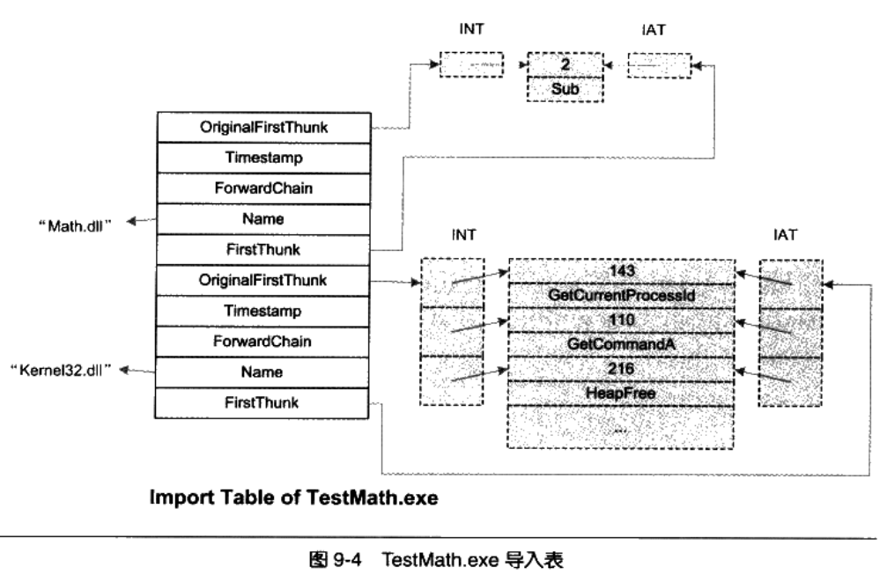

- EXP文件
  - 标准的ELF/COFFF文件，用于存放链接器遍历所有目标文件收集到的导出符号信息的临时导出表".edata"段，该段会输出到输出文件的".rdata"
- 导出重定向
  - Export Forwarding:将某个导出函数重定向到另一个DLL，使用模块定义文件,EG:`HeapAlloc=NTDLL.RtlAllocHeap`
  - 实现：RVA地址位于导出表中，指向一个ASCII字符串，该字符串在导出表中，字符串=文件名+符号名
- 导入表
  - 查看依赖模块以及导入函数：`dumpbin /IMPORTS libc.dll`
  - 导入表结构：IMAGE_IMPORT_DESCRIPTOR结构体(Winnt.h)数组，每个结构体对应一个导入的DLL
    - 结构体字段：FirstThunk 指向一个导入地址数组(Import Address Table IAT),IAT每个元素对应一个导入符号，每个元素在因不同情况有不同含义，可能是导入符号的序号也可能是符号的名字
    - 元素最高位为1，低32位为导入符号的序号值；不是1，则元素值指向一个IMAGE_IMPORT_BY_NAME的结构的RVA
      - IMAGE_IMPORT_BY_NAME由一个WORD(hint值，导入符号最有可能的序号值)和一个字符串(符号名)组成，链接器首先使用hint值定位符号在导出表的位置，若找不到则使用符合名进行二分查找
    - 结构体字段：OriginalFirstThunk，指向一个数组即导入名称表(Import Name Table INT),INT跟IAT一样，数值也一样
  - 动态链接器改写IAT：
    - IAT在刚完成映射未重定位和符号解析值，其初始值为导入符号的序号或符号名，完成模块链接后，其值修改为符号的真正地址，但PE导入表都是只读的
    - 链接器属于Windows内核，可以修改PE导入表的页面属性修改为可写，修改完值后，页面属性修改回只读
- 延迟载入 - Delay Load
  - 当链接器链接一个支持延迟载入的DLL时，链接器产生与普通DLL类似的数据，当延迟载入API第一次被调用时，由链接器添加的特殊桩代码启动，该代码负责该DLL的装载
  - GetProcAddress找到API地址
- 导入函数的调用
  - 间接调用指令：`CALL DWORD PTR [0x0040D11C]`,间接调用地址0x0040D11C中保存的地址，从该地址读取四个字节作为目标地址，然后调用该目标地址，0x0040D11C是IAT中的某一项，类似于GOT
  - 普通模块内部函数直接调用指令：`CALL XXXXXXXX`
  - 如何区分模块内部调用与模块外部调用？
    - 1.通过__declspec(dllimport)区分直接调用或间接调用
      - 具体操作：编译器对于同一个导出函数产生两个符号定义，eg:foo函数产生foo符号和__imp__foo符号，foo符号执行foo函数的桩代码,__imp_foo执行foo函数在IAT表中的位置
      - 通过__declspec(dllimport)标记的函数会在编译时添加前缀"__imp__",相比统一调用减少一条JMP指令调用
    - 2.对于导入函数不区分，统一使用直接调用，但是对于导入函数添加桩代码，该代码将控制权交给IAT中的真正目标(JMP指令)

### 9.3 DLL优化

- 出现的问题:
  - 1.大量DLL频繁的Rebase,造成程序启动速度缓慢的问题
  - 2.在大量DLL时，符号解析中的符号字符串的比较和查找问题
- 重定基址 Rebasing
  - 条件：一个进程中，多个DLL不能被装载到同一个虚拟地址，每个DLL所占用的虚拟地址空间不能重叠
  - Windows PE：采用装载时重定位的方法，对DLL中的每个绝对地址进行重定位 = 原绝对地址 + 重定位差值
  - PE重定位信息段：".reloc"
  - 空间换时间：多个进程共享DLL，导致每个进程都得有DLL代码段的副本，但运行速度比GOT更快
- 改变默认基地址
  - 前提：对于DLL默认的装载基地址为：0x100 0000,对于一个程序，DLL数量是固定的，DLL加载顺序是固定的，因此可以提前指定每个DLL的基地址，从而避免Rebasing
  - link命令：`link /BASE:0x1001000, 0x10000 /DLL libc.obj`
    - 基地址必须是64K倍数，需要指定空间允许最大长度
  - 使用editbin修改已有的DLL的基地址：`editbin /REBASE:BASE=0x10020000 libc.dll`
- 系统DLL
  - 进程空间中的专用地址空间：0x7000 0000 ~ 0x8000 0000,系统DLL都具有默认指定的基地址
- 序号
  - 前提：每个导出函数都有一个对应的序号（可以没有函数名，但是必须有唯一的序号），使用DLL导入函数时，可以使用函数名也可以使用序号，序号标识导出函数在导出表中的位置
  - 可以在def文件中定义导出函数的序号,也可以仅指定序号
  - 使用序号比使用函数名稍微快，但序号可能经常变动，函数名基本不变

```TEXT
LIBRARY Libc
EXPORTS
Add @1
Sub @2
Mul @3 NONAME
```

- 导入函数绑定
  - 前提：多数情况下，DLL以同样的顺序被加载到相同的地址，所以其导出符号的地址不变
  - DLL绑定：将函数的导出地址保存到模块的导入表中，从而省去启动时的符号解析问题
  - 使用editbin对DLL或EXE进行DLL绑定：`edit /BIND linc.[dll|exe]`,绑定完成后使用`dumpbin /IMPORTS`查看输出文件的导出信息
  - DLL绑定的实现：editbin对导入符号进行遍历查找，将找到的符号地址写入INT表
  - 导致DLL绑定地址失效的情况：
    - 1.被依赖的DLL更新
      - PE处理：校验是否失效,在地址绑定时记录每个导入DLL的时间戳和校验和，在加载时进行验证，若验证失败，则按照正常模式进行符合解析
    - 2.被依赖的DLL在装载时发生重定基址

### 9.4 C++与动态链接

- 组件对象模型（COM Component object model）
- 编写动态库的指导原则：
  - 1.所有的接口都应该是抽象的，所有的方法都应该是纯虚的（或inline）
  - 2.所有的全局函数使用“extern "C"”修饰，导出函数使用__stdcall调用规范
  - 3.不用使用C++标准库STL
  - 4.不用使用异常
  - 5.不用使用虚析构函数
  - 6.不要在DLL内申请内存，在DLL外释放（或者相反），内存分配的函数不能是inline
  - 7.不要在接口中使用重载方法

### 9.5 DLL HELL

- DLL Hell为何发生？
  - 1.DLL覆盖问题：旧版DLL覆盖新版DLL
  - 2.新版DLL兼容性问题
  - 3.新版DLL引入新BUG
- 解决方法：
  - 1.使用静态链接
  - 2.防止DLL覆盖（Windows文件保护WFP）
  - 3.避免DLL冲突
  - 4..Net解决方案：
    - 使用清单文件：Manifest文件
    - SxS Manager(Side-by-Side)程序使用清单文件实现DLL的加载
    - \Windows\WinSxS目录

### 9.6 本章总结

- DLL简介：
  - DLL在进程中的地址空间和加载
  - DLL的基地址和RVA
  - DLL的数据段
  - DLL的简单使用：创建、生成、使用
- DLL符号导出表结构
  - IAT
  - INT
  - EXP文件
  - 导出重定向问题
- DLL符号导入表结构
- DLL延迟载入
- 导入函数的调用过程
- DLL优化
  - DLL存在的问题
  - 如何进行DLL优化
    - 1.指定DLL默认基地址
    - 2.使用序号代替符号名
    - 3.导入函数绑定
- 编写DLL的原则
- DLL HELL
  - dll hell原因
  - 如何解决或者避免dll hell
