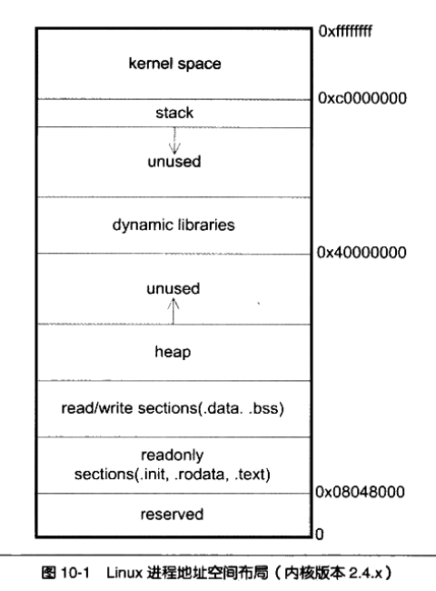
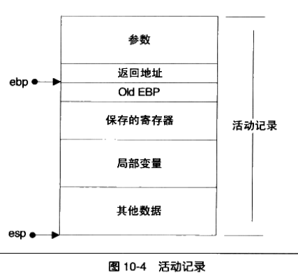
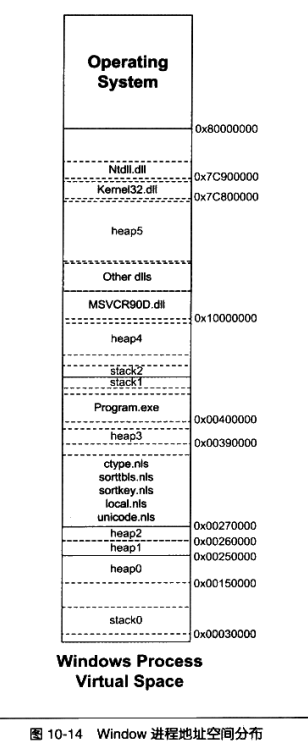

# 库与运行库

- 问题：
  - 1.malloc如何分配内存？
  - 2.局部变量存放在哪儿？
  - 3.为何一个编译好的简单的程序也占用几KB的空间？
  - 4.为什么程序一启动就有堆栈、IO、异常可用？
  - 5.为什么程序能够执行，如何执行？
- 前提 - 程序的环境：
  - 内存、运行库、系统调用

## 10 内存

- 程序与内存的关系：程序如何使用内存

### 10.1 程序的内存布局

- 内存空间
  - 平坦内存模型：直接使用32地址进行寻址，用户可以使用32位指针访问任意的内存位置
  - 不同的内存区域有不同的地位：
    - 内核空间（Windows 高地址的2GB、Linux高地址1GB），用户程序不能访问
    - 用户空间：划分多个区域
      - 栈：用于维护函数调用的上下文，通常在用户空间的最高地址处分配，具有数M字节大小
      - 堆：用于容纳应用程序动态分配的内存区域（malloc\new），通常位于低地址方向，一般较大，数M或数百M字节
      - 可执行文件映像：存储可执行文件在内存的映像
      - 保留区：对内存中受保护而禁止访问的内存区域的总称
- Q:程序常见问题："段错误"、"非法操作，该内存地址不能读写"
- A:1.指针初始化为NULL后，未进行合理赋值就使用导致；2.没有初始化栈上的指针，该指针的值为随机值，然后直接使用导致；

### 10.2 栈与调用惯例

- 什么是栈？
  - 栈的遵循的数据规则：FILO First In Last Out
  - 操作：入栈push  出栈 pop
  - i386中，栈顶由esp寄存器进行定位，push使esp减小，pop是esp增大

- 堆栈帧(Stack Frame)\活动记录(Activate Record)
  - 一个函数调用所需要的维护信息
  - 通常包含：函数的返回地址和参数、临时变量(函数的非静态局部变量、编译器自动生成的临时变量)、保存的上下文(函数调用前后保持不变的寄存器)
  - i386中使用两个指针划分活动记录：esp\ebp
    - esp：始终指向栈顶
    - ebp：指向函数活动记录的一个固定位置(称为帧指针),不随当前函数的执行而变化
      - ebp之前(ebp-4)为函数的返回地址,再之前为压入栈中的参数，具体视参数数量和大小确定
      - ebp指向的值为调用该函数前ebp的值(即调用当前函数的调用函数的ebp值)
  - i386函数调用规则：
    - 1.将所有或部分参数压入栈（没有入栈的使用某些寄存器传递）
    - 2.将当前指令的下一条执行地址入栈
    - 3.跳转到函数执行
  - 标准i386函数体开头：
    - push ebp //将old ebp入栈
    - mov ebp,esp //ebp = esp
    - sub esp,XXX [or] push XXX //分配空间或者保存寄存器
  - 标准i386函数体结尾：
    - pop XXX //可选恢复寄存器值
    - mov esp,ebp //回收局部变量
    - pop ebp //从栈恢复保存的ebp
    - ret //从栈取得返回值，并跳转

- 未初始化的变量或者内存区域，值为"烫"原因：
  - 1.Debug模式会将所有分配的空间每个字节初始化为0xCC，0xCCCC为汉字"烫"，有的初始化为0xCD，0xCDCD为汉字"屯"
- 在某些场合下，函数的进入和退出并非按照标准方式进行
- Windwos下的运行时指令插入 HOOK实现技术：
  - 特殊指令：`mov edi,edi`,意义作为2字节的占位符存在
  - 在运行时，将2字节的占位符替换为指定的2字节跳转指令
- 调用惯例
  - 调用惯例Calling Convention：函数的调用方和被调用方对于函数如何调用遵循的明确的约定
  - 内容：
    - 1.函数参数的传递方式和顺序
    - 2.栈的维护方式
    - 3.名字修饰的策略：对不同的调用惯例进行区分，需要对函数进行修饰
      - C语音cdecl惯例修饰：`int _cdecl foo(int x)`
      - GCC:`__attribute__((cdecl))`
      - cdecl规则：从右往左顺序参数入栈；函数调用方出栈；名字修饰：函数名前加一个下划线
  - 其他的调用惯例：cdecl、stdcall、fastcall、pascal、thiscall
- 函数返回值传递
  - 对于返回5-8字节的情况，几乎所有的调用惯例都是采用eax\edx联合返回，eax存储返回值的低4字节，edx存储高1~4字节
  - 对于超过8字节的情况：
    - 函数返回时使用一个临时的栈上内存区域作为中转，其结果被复制了两次（数据到临时对象、临时对象到函数的返回对象）
- C++返回对象
  - C++返回一个对象时，要经过两次拷贝构造函数的调用（复制到栈上的临时对象，把临时对象复制到存储返回值的对象）
  - C++返回值优化技术，可以将对象复制减少1次

### 10.3 堆与内存管理

- malloc:由于系统调用性能较差，因此空间分配有运行库管理，运行库向操作系统申请一大堆空间供程序使用，当用完后，再次申请，运行库使用堆的分配算法管理空间
- 运行库如何向操作系统申请内存？
- Linux进程堆管理
  - Linux提供两种堆空间分配方式：
    - brk()系统调用,设置进程数据段的结束地址，即扩大或者缩小，将地址向高地址移动则扩大，扩大的部分即可用于堆使用
    - mmap()系统调用，类似于windows的VirtualAlloc即向系统申请一段虚拟内存（该内存可以映射到某个文件，也可以不映射文件称为匿名空间），匿名空间可以作为堆空间
  - glibc的malloc函数：
    - 对于小于128KB，在现有堆空间分配
    - 对于大于128KB，使用mmap()申请匿名空间，在匿名空间中分配
  - 一次malloc能够申请的最大内存是多少？
    - 从BSS段结束到0x40 000 000
    - 从共享库到栈
    - 不同Linux内核不一样，大约2.9G
    - 还有其他影响因素
- Windows进程管理 

  - API：VirtualAlloc，向系统申请虚拟内存，申请大学必须是页的整数倍
  - 堆管理器核心接口API：
    - HeapCreate:创建一个堆
    - HeapAlloc:在堆里分配内存
    - HeapFree:释放已分配的内存
    - HeapDestroy:销毁一个堆
    - 堆管理器的位置：
      - 1.NTDLL.dll:windows用户层最底层的DLL，用户程序、运行时库、子系统的堆分配
      - 2.Ntoskrnl.exe:windows内核中的堆空间分配、内核组件、驱动程序，接口以RtlHeap开头
  - 每个进程创建时有一个默认1M的堆，当堆空间不够时，malloc会自动创建新堆
  - Q:malloc申请的空间一定是连续的吗？
  - A:对于虚拟空间一定是连续的，但对于物理空间不一定连续
- 堆分配算法
  - 管理一大块连续内存，并提供分配、释放
  - 空闲链表
  - 位图
  - 对象池

### 10.4 本章总结

- 程序内的内存布局
- 栈与栈帧、调用惯例、函数调用、函数的返回值
- 程序中堆的位置、堆如何分配、堆的管理算法

## 11 运行库

- 程序的开始
- 典型的程序运行步骤：
  - 1.OS创建进程，控制权交给程序入口函数
  - 2.入口函数对运行库和运行环境初始化(堆、I/O、线程、全局变量构造)
  - 3.入口函数完成初始化后，调用main函数，开始执行程序主体
  - 4.main函数执行完毕后,返回入口函数，入口函数执行清理工作，调用系统调用结束进程
- 入口函数的实现
  - 不同情况下启动过程有所不同：静态glibc\动态glibc\可执行文件\共享库
  - 以下默认都是静态glibc+可执行文件
  - glibc入口函数
    - 
