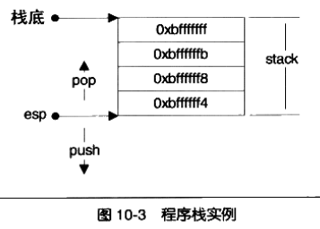

# 10 库与运行库

- 问题：
  - 1.malloc如何分配内存？
  - 2.局部变量存放在哪儿？
  - 3.为何一个编译好的简单的程序也占用几KB的空间？
  - 4.为什么程序一启动就有堆栈、IO、异常可用？
  - 5.为什么程序能够执行，如何执行？
- 前提 - 程序的环境：
  - 内存、运行库、系统调用

## 10 内存

- 程序与内存的关系：程序如何使用内存

### 10.1 程序的内存布局

- 内存空间
  - 平坦内存模型：直接使用32地址进行寻址，用户可以使用32位指针访问任意的内存位置
  - 不同的内存区域有不同的地位：
    - 内核空间（Windows 高地址的2GB、Linux高地址1GB），用户程序不能访问
    - 用户空间：划分多个区域
      - 栈：用于维护函数调用的上下文，通常在用户空间的最高地址处分配，具有数M字节大小
      - 堆：用于容纳应用程序动态分配的内存区域（malloc\new），通常位于低地址方向，一般较大，数M或数百M字节
      - 可执行文件映像：存储可执行文件在内存的映像
      - 保留区：对内存中受保护而禁止访问的内存区域的总称
- Q:程序常见问题："段错误"、"非法操作，该内存地址不能读写"
- A:1.指针初始化为NULL后，未进行合理赋值就使用导致；2.没有初始化栈上的指针，该指针的值为随机值，然后直接使用导致；


### 10.2 栈与调用惯例

- 什么是栈？
  - 栈的遵循的数据规则：FILO First In Last Out
  - 操作：入栈push  出栈 pop
  - i386中，栈顶由esp寄存器进行定位，push使esp减小，pop是esp增大



- 堆栈帧(Stack Frame)\活动记录(Activate Record)
  - 一个函数调用所需要的维护信息
  - 通常包含：函数的返回地址和参数、临时变量(函数的非静态局部变量、编译器自动生成的临时变量)、保存的上下文(函数调用前后保持不变的寄存器)
  - i386中使用两个指针划分活动记录：esp\ebp
    - esp：始终指向栈顶
    - ebp：指向函数活动记录的一个固定位置(称为帧指针),不随当前函数的执行而变化
      - ebp之前(ebp-4)为函数的返回地址,再之前为压入栈中的参数，具体视参数数量和大小确定
      - ebp指向的值为调用该函数前ebp的值(即调用当前函数的调用函数的ebp值)
  - i386函数调用规则：
    - 1.将所有或部分参数压入栈（没有入栈的使用某些寄存器传递）
    - 2.将当前指令的下一条执行地址入栈
    - 3.跳转到函数执行
  - 标准i386函数体开头：
    - push ebp //将old ebp入栈
    - mov ebp,esp //ebp = esp
    - sub esp,XXX [or] push XXX //分配空间或者保存寄存器
  - 标准i386函数体结尾：
    - pop XXX //可选恢复寄存器值
    - mov esp,ebp //回收局部变量
    - pop ebp //从栈恢复保存的ebp
    - ret //从栈取得返回值，并跳转


- 未初始化的变量或者内存区域，值为"烫"原因：
  - 1.Debug模式会将所有分配的空间每个字节初始化为0xCC，0xCCCC为汉字"烫"，有的初始化为0xCD，0xCDCD为汉字"屯"
- 在某些场合下，函数的进入和退出并非按照标准方式进行
- Windwos下的运行时指令插入 HOOK实现技术：
  - 特殊指令：`mov edi,edi`,意义作为2字节的占位符存在
  - 在运行时，将2字节的占位符替换为指定的2字节跳转指令
- 调用惯例
  - 调用惯例Calling Convention：函数的调用方和被调用方对于函数如何调用遵循的明确的约定
  - 内容：
    - 1.函数参数的传递方式和顺序
    - 2.栈的维护方式
    - 3.名字修饰的策略：对不同的调用惯例进行区分，需要对函数进行修饰
      - C语音cdecl惯例修饰：`int _cdecl foo(int x)`
      - GCC:`__attribute__((cdecl))`
      - cdecl规则：从右往左顺序参数入栈；函数调用方出栈；名字修饰：函数名前加一个下划线
  - 其他的调用惯例：cdecl、stdcall、fastcall、pascal、thiscall
- 函数返回值传递
  - 对于返回5-8字节的情况，几乎所有的调用惯例都是采用eax\edx联合返回，eax存储返回值的低4字节，edx存储高1~4字节
  - 对于超过8字节的情况：
    - 函数返回时使用一个临时的栈上内存区域作为中转，其结果被复制了两次（数据到临时对象、临时对象到函数的返回对象）
- C++返回对象
  - C++返回一个对象时，要经过两次拷贝构造函数的调用（复制到栈上的临时对象，把临时对象复制到存储返回值的对象）
  - C++返回值优化技术，可以将对象复制减少1次

### 10.3 堆与内存管理

- malloc:由于系统调用性能较差，因此空间分配有运行库管理，运行库向操作系统申请一大堆空间供程序使用，当用完后，再次申请，运行库使用堆的分配算法管理空间
- 运行库如何向操作系统申请内存？
- Linux进程堆管理
  - Linux提供两种堆空间分配方式：
    - brk()系统调用,设置进程数据段的结束地址，即扩大或者缩小，将地址向高地址移动则扩大，扩大的部分即可用于堆使用
    - mmap()系统调用，类似于windows的VirtualAlloc即向系统申请一段虚拟内存（该内存可以映射到某个文件，也可以不映射文件称为匿名空间），匿名空间可以作为堆空间
  - glibc的malloc函数：
    - 对于小于128KB，在现有堆空间分配
    - 对于大于128KB，使用mmap()申请匿名空间，在匿名空间中分配
  - 一次malloc能够申请的最大内存是多少？
    - 从BSS段结束到0x40 000 000
    - 从共享库到栈
    - 不同Linux内核不一样，大约2.9G
    - 还有其他影响因素
- Windows进程管理<br>

  - API：VirtualAlloc，向系统申请虚拟内存，申请大学必须是页的整数倍
  - 堆管理器核心接口API：
    - HeapCreate:创建一个堆
    - HeapAlloc:在堆里分配内存
    - HeapFree:释放已分配的内存
    - HeapDestroy:销毁一个堆
    - 堆管理器的位置：
      - 1.NTDLL.dll:windows用户层最底层的DLL，用户程序、运行时库、子系统的堆分配
      - 2.Ntoskrnl.exe:windows内核中的堆空间分配、内核组件、驱动程序，接口以RtlHeap开头
  - 每个进程创建时有一个默认1M的堆，当堆空间不够时，malloc会自动创建新堆
  - Q:malloc申请的空间一定是连续的吗？
  - A:对于虚拟空间一定是连续的，但对于物理空间不一定连续
- 堆分配算法
  - 管理一大块连续内存，并提供分配、释放
  - 空闲链表
  - 位图
  - 对象池

### 10.4 本章总结

- 程序内的内存布局
- 栈与栈帧、调用惯例、函数调用、函数的返回值
- 程序中堆的位置、堆如何分配、堆的管理算法

## 11 运行库

### 11.1  程序的开始

- 典型的程序运行步骤：
  - 1.OS创建进程，控制权交给程序入口函数
  - 2.入口函数对运行库和运行环境初始化(堆、I/O、线程、全局变量构造)
  - 3.入口函数完成初始化后，调用main函数，开始执行程序主体
  - 4.main函数执行完毕后,返回入口函数，入口函数执行清理工作，调用系统调用结束进程
- 入口函数的实现
  - 不同情况下启动过程有所不同：静态glibc\动态glibc\可执行文件\共享库
  - 以下默认都是静态glibc+可执行文件
  - glibc入口函数
    - `_start`:由汇编实现与平台相关,加载进程参数和环境变量
    - `_lib_start_main`：注册fini、调用ini函数、调用main、调用exit、调用_exit
    - hlt指令作用：检测exit系统能否正常执行，否则强行停止进程
  - MSVC CRT入口函数：
    - crt\src\crt0.c:mainCRTStartup函数
    - 1.系统变量赋值：操作系统信息（此处调用alloca在栈上分配内存，堆未初始化）
    - 2.初始化堆
    - 3.初始化IO
    - 4.获取命令行参数和环境变量
    - 5.设置命令行参数、设置环境变量
    - 6.初始化C运行库：_cinit
    - 7.调用main函数
    - 8.调用C退出代码:_cexit
    - Q&A
      - Q:alloca如何实现在栈上分配内存？
      - A:减少ESP值（ESP指向栈顶位置指针）
      - Q:为何使用MSVC编译的Win32程序的入口函数是WinMain？
      - A:MSVC的程序入口都是同一段代码，但是MSVC根据不同编译参数被编译为不同的版本，不同的版本指定的入口函数不同
- 运行库与IO
  - 文件描述符(File Descriptor) 句柄(Handle),用户通过某个打开文件函数获得该文件的句柄，并依据该句柄对文件进行操作和处理
  - 文件句柄总是和内核文件关联(内核可以通过文件句柄获取内核文件对象的地址)
  - Linux:
    - 内核中，每个进程都有一个私有的打开文件列表(指针数组,位于内核),每个元素指向一个打开的内核文件对象，fd为该表的下标


- MSVC CRT入口函数初始化
  - 系统堆初始化
    - mainCRTStartup->_heap_init()
    - 调用HeapCreate()
  - IO初始化
    - FILE结构定义：`_iobuf`
    - 通过`_file`字段访问内部文件句柄表
    - 句柄信息的数据结构：`ioinfo`
    - `crt/src/ioinit.c`中数组：`ioinfo * __pioinfo[64]`表示用户态的打开文件表,相当于二维数组(使用指针数组比二维数组更加节省空间)
    - IO初始化即为初始化二维打开文件表
      - 建立打开文件列表
      - 父进程继承的打开文件表
      - 操作系统提供的标准输入输出


### 11.2 C/C++运行库

- C语言运行库
  - 运行时库Runtime Library,C语言运行时库:C运行库 CRT
  - CRT包括：启动与退出、标准函数、IO、堆、语言实现、调试
- C语言标准库
  - 包括：标准输入输出stdio.h、文件操作stdio.h、字符操作ctype.h、字符串操作string.h、数学函数math.h、资源管理stdlib.h、格式转换stdlib.h、时间日期time、断言assert、常量limits.h/float.h、变长参数stdarg.h、非局部跳转setjmp.h
  - 变长参数：
    - 定义变长参数：`int Adds(int c, ...)`
    - 访问变长参数(4.crt.c)：
      ```C
      #include "stdarg.h"
      int Adds(int c, ...)
      {
          int ret = 0;
          va_list args;
          va_start(args, c);
          while (c--)
          {
              int x = va_arg(args, int);
              ret += x;
          }
          va_end(args);
          return ret;
      }
      ```
  - 非局部跳转(4.crt.c)：
    - 实现从一个函数体向另一个函数体内跳转
- glibc与MSVC CRT
  - glibc发布版组成：头文件+二进制文件(静态版/动态版)
  - glibc启动文件：
    - ctr1.o(含_start)+全局构造和析构函数调用代码 ===> ctr1.o
    - crt0.o不含全局构造和析构函数的调用代码
    - 辅助初始化代码：crti.o(包含.init段),crtn.o(含.finit段)
    - 链接的一般顺序：`ld crt1.o crti.o [user objects] [system libraries] crtn.o`
    - C++全局构造和析构函数的代码不在.init/.finit段内(仅含有调用该函数的代码)
    - 可通过`__attribute__((section(".init")))`将函数放入init段内，但是函数的返回指令ret会让_init()提前返回，必须使用汇编指令
    - gcc平台相关：
      - ctrbeginT.o/crtend.o用于提供C++全局构造和析构的实现
- MSVC CRT
  - MSVC CRT版本分类：动态/静态版、单线程/多线程版、调试/发布版、纯C运行库/C++版
  - 静态版命名规则：`libc [p][mt][d].lib`
  - 动态版crt:两个文件lib+dll
- Q&A
  - Q：同一程序内不同的obj/dll使用不同版本CRT,有何问题？
  - A:完全静态链接，基本是没问题；动态链接可能有问题；可通过参数禁止某些版本CRT；资源传递有问题(申请的内存释放问题、文件句柄使用问题)

### 11.3 运行库与多线程

- CRT多线程问题
  - 线程访问权限
    - 线程的私有空间：
      - 栈、线程局部存储TLS、寄存器
      - 局部变量、线程参数、TLS
    - 线程共享空间：
      - 堆、全局变量、函数静态变量、程序代码、打开的文件
  - 多线程运行库
    - C/C++标准库内不含线程部分
    - 多线程操作接口：线程创建、运行、销毁
      - windows:_beginthread()、_endthread()
      - Linux:pthread库
    - 多线程环境：C运行库支持多线程执行
      - 线程安全的函数
  - CRT改进
    - 使用TLS
    - 加锁
    - 改进函数调用方式
- TLS的实现
  - gcc定义TLS变量:`__thread int tls_int_a`
  - msvc:`__declspec(thread) int tls_int_a`
  - vista/2008之前的系统通过显式加载的DLL无法使用其内部的TLS全局变量
  - TLS变量对每个线程都有一个副本
  - WindowsTLS实现
    - 将被declspec标记的变量放入PE的`.tls`段内，当进程启动一个新线程时，系统将.tls内容复制到一个新空间中，即每个线程具有独立的tls副本，因此对于TLS的同一个变量在不同线程中的地址不同
    - TLS变量处理：复制tls段时，会调用TLS对象的全局构造函数进行初始化，线程退出时还会调用全局析构函数
    - TLS表：数据目录结构中的元素IMAGE_DIRECT_ENTRY_TLS,该元素指向TLS表，TLS表通常位于`.rdata`段
    - 线程如何访问TLS变量：线程环境块TEB Thread Environment Block,保存线程信息和TLS数组
  - 显示TLS
    - 代码显式操作TLS变量：申请、取值、赋值、释放
    - Windows:TlsAlloc()/TlsGetValue()/TlsSetValue()/TlsFree()
    - Linux:pthread_key_create()/pthread_getspecific()/pthread_setsepecific()/pthread_key_delete()
    - Q:CreateThread()与_beginthread()区别？
    - A:_tiddata释放问题

### 11.4 C++全局构造与析构

- glibc构造
  - 由`.init`和`.finit`段拼成的函数init()和finit(),先/后于main函数执行
  - 程序启动过程：
    - `_start->__libc_start_main->__libc_csu_init(csu/Elf-init.c)->_init->__do_global_ctors_aux(crtbegin.o gcc/Crtstuff.c)`
    - 在__do_global_ctors_aux函数中遍历 `__CTOR_LIST__`,把第一个元素作为数组元素个数，之后的每个元素作为函数指针调用
    - `__CTOR_LIST__`存放所有的全局对象的构造函数
    - 编译器如何产生全局构造函数？
      - 编译器：对于每个编译单元.cpp，GCC编译器变量其中的所有的全局/静态对象，构建一个特殊的函数，该函数用于将本单元内所有的全局/静态对象进行初始化和析构，然后在目标文件的`.ctors`段里放一个指向该函数的指针
      - 链接器：链接器连接目标文件时，将同名的段进行合并，多个`.ctors`段合并为一个，形成了函数指针数组，特殊的目标文件ctrbegin.o和crtend.o,都具有`.ctors`段同样被合并，前者开头为一个4字节的-1，修改为全局构造函数的数量，并将该段起始地址定义为符号`__CTOR_LIST__`，后者`.ctors`内容为0，定义一个符号`__CTOR_END__`执行.ctor的末尾
    - 链接顺序：
      - `ld ctri.o ctrbegin.o [user object] [system object] ctrend.o ctrn.o`
      - 忽略ctri.o/ctrn.o,这两个目标文件不参与全局构造/析构
    - 演示：[在main函数前调用函数](./4.crt.c)


- glibc析构
  - 与构造类似：`__do_global_dtor_aux/__DTOR_LIST__`
  - `__libc_start_main`将`__libc_csu_fini`通过`___cxa_exit()`注册到退出列表中
- MSVC CRT全局构造
  - 入口函数:mainCRTStartup->_initterm
  - _initterml类似于`__do_global_ctors_aux`,其参数`__xc_a/__xc_z`类似于`__CTOR_LIST__/__CTOR_END__`,其参数为全局变量，在调用mainCRTStartup前已经构建完成(crt/src/cinitexe.c)
  - 宏`_CRTALLOC`(crt/src/sect_attribs.h)
  - 语法：`#pragma section("section-name"[,attribute])`,在目标文件中创建名为section-name的属性为attributes的段
  - 即在生成的目标文件内单元创建了段`.CRT$XCA/.CRT$XCZ`，同时在每个编译单元内生成`.CRT$XCU`的段，该段内放入该编译单元的所有的全局初始化函数
  - 链接时将所有同名段进行合并，合并到输出时，所有段按照字母表顺序进行排列，所有的`.CRT$XC*`属性都是只读的，且名称相近，因此都以此被放入`.rdata`中的位置,自然形成了全局构造函数数组,供_initterm函数遍历
  - 演示：[MSVC自己添加初始化函数](./4.crt.c)


- MSVC CRT析构
  - 在全局变量的构造函数内，通过注册atexit()实现全局析构
  - 与glibc析构类型

### 11.5 fread实现

- IO部分为运行库最复杂的部分之一
- fread:通过系统API：ReadFile()实现，从fread到ReadFile的详细过程
- fread函数签名与ReadFile函数签名
- 缓冲
  - 读文件缓冲
  - 写文件缓冲
  - 缓冲的C语言API
    - `int fflush(FILE* stream)/int setvbuf(FILE* stream,char* buf,int mode,size_t size)/void setbuf(FILE* stream,char* buf)`
    - flush:针对写而言，指将缓冲内的数据全部写入文件，并清空缓冲
- fread_s
  - fread->fread_s
  - 参数检查、对文件加锁、调用_fread_nolock_s,调用完解锁，返回
- fread_nolock_s
  - 执行具体读取过程
- _read
  - ReadFile
- 文本换行 不同操作系统文本换行符不同需要进行统一转换
- fread总结
  - fread->fread_s(添加缓冲溢出保护、加锁)->_fread_nolock_s(循环读取缓冲)->_read(换行符转换)->ReadFile(API读取文件)

### 11.6 总结

- 程序如何开始？
  - OS创建进程，控制转交入口函数
  - 入口函数进行初始化(运行库、环境、堆、IO)
  - 入口函数调用main函数，执行主体
  - main函数退出，执行清理
- glibc入口函数
- msvc crt入口函数
- 运行库初始化\堆初始化、IO初始化
- C++运行库组成、glibc与msvc crt
- 运行库版本问题
- TLS
- glibc全局构造与析构
- msvc crt全局构造与析构
- 从CRT中的fread到WindowsAPI ReadFile的执行过程

## 12 系统调用与API

- 系统调用 System Call

### 12.1 系统调用介绍

- 操作系统通过中断实现接口，Linux:0x80,Windows:0x2E
- 通过运行库的统一调用，解决不同平台的系统调用问题，提升代码的可移植性

### 12.2 系统调用原理

- 特权级与中断
  - 用户模式User Mode、内核模式Kernel Mode
  - 操作系统一般通过中断从用户态切换到内核态
  - 中断Interrupt
    - 中断号
    - 中断处理程序：中断向量表，一个指向中断处理程序的指针数组
    - 硬件中断、软件中断（i386中断指令：int (中断号)）
    - 通常一个中断号对应多个系统调用或所有系统调用，通过系统调用好确定具体的某个系统调用
      - Windows：系统调用中断号(i386)：int 0x2e
      - Linux:系统调用号由特定寄存器eax传入，int 0x80为系统中断号
  - 基于int的Linux的经典系统调用实现
    - 1.触发中断：fork函数,为一个_syscall0的宏函数，用于定义一个没有参数的系统调用的封装，第一个参数为系统调用的返回值类型，第二个参数为系统调用名称(Linux/include/asm-x86/unistd_32.h)
      - 系统调用的参数通过寄存器ebx/ecx/edx/esi/edi/ebp传递,最多支持6个参数
      ```C
      push ebx //第一个参数寄存器压栈
      eax = __NR_##name //传递系统调用号到eax寄存器
      ebx = arg1  //传递第一个参数到ebx寄存器
      int 0x80  //触发0x80中断，执行中断处理程序
      __res = eax //系统调用返回值 放入__res
      pop ebx //第一个参数寄存器出栈
      ```
    - 2.切换堆栈
      - 在执行0x80的中断处理程序前，需要切换栈，Linux中用户态和内核态使用不同栈，各种负责函数调用，即当前栈从用户栈切换到内核栈，执行中断处理程序返回，当前栈从内核栈切换为用户栈，当前栈指栈顶指针ESP所在的空间,寄存器SS指向当前栈所在的页
      - 用户栈切内核栈
        - 1.保存当前ESP/SS
        - 2.将ESP/SS设置为内核栈值
      - 内核栈切用户栈
        - 1.恢复原来保存的ESP/SS
        - 2.用户态的ESP/SS保存在内核栈上
      - 0x80中断硬件处理：
        - 1.找到当前进程内核栈
        - 2.内核栈依次压入用户态寄存器SS/ESP/EFLAGS/CS/EIP
      - 内核使用`iret`指令返回用户态，`iret`指令将从内核栈上弹出保存的用户态寄存器
        
    - 3.中断处理程序
        
      - 中断向量表(Linux/arch/i386/kernel/traps.h),trap_init函数初始化中断向量表,系统调用为`set_system_gate(SYSCALL_VECTOR,&system_call)`,中断号定义在Linux/include/asm-i386/mach-default/irq_vector.h
      - 最终执行的函数为system_call，定义在Linux/arch/i386/kernel/entry.S
      - `main->fork->int 0x80->system_call`
  - Linux新型系统调用机制
    - 专门针对系统调用的指令：sysenter/sysexit
    - 虚拟动态共享库：linux-gate.so.1,加载地址总是0xffffe000
    - `__kernel_vsyscall`

### 12.3 Windows API


- Windows API概览
  - WindowsAPI版本：
    - Win16 - 核心DLL:kernel.exe(kernel286.exe/kernel386.exe)/user.exe/gdi.exe
    - Win32 - 核心DLL:Kernel.dll/user32.dll/gdi32.dll
    - Win64 - 与32位类似，指针变为64位
  - Win32DLL功能划分
    - 基本服务-kernel32.dll/图像设备接口-gdi32.dll/用户接口-user32.dll
    - 高级服务-advapi32.dll/通用对话框-comdlg32.dll/通用控件-comctl32.dll/Shell-shell32.dll/网络服务-ws_32.dll
  - 底层DLL:NTDLL.dll,该dll将内核的系统调用进行包装，kernel.dll/user.dll均依赖此dll,导出函数大多以Nt开头
- 使用Windows API的原因：
  - 尽量隔离硬件结构不同而导致的程序兼容问题
  - 隔离内核不同，Windows 9x与Windows NT内核
- Windows API实例
  - 9x内核不原生支持Unicode,系统调用都是ANSI
  - NT内核原生支持unicode,所有系统调用都是unicode
  - `char*`类型 使用ANSI编码，FuncA
  - `wchar_t*`类型 使用unicode编码，FuncW
  - 即ANSI版本API和unicode版本API
  - 通过宏`UNICODE`，对应的函数会展开为A版或者W版
  
- Windows API与子系统

### 12.4 总结

- 系统调用的概念
- 系统调用的实现原理
- Windows API介绍

## 13 运行库实现

- 实现简单的CLR,具有关键功能：入口函数、初始化、堆管理、基本IO、

### 13.1 C运行库

- 简易版CRT基本功能
  - 入口函数
  - 基本的进程操作
  - 堆操作
  - 基本文件操作
  - 基本字符串操作
  - 格式化字符串操作
  - atexit()函数
  - 跨平台
- mimi crt实现

### 13.2 如何使用mini crt

- gcc编译:
  - `gcc -c -fno-builtin -nostdlib -fno-stack-protector 4.miniCRT.c 4.malloc.c 4.stdio.c 4.string.c`
  - `ar -rs 4.miniCRT.a 4.malloc.o 4.stdio.o 4.sting.o`
    - 说明：
      - `-fno-builtin`:关闭GCC内置函数功能
      - `-nostdlib`:不使用来自glibc/gcc的库文件和启动文件(包含-nostartfiles)
      - `-fno-stack-protector`:关闭堆栈保护
- Windows下MSVC CRT编译
  - `cl /c /DWIN32 /GS- 4.miniCRT.c 4.malloc.c 4.stdio.c 4.string.c`
  - `lib 4.miniCRT.obj 4.malloc.obj 4.stdio.obj 4.string.obj /OUT:4.miniCRT.lib`
    - `/DWIN32`：定义宏WIN32
    - `/GS-`:关闭堆栈保护
- 使用miniCrt
  - gcc:编译时指定入口函数:-e mini_crt_entry
  - msvc:指定入口函数 /entry:mini_crt_entry,定义符号WIN32

### 13.3 C++运行库的实现

- Linux:
  - C运行库 - libc.so/libc.a
  - C++运行库 - libstdc++.so/libstdc++.a
- Windows:
  - C运行库 - libcmt.lib/msvcr90.dll
  - C++运行库 - libcpmt.lib/msvcp90.dll
- 反汇编：`objdump -dr hello.o`
- 反修饰符号：`c++fit [符号]`

### 13.4 如何使用Mini CRT++

- 编译MiniCRT++
  - windows:
    - `cl /c /DWIN32 /GS- 4.miniCRT.c 4.malloc.c 4.stdio.c 4.string.c 4.atexit.c`
    - `cl /c /DWIN32 /GS- /GR- 4.crtbegin.cpp 4.crtend.cpp 4.ctor.cpp 4.new_delete.cpp 4.iostream.cpp`
    - `lib 4.miniCRT.obj 4.malloc.obj 4.stdio.obj 4.string.obj 4.atexit.obj ctor.obj new_delete.obj iostream.obj ...obj /OUT:4.miniCRT.lib`
  - gcc:
    - `gcc -c -fno-builtin -fno-stdlib -fno-stack-protector 4.miniCRT.c ....c 4.atexit.c`
    - `g++ -c -nostdinc++ -fno-rtti -fno-exceptions -fno-builtin -nostdlib -fno-stack-protector 4.crtbegin.cpp 4.crtend.cpp ...cpp 4.sysdep.cpp`
    - `ar -rs 4.miniCRT.a 4.malloc.o ...o 4.sysdep.o`

### 13.5 总结

- 尝试实现一个C运行库
- 使用C运行库，编写和运行C程序
- 为C运行库添加C++特性的支持
- 编译C++版运行库，使用C++运行库
