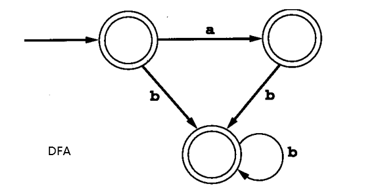

# 02词法分析

- 词法分析：lexical analysis、词义：lexeme
- 读取源代码文本，并拆分为记号
- 扫描的格式说明和识别方法：正则表达式、有穷自动机

## 2.1 扫描处理

- 从源代码读取字符流并形成编译器要处理的逻辑单元，记号Token
- 通常记号表示为枚举类型，分为：保留字(reserved word)、特殊符号(special symbol)、多字符串的记号
- 记号必须与字符串分开,与记号相关的值：属性

## 2.2 正则表达式

- L(r)
- 定义
  - 1.基本正则表达式
  - 2.运算 ：|、连结、重复*
  - 3.从各选择对象中选择,$L(r|s)=L(r) \cup L(s)$
  - 4.运算的优先和括号的使用，重复的优先级较高,$L(a|b^*)=L(a|(b^*))$
$$
S^*= \bigcup_{n=0}^{\infty}{S^n} \\
L(r^*)=L(r)^* \\
$$

- 一个或者多个重复:`+`
- 任意字符:`.`
- 字符范围:`[a-z]、[0-9]`
- 不在指定字符范围:`~(a|b|c|d)`
- 可选的子表达式:`?`

## 2.3 有穷自动机

- 用于描述特定算法的数学方法
- 开始状态、接受状态
- DFA:确定性有穷自动机，deterministic-确定性的
- NFA:非确定性有穷自动机，nonedeterministic finite automaton

- $\epsilon -转换：无需考虑输入串就有可能发生的转换$，用途：为每一个记号合并自动机；描述空串的匹配
- 用代码实现有穷自动机
  - 表驱动：列-输入字符+是否接受；行-状态

## 2.4 从正则表达式到DFA

- 将正则表达式转换为DFA,或者将DFA转换为正则表达式
- 一般过程：正则表达式->NFA->DFA->程序
- Thompson结构：Thompson Construction,$使用\epsilon-转换将正则表达式的机器片段构建在一起以构成与整个表达式相对应的机器$
  - 通过对基本的正则表达式构建NFA,然后通过连接NFA得到整个正则表达式的NFA
  - 1.基础表达式
  - 2.并集与选择
  - 3.重复
- 从NFA到DFA
  - 需要从单字符的某种状态中去掉$\epsilon-转换和多重转换$
  - $\epsilon-闭包closure$：可由 $\epsilon-转换从某状态或者某些状态达到的所有状态集合$
  - 状态集合的闭包=状态集合所有闭包的并集

$$
\bar{S}= \bigcup_{s \in S}{\bar{s}}
$$

  - 1.$状态集合的\epsilon-闭包，一个状态的\epsilon-闭包总是包含该状态自身$
  - 2.子集构造

- 利用子集构造模拟NFA
  - 仅根据下一个输入字符构造一个状态
- 将DFA中的状态数最小化
  - 结论：对于任何DFA都有唯一一个含有最少状态数的等价DFA
  - 通过某个状态是否接受某个转换进行区分

## 2.5 TINY扫描程序的实现

- 