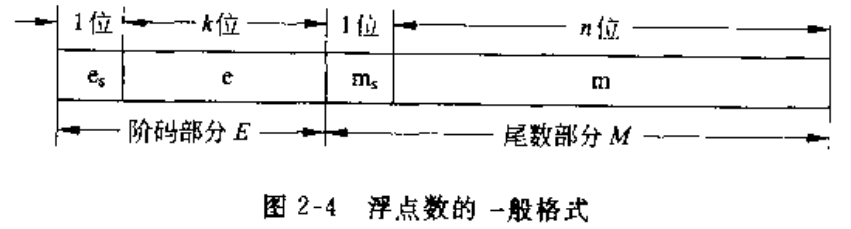

# 01 概论与数据的机器层次表示

## 1 概论

- 电子管、晶体管、集成电路
- 存储程序概念 - 冯诺依曼结构
  - 组成：运算器、存储器、控制器、输入设备、输出设备
  - 采用二进制表示数据和指令,事先将程序和数据放入存储器，然后启动计算机
- 非冯诺依曼结构

- 计算机硬件组成
  - CPU=计算器+控制器
  - 组成：CPU+主存储设备+外围设备
- 总线结构
  - 单总线结构：总线结构=地址总线+数据总线+控制总线
  - 总线电路：三态门
- 大中型计算机结构
  - 主机-->通道-->控制器-->外设
- 计算机系统
  - 多层次结构
    - 微程序级（微指令集）--传统机器级（机器指令）--操作系统级（作业控制语言）--汇编语言---高级语言--应用语言
- 工作过程和性能指标
  - 程序放入主存储器，控制器控制逐条取出执行
  - 指标
    - 机器字长：参与运算的数的基本位数，只内部加法器、寄存器位数，1Byte=8bit
    - 数据通路宽度：数据总线一次所能并行传送信息的位数，指外部数据总线宽度，可能与CPU寄存器大小不一致
    - 主存容量：K M G T P
    - 运算速度：
      - 评估机器运算速度的指标:平均运算速度、每条指令执行所需的时钟周期数、MIPS/MFLOPS

## 2 数据的机器层次表示

- 无符号数、带符号数、定点数、浮点数、字符和汉字编码、数据校验码

### 2.1 数值数据的表示

- 数制：B后缀-2进制，Q/O后缀-8进制，H后缀-16进制、D后缀-10进制
- 无符号与带符号数字
  - 字长为n+1的无符号数表示范围：$0到2^{n+1}-1$
  - 带符号数：使用最高位作为符号位（原码），0-正数，1-负数
- 原码表示
  - 最高位为符号位，数值部分与真值相同
  - 真值0有两种表示形式：$[+0]_原=0000，[-0]_原=1000$
  - 机器数和真值换算简单，实现乘、除简单，但是实现加、减复杂

$$
[X]_{原}=
\begin{cases}
    X & 0\leq X < 2^n\\
    2^n-X=2^n+|X| & -2^n \leq X \leq 0
\end{cases}
$$

- 补码表示
  - 模和同余：A和B对模M同余，A=B(mod M)
  - 补码作用将减法运算简化为加法运算 $A-B = A+(-B)=A+(M-B)=X(mod M)$
  - 对于正数，数值部分与真值形式相同，对于负数，将数值部分按位取反，然后在最低位+1
  - 对于真值0，$[+0]_补=[-0]_补=00000，使用10000表示最小的负数-2^n$

$$
[X]_{补}=
\begin{cases}
    X & 0 \leq X < \frac{M}{2} \\
    M+X & -\frac{M}{2} \leq X < 0
\end{cases}
$$

$$
真值、原码与补码转换\\
\begin{aligned}
    X>0 &:\qquad X=X_{原}=X_{补} \\
    X<0 &:\\
    &\qquad X_{补}=X_{原}除符号位外其他各位求反后+1\\
    &\qquad X_{补}=X_{原}自低位向高位，尾数第一个1及其右侧的0保持不变，左侧各位取反，符号位不变\\
    &\qquad X_{补}=X数值位自低位向高位，尾数第一个1及其右侧的0保持不变，左侧各位取反，负号用1表示\\
    &\qquad X_{原}=X_{补}除符号位外其他各位求反后+1\\
\end{aligned}
$$

- 反码表示
  - 对于正数，数值与真值相同
  - 对于负数，将数值部分按位取反
  - 真值0有两种不同表示，$[+0]_反=0000，[-0]_反=1111$
- 三种码制的比较
  - 1.对于正数，原码=补码=反码，对于负数不同
  - 2.最高位都是符号位，补码和反码的符号位可作为数值位的一部分参与运算，原码需分开处理
  - 3.对于真值0,原码和反码有两种不同的表示形式，补码只有唯一的形式
  - 4.表示范围，原码和反码相对0对称$[-(2^n-1),2^n-1]$,补码的范围$[-2^n,2^n-1]$

### 2.2 机器的定点表示与浮点表示

针对小数需要指出小数点的位置,根据小数点的位置是否固定区分为定点表示和浮点表示
- 十进制小数转换成二进制小数
  - 先将十进制数的整数部分和小数部分分别转换后，再加以合并
  - 采用"乘2取整，顺序排列"法。具体做法是：用2乘十进制小数，可以得到积，将积的整数部分取出，再用2乘余下的小数 部分，又得到一个积，再将积的整数部分取出，如此进行，直到积中的小数部分为零，或者达到所要求的精度为止。
    然后把取出的整数部分按顺序排列起来，先取的整数作为二进制小数的高位有效位，后取的整数作为低位有效位
- 由二进制数转换成十进制数的基本做法
  - 把二进制数首先写成加权系数展开式，然后按十进制加法规则求和。这种做法称为"按权相加"法

- 定点表示
  - 约定：所有的数据的小数点的位置不变，通常小数点固定在有效数据位的最前面或者末尾
  - 定点小数
    - 纯小数，小数点位置固定在有效数据位前，符号位之后，$X_sX_1X_2X_3\cdots X_n$,小数点位置隐含，不占据二进制位，$X_{最大正数}=1-2^{-n},X_{最小正数}=2^{-n}$
  - 定点整数
    - 纯整数，小数点位置隐含在最低有效数位之后
- 浮点表示
  - 小数点的位置根据需要而浮点，$N=M \times r^{E}$,E阶码，M尾数，通常r=2
  - 尾数为纯小数，阶码为纯整数，含两个符号位$e_s,m_s$,k位的e,n位的m,表示范围由e决定，表示精度由m决定
  - 范围：
    - $X_{最大正数}=(1-2^{-n}) \cdot 2^{2^k-1}$
    - $X_{最小正数}=2^{-n} \cdot 2^{-2^k}$
  - 格式化浮点数：尾数的最高位必须是一个有效值
    - $|M| \in (\frac{1}{r},1)$

- 浮点数的阶码移码表示法
  - $X_{移}=偏置值+X$
  - 在移码中最高位与原码的最高符号位相反
  - 移码全0时最小，全1时最大
  - 真值0在移码中唯一$[+0]=[-0]=1000 0000$
  - 移码将真值映射到一个正数域，可以视作无符号数，可无视符号进行比较运算
  - 同一数值的移码和补码最高位相反，其他位相同
  - 浮点数的阶码通常用移码表示
    - 1.方便比较大小
    - 2.方便进行判零
  - 如何选择偏置值？
    - 阶码n+1位，则有$2^{n+1}$个无符号整数
    - 选择偏置值应使阶码的真值的正数和负数分布均匀（即都是$2^n$个），因此选择中间值$2^n-1或者2^n$
- 定点、浮点表示与定点、浮点计算机
  - 定点与浮点区别
    - 范围:相同字长时，浮点表示范围更大
    - 精度:相同字长，定点的精度更高
    - 运算:浮点运行更复杂
    - 溢出处理:定点运算超出数的表示范围即溢出，浮点运算仅当阶码超出范围时才溢出
  - 定点机与浮点机
    - 定点机：浮点依靠软件实现
    - 定点机+浮点运算部件：
    - 浮点机：具有浮点运算指令和基本的浮点运算器的机器
- 浮点尾数的基数的选择
  - $N=M \times r^E$,中基数r的选择，影响浮点的精度和范围
  - 相同阶码位数情况下，r越大浮点表示范围越大,r越大表示的数的个数越大，数轴分布越稀疏，精度单调下降，可降低因尾数右移造成的精度损失，，减少运算中的位移次数，提升运算速度
- 短浮点数-IEEE 754标准
  - IEEE标准，尾部部分采用原码表示：$[尾符m_s]+[阶码移码E]+[尾部数值位m]$
  - 又称单精度浮点数,总位数32位，数符(1)+阶码移码(8)+尾数(23)
  - 尾数隐含1位，偏置值7FH(127)
- EG:
  - a.将$(100.25)_{10}转换为短浮点数格式(基数2，偏置值127，尾数(23)隐含1位,阶码(8))$
    - 1.十进制转二进制：$(100.25)_{10}=(1100100.01)_2$
    - 2.规范化二进制数：$1100100.01=1.10010001\times 2^6$
    - 3.计算阶码的移码(偏置值=127)：$111 1111+110=1000 0101$
    - 4.得到符号位:0,阶码的移码(8位)：1000 0101，尾数(23位，1位隐含位)：1001 0001 0000 0000 0000 000
    - 5.最终结果：0;1000 0101;1001 0001 0000 0000 0000 000
    - 6.转为十六进制：42C88000
  - b.将短浮点数C1C90000H转换为十进制数
    - 1.十六进制转二进制：1;100 0001 1;100 1001 0000 0000 0000 0000 
    - 2.符号位：1，阶码移码:1000 0011,尾数：100 1001 0000 0000 0000 0000，即：阶码原值：1000 0011 - 111 1111 =0100=4，尾数:=1.100 1001
    - 3.规范化形式：$(1.1001001 \times 2^4)_2,即(11001.001)_2$
    - 4.转为十进制：25.125，加上符号位：-25.125

### 2.3 非数值数据的表示

> 非数值数据通常指：字符、字符串、图形符号等

- 字符和字符串表示
  - ASCII字符编码
    - 规则：7位二进制表示一个字符，内容：0-9,a-z,A-Z,32个专用符号，32个控制符号总计128个符号，96个可打印字符
    - 存储：一个字节存储一个字符，最左边一位作为奇偶校验位或区分汉字与西文字符，右边7位字符代码
    - 特点：
      - 数字和字母是连续排列(数字、大写字母、小写字母)
      - 数字去掉高3位后刚好与数字值二进制相同，字符0(011 0000),字符A(100 0001)字符a(110 0001)
    - 扩展ASCII:使用高128位，即8位表示一个字符
  - 字符串的存放
    - 连续的字符
    - 向量法存储：字符串所有的元素在物理内存上连续，特点:简单、节省空间，但不利于插入和删除
    - 串表法：每个字符代码后面有一个链接字，用于指定下一个字符的存储单元地址，特点：利于插入和删除，但空间利用率低
  - 汉字的表示
    - 汉字国际码（汉字交换码）GB码
      - GB2312-80规定：每个汉字使用两个字节表示，每个字节只用低7位进行编码
    - 汉字区位码
      - 将汉字编码GB2312-80中的6763个汉字分为94个区，每个区含有94个汉字(位),区和位组成二维数组，每个汉字在二维数组具有唯一的区位码，区号和位号都是01-94
      - 国标码=区位码(十六进制)+2020H
    - 汉字机内码
      - 汉字机内码=汉字国际码+8080H,即每个字节的最高位置1
  - 统一编码
    - Unicode:采用16位数表示Unicode的每个符号，使用UCS-2编码
    - BMP:基本多语言平面，使用16位数表示的65536个不同的字符或符号的集合
    - 也允许在UCS-2编码文本中插入UCS-4字符，在BMP中保留2个大小为1024的块，任何位置不不表示任何字符
    - UCS-4
      - 采用两个16位字表示，每个16位表示的数字在BMP的保留块中
    - 对于一个符号
      - 扩展ASCII(8b):0~7
      - Unicode(USC-2)(16b):0~15
      - Unicode(USC-4)(32b):0~31
- 十进制数与数串表示
  - BCD码
    - 使用4b表示一位十进制数，即二进制编码的十进制数Binary Code Decimal
    - 4b二进制有16中状态，其中采用10中表示数码，其他6种表示冗余状态，因为可采用不同的数码，因此产生多种BCD码
    - 常见的BCD码:8421码、2421码、余2码
    - 8421码(NBCD码)：
      - 4位二进制的权位分别是8421
      - 特点：
        - 有权码,$D=8B_0+4B_1+2B_2+1B_3$
        - 冗余状态为:0x1010~0x1111
    - 2421码:
      - 4位二进制的权位:2421
      - 特点:
        - 有权码,$D=2B_0+4B_1+2B_2+1B_3$
        - 对9的自补码,即某数的2421码对自身取反即可得到该数对9补数的2421码
        - 非法码：0x0101~0x1010
    - 余3码:
      - 在8421的基础上+0011得到，即每个数多余3
      - 特点:
        - 无权码
        - 对9的自补码
        - 非法码:0000~0010,1101~1111
  - 十进制数串
    - 十进制数在计算机中以数串的形式存储，有两种形式：压缩的和非压缩的
    - 非压缩的十进制数串
      - 一个字节存放一个十进制数或符号的ASCII-7码，分为分隔式数字串和后嵌入数字串
      - 分隔式数字串:
        - 符号未单独占一个字节,放在数字位之前，正号:2BH,负号:2DH
      - 后嵌入数字串:
        - 符号位不作为一个单独字节,嵌入最后一位，若为正最后一位不变(30H~39H)，若为负，最后一位+40H,变为(70H~79H)
      - 非数值处理方便
    - 压缩的十进制数串
      - 一个字节存放2位BCD码表示的数字，符号占半个字节，存放在最低数字之后，正号:CH,负号:DH
      - 规定:字符数+符号位之和必须为偶数，否则在最高位补0H
      - 指定内存中的十进制压缩串：首地址+串长
- 现代计算机数据表示
  - IA-32,基本数据类型:字节、字、双字、四字、双四字
  - 指针数据：近指针（32位偏移）、远指针(48位)=偏移量(0~31)+段选择符(32~47)
  - BCD数：(IA-32中的BCD采用8421码)
    - 未拼装的BCD数(UBCD):一个字节仅包含一位十进制数,在0~3位上
    - 拼接的BCD数:一个字节包含两个十进制数，低位:0~3,高位:4~7
- 数据校验码
  - 检错纠错编码:检测并纠正错误
  - 码距:两个码字之间的最少变化的二进制位数
  - 检错纠错原理:
    - 在编码中，除合法的码字外，添加非法的码字，当合法的码字出现错误时，变为非法码字
    - 码距越大，检错、纠错能力越强，检错能力总是大于纠错能力
  - 奇偶校验码
    - 码距:2，可以检出1位错误，但是不能纠错
    - 实现：校验码=若干位有效信息+1位二进制校验位，校验位的取值将使整个校验码中的1的个数为偶数或者奇数
    - 校验位值：
      - 奇校验：整个校验码1的个数为奇数
      - 偶校验：整个校验码1的个数为偶数
  - 交叉奇偶检测
    - 多个字节进行，每个字节的横向单字节奇偶交验，全部字节的相同位进行奇偶校验
    - 可发现两位同时出错的情况
  - Hamming校验码
    - 多重奇偶校验码
    - 实现原理:有效信息中添加校验位形成
    - 检测并校正1位错误，检测2位错误的编码原理：$校验位数目K,信息位N: 2^{K-1} \geq N+K+1$
    - 校验码：$H_mH_{m-1}\cdots H_2H1$:
      - 1.$校验位+信息位=m,每个校验位P_i在位号为2^{i-1}的位置上$
      - 2.$每一位H_i由多个校验位校验，校验关系：校验的每一位位号=校验的各个校验位的位号之和，即hamming码的位号=参与校验的校验为的权值和$
      - 3.增大码距时，所有的编码的码距尽量均匀增大
    - 编码
    - 校验
  - 循环冗余校验码
    - CRC Cyclic Redundancy Check
    - 基本原理：$有效信息使用多项式M(x)表示，M(x)左移若干位，余数R(x)=M(x) mod G(x),CRC码E(x)=M(x)+R(x),校验：D(x)=E(x) mod G(x),若D(x)为0则表示没有错误，否则存在错误$
    - 编码
      - 1.$N位有效信息编码为多项式:M(X)$
      - 2.$M(X)左移K位得到M(X)\times X^K,空出K位$
      - 3.$选取一个K+1位的多项式G(X),对M(X)\times X^K作模2除:\frac{M(X)\times X^K}{G(X)}=Q(x)+\frac{R(x)}{G(x)}$
      - 4.$将左移K位后的有效信息和余数R(X)作模2加减得到N+K位的CRC码$
    - 校验
    - 生成多项式的选择
      - 1.任何一位发生错误应使余数不为0
      - 2.不同位发生错误应使余数不同
      - 3.对余数做模2除法，应使余数循环

