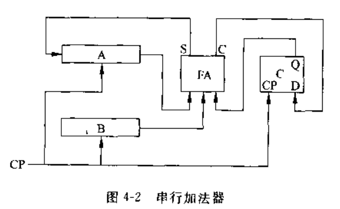

# 02指令系统与数值的机器运算

## 3 指令系统

### 3.1 指令格式
  
- 操作码字段+地址码字段
  - $OP \quad A_1 A_2 A_3 A_4$
  - 操作码：OP,指令的性质和功能
  - 地址码：操作数的地址
    - $A_1$第一操作数地址，$A_2$第二操作数地址，$A_3$操作结果存放地址，$A_4$下一条指令地址
  - 三地址指令
    - $OP A_1 A_2 A_3$,采用程序计数器PC来表示下一条指令地址
  - 二地址指令
    - $OP A_1 A_2$,第一操作数兼存放结果
  - 一地址指令
    - $OP A_1$,隐含的操作数在专门的寄存器内，累加寄存器ACC,保存多条指令连续操作的累计结果
  - 零地址指令
    - $OP$,用于堆栈计算
- 指令的操作码
  - 操作码的编码
    - 规整型-定长编码 
      - 操作码字段位数固定，$指令数m,操作码字段位数n, m \leq 2^n,即 n \geq \log_2{m}$
      - 特点：设计简单、减少指令译码时间、冗余信息称为非法操作码
    - 非规整码型-非定长编码
      - 操作码字段位数不固定
      - 特点：有效压缩指令中操作码的平均长度、增加译码难度
      - 常采用扩展操作码方法，即对于操作数较多的指令操作码字段段些

### 3.2 寻址技术

- 寻址：寻址下一个操作数或者指令地址，分为编址方式寻址和寻址方式寻址
- 编址方式
  - 对要寻址的设备预先进行编址(编号)，然后根据编址进行寻址
  - 编址单位
    - 字编址
      - 编址单位与寻址单位一致，即编址单位所包含的信息量与访问设备所获取的信息量一致
      - 每执行一条指令，PC+1，从主存读取一个数据，地址计数+1
      - 缺点：不支持非数值类型
    - 字节编址
      - 编址单位与信息的基本单位一致，但和主存的访问单位不一致
      - 若指令长度32位，每执行一条指令，PC+4,若数据长度32位，每次读写完一次数据，地址寄存器+4
    - 位编址
  - 指令中的地址码位数
    - 地址码位数与主存容量、最小寻址单位相关
- 指令寻址与数据寻址
  - 指令寻址：顺序寻址、跳跃寻址(直接寻址、相对寻址、间接寻址)
  - 基本数据寻址
    - 数据寻址：根据指令中的地址码字段找到真实数据地址,形式地址A：指令中的地址码字段的地址，有效地址EA：可访问的具体的内存地址，寻址过程：$A \underrightarrow{寻址方式} EA$
  - 常见的寻址方式:
    - 立即寻址:$[OP \quad 立即数]$，数据包含在指令中，常用于给寄存器或者主存单元赋初值或提供常数
    - 寄存器寻址:$[OP \quad R_i]$,地址码部分是某个寄存器编号，该寄存器内存放着操作数$S=(R_i)$
    - 直接寻址:地址码的地址就是操作数的有效地址EA=A,操作数$S=(A)$
    - 间接寻址:地址码存放操作数地址的主存单元地址，通常在指令中划分一位作为直接寻址或者间接寻址的标识，操作数$S=((A))$,$IR:[OP @ [间接地址]]$,多级间接寻址，同常最高位为1标识间接地址
    - 寄存器间接寻址:地址码为某个寄存器的编号，该寄存器内存放操作数在主存单元的有效地址，即操作数$S=((R_i))$
    - 变址寻址:$EA=(R_x)+A$，有效地址=变址寄存器值+形式地址，因此操作数$S=((R_x)+A)$,通常指令中的形式地址值为基准地址，变址寄存器值为修改量
    - 基址寻址:$EA=(R_b)+D$,有效地址=基址寄存器值+指令中的偏移量，$S=((R_b)+D)$,与变址寻址区别:变址寻址的指令中的基准值固定，变址寄存器的修改量可变；基址寻址的基址寄存器基准值固定，指令中的位移量可变
    - 相对寻址:程序计数器PC提供基准地址，指令中的地址码提供位移量，EA=(PC)+A
    - 页面寻址:EA=页面地址+页内地址
      - 基页寻址：EA=0//S,等于直接寻址
      - 当前页寻址：$EA=(PC)_H//S$
      - 页寄存器寻址：$EA=(页寄存器)//S$,页面标志位(Z/C),Z/C=0表示0页寻址，Z/C=1表示当前页寻址

| 寻址方式       | 有效地址                 | 特点                                               |
| -------------- | ------------------------ | -------------------------------------------------- |
| 立即寻址       | OP 立即数                | 数据包含在指令中                                   |
| 寄存器寻址     | $OP \quad R_i,S=(R_i)$   | 地址码部分是某个寄存器编号                         |
| 直接寻址       | $EA=A,S=(A)$             | 地址码的地址就是操作数的有效地址                   |
| 间接寻址       | $OP@[间接地址],S=((A))$  | 地址码为操作数地址的主存单元地址,间接寻址标志位@=1 |
| 寄存器间接寻址 | $S=((R_i))$              | 地址码为某寄存器编号,寄存器存放操作数在主存的地址  |
| 变址寻址       | $EA=(R_x)+A,S=((R_x)+A)$ | 有效地址=变址寄存器值+形式地址                     |
| 基址寻址       | $EA=(R_b)+D,S=((R_b)+D)$ | 有效地址=基址寄存器值+指令中的偏移量               |
| 相对寻址       | $EA=(PC)+A,S=((PC)+A)$   | 有效地址=PC提供的基准地址+位移量                   |
| 页面寻址       | EA=页面地址+页内地址     | 基页寻址、当前页寻址、页寄存器寻址                 |

  - 为区分不同的寻址方式，必须在指令中给出标识指定具体的寻址方式，通常有两种标识:隐式、显式
    - 显式指定：指令中设置特定的寻址方式字段，表明寻址类型
    - 隐式指定：指令的操作码字段说明指令的格式并隐式指定约定的寻址方式
    - |操作码|寻址方式|形式地址|
    - |操作码-----------|形式地址|
  - 一条指令有多个地址码时，每个地址码可采用不同的寻址方式

- 变型、组合寻址

| 寻址方式     | 有效地址                             | 类型           | 特点                           |
| ------------ | ------------------------------------ | -------------- | ------------------------------ |
| 自增寻址     | $EA=(R_t),R_a \leftarrow (R_t)+d$    | 寄存器间接寻址 | 先取值,然后寄存器自动增量修改  |
| 自减寻址     | $R_t \leftarrow (R_t)-d,EA=(R_t)$    | 寄存器间接寻址 | 先寄存器自动减量修改，然后取值 |
| 先变址后间址 | $EA=((R_x)+A),S=(((R_x)+A)),OPR_x@A$ | 扩展变址寻址   | 先变址寻址，然后间接寻址       |
| 先间址后变址 | $EA=(R_x)+(A),S=((R_x)+(A)),OP@R_xA$ | 扩展变址寻址   | 先间接寻址，然后变址寻址       |
| 基址变址寻址 | $EA=(R_b)+(R_x)+D$                   |                |                                |

### 3.3 堆栈与堆栈操作

- FILO,用于暂存中断断点、子程序调用的返回地址、状态标识、现场状态、子程序参数传递
- 堆栈结构
  - 主存储器中的一个指定区域或特定的快速存储器或者一组寄存器
- 寄存器堆栈(硬堆栈)
  - 构成：一组专门的寄存器
  - 特点：栈顶固定、每个寄存器互联对应位推移、最多压入k个数据(k个寄存器)、不需要栈顶指针
  - 入栈、出栈都是每个寄存器对应位的整体推移
- 存储器堆栈(软堆栈)
  - 构成:主存中划分的一个区域
  - 特点:大小可变、栈底固定、栈顶浮动，需要一个专门的硬件寄存器作为栈顶指针SP,分为：两种堆栈
  - 自底向上生成堆栈(向低地址方向)
    - SP始终指向栈顶的满单元
    - 入栈:
      - 修改栈指针:$(SP)-1 \rightarrow SP$
      - 内容A入栈:$(A) \rightarrow (SP)$
    - 出栈:
      - 栈顶内容送人A:$((SP)) \rightarrow A$
      - 修改栈顶指针:$(SP)+1 \rightarrow SP$
    - (SP):堆栈指针内容，即栈顶单元地址
    - ((SP)):栈顶单元内容
  - 自顶向下生成堆栈(向高地址方向生成)
    - 入栈
      - $(SP)+1 \rightarrow SP$
      - $(A)\rightarrow (SP)$
    - 出栈
      - $((SP))\rightarrow A$
      - $(SP)-1 \rightarrow SP$
- 堆栈操作
  - 通过调整栈顶指针得到新的栈顶位置，对位于栈顶的数据进行操作

### 3.4 指令类型

- 数据传送指令

| 指令类型     | 指令             | 用途                     |
| ------------ | ---------------- | ------------------------ |
| 一般传送指令 | MOV、LOAD、STORE | 数据复制                 |
| 堆栈操作指令 | PUSH、POP        | 入栈、出栈               |
| 数据交换指令 |                  | 源操作数与目的操作数互换 |

- 运算类指令

| 指令类型     | 指令                       | 说明                    |
| ------------ | -------------------------- | ----------------------- |
| 算术运算指令 | (浮点)加减乘除\比较\+1\-1  |
| 逻辑运算指令 | 与\或非\与或\异或          | 位检查\位清除\位设置... |
| 移位类指令   | 算术移位\逻辑移位\循环移位 |

- 程序控制类指令

| 指令类型   | 指令 | 说明         |
| ---------- | ---- | ------------ |
| 无条件转移 | JMP  | 采用相对寻址 |
| 条件转移   |      | 采用相对寻址 |
| 子程序调用 | CALL |              |
| 返回指令   | RET  |              |

- 输入输出类指令
  - 独立编址I/O
  - 统一编址I/O
- 80x86系列指令
  - MOV:数据传输指令
  - PUSH/POP：入栈、出栈指令
  - ADD/SUB:加减指令，INC/DEC：（寄存器）加一、减一，ADC:带进位加、SBB：带借位减
  - CMP:比较指令
  

## 4 数值的机器运算

- 运算部件、运算器

### 4.1 基本算术运算的实现

- 加法器
  - 全加器FA
    - 输入：$A_t,B_t,进位C_{t-1}$
    - 输出：$S_t,C_t$
    - 关系:$S_t=A_t \bigoplus B_t \bigoplus C_{t-1},C_t=A_tB_t+(A_t \bigoplus B_t)C_{t-1}$
  - 串行加法器与并行加法器
    - 串行:只有一个全加器，数据逐位串行送入加法器进行运算

    - 并行:多个全加器，位数取决于机器字长，同时运算
      - 串行进位的并行加法器
      - 1.并行进位方式
      - 2.分组并行进位

### 4.2 定点加减运算

- 原码加减运算
  - 符号位不参与运算，符号位决定与指令的操作(真实的加或者减)
  - 结果的符号位取决于两个操作数的绝对值大小
  - 运算：
    - 1.两个运算数，取绝对值
    - 2.根据符号位进行判断运算
    - 3.根据进位情况，判断是否需要变补
    - 4.添加符号位
- 补码加减运算
  - 补码加法
    - 符号位参与运算：$[X+Y]_补=[X]_补+[Y]_补$
  - 补码减法：$[X-Y]_补=[X+(-Y)]_补=[X]_补+[-Y]_补$
  - 变补：$由[Y]_补求解[-Y]_补，[-Y]_补=[[Y]_补]_{变补}$
  - 补码：

$$
\begin{aligned}
&[X]_补=
  \begin{cases}
    [X]_原 &X>0 \\
    [X]_原数值位取反+1,组合符号位 &X<0 \\
  \end{cases}
  \\
&[X]_{变补}=[X]_补所有位取反+1
\end{aligned}
$$

- 补码的溢出与检测方法
  - 溢出的情况：两正数相加结果为负(符号位=1)，两负数相加结果为正(符号位=0)
  - $[X]_补 = X_sX_1X_2...X_n$
  - $[Y]_补 = Y_sY_1Y_2...Y_n$
  - $[S]_补 = S_sS_1S_2...S_n$
  - 采用一个符号位的溢出判断;
    - $溢出=\bar{X_s}\bar{Y_s}S_s+X_sY_s\bar{S_s}$
  - 采用进位判断：
    - 进位：$C_sC_1C_2...Cn,C_s为符号位进位，C_1为最高位进位$
    - $溢出=\bar{C_s}C_1+C_s\bar{C_1}=C_s \bigoplus C_1$
  - 采用变形补码(双符号位补码)
    - 符号位扩充为:$S_{s1},S_{s2}$
    - $溢出=\bar{S_{s1}}S_{s2}+S_{s1}\bar{S_{s2}}=S_{s1} \bigoplus S_{s2}$

### 4.3 带符号数的移位和舍入操作

- 带符号数的移位
  - 算术移位：保持符号位不变，数值位变化(左移乘2，右移除2)
  - 原码移位：
    - 1.符号位保持不变
    - 2.因移位而空出的位置补0
  - 补码移位:
    - 正数：
      - 符号位不变，因移位而空出的位置补0
    - 负数：
      - 符号位不变，左移补0，右移补1
- 带符号数的舍入
  - 常见的舍入方法：
    - 1.横舍(断)，始终舍弃多余的位数
    - 2.冯诺依曼舍入：恒置1，保留部分最低位始终是1
    - 3.算术四舍五入
    - 4.查表舍入，使用ROM存放舍入处理表，每次舍入都查询该表

### 4.4 定点乘法运算

- 原码一位乘法
  - $P_s = X_s \bigoplus Y_s$
  - 将n位乘法转化为n次累加和位移
  - 规则:
    - 1.获取参与运算的操作数的绝对值
    - 2.令乘数的最低位为判断位，为1则加被乘数，为0则不加
    - 3.累加后的部分积以及乘数右移一位
    - 4.重复n次2-3步
    - 5.单独处理符合位
- 补码一位乘法
  - 校正法
    - $[X \times Y]_补 = [X]_补\times(0.Y_1Y_2...Y_n)+[-X]_补\times Y$
  - 比较法(Booth)
    - $[X \times Y]_补 = [Z_n]_补 + (Y_1-Y_s)[X]_补$
    - 1.参与运算的数用补码表示
    - 2.符号位参与运算
    - 3.乘数最低位增加一位附加位$Y_{n+1}$,其初始值为0
    - 4.乘数的最低两位$Y_n,Y_{n+1}$决定每次执行的操作
    - 5.

