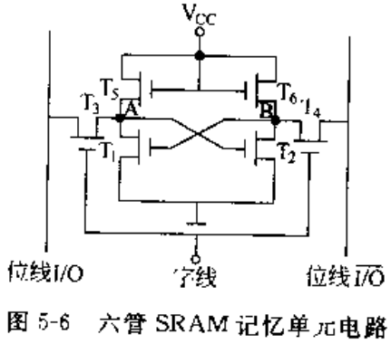
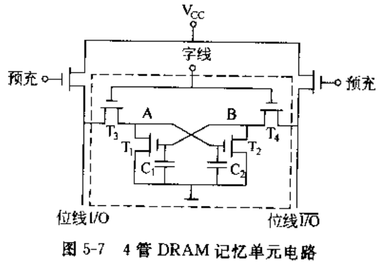
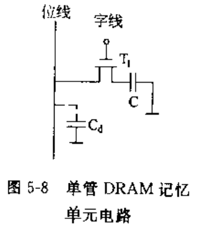

# 03存储系统和结构

## 5.1 存储系统的组成

- 存储器分类
  - 依据存储器在计算机系统中的作用划分：
    - 高速缓冲存储器Cache - 位于CPU和主存之间 - CPU芯片内
    - 主存储器
    - 辅助存储器
  - 按照存储方式分类：
    - 随机存取存储器 Random Access Memory RAM
    - 只读存储器 Read Only Memory ROM
    - 顺序存取存储器 Sequential Access Memory SAM
    - 直接存取存储器 Direct Access Memory DAM
  - 按存储介质分类：
    - 磁芯存储器
    - 半导体存储器
    - 磁表明存储器
    - 光存储器
  - 存储系统层次结构

## 5.2 主存储器的组织

- 主存储器的基本结构
  - 主存：存储体、地址译码驱动电路、I/O读写电路
- 主存储器的存储单元
  - 存储方式：
    - 大端方案：字地址=最高有效字节地址
    - 小端方案：字地址=最低有效字节地址
- 主存储器的主要技术指标
  - 存储容量
  - 存取速度，$存取时间T_s,存取周期T_m,主存带宽B_m$
  - 可靠性
  - 功耗
- 数据在主存中的存放
  - 采用字节编址
  - 三种数据存放方法
    - 1.不同长度的数据依次存放
    - 2.不同长度的数据都必须从一个存储子的起始位置存放
    - 3.边界对齐方法：
      - 双字数据的起始地址最末3位必须是000，单字数据的起始地址最末位必须是00，半字节数据的起始位置最末尾必须是0

### 5.3 半导体随机存储器和只读存储器

- RAM记忆单元电路
  - SRAM Static RAM
  - DRAM Dynamic RAM
  - 6管SRAM记忆单元电路
  - 4管DRAM记忆单元电路
  - 单管DRAM记忆单元电路

- 动态RAM的刷新
  - 