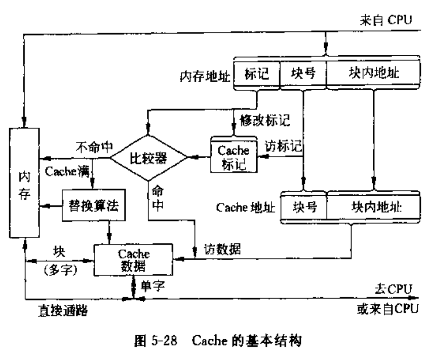

# 03存储系统和结构

## 5.1 存储系统的组成

- 存储器分类
  - 依据存储器在计算机系统中的作用划分：
    - 高速缓冲存储器Cache - 位于CPU和主存之间 - CPU芯片内
    - 主存储器
    - 辅助存储器
  - 按照存储方式分类：
    - 随机存取存储器 Random Access Memory RAM
    - 只读存储器 Read Only Memory ROM
    - 顺序存取存储器 Sequential Access Memory SAM
    - 直接存取存储器 Direct Access Memory DAM
  - 按存储介质分类：
    - 磁芯存储器
    - 半导体存储器
    - 磁表明存储器
    - 光存储器
  - 存储系统层次结构

## 5.2 主存储器的组织

- 主存储器的基本结构
  - 主存：存储体、地址译码驱动电路、I/O读写电路
- 主存储器的存储单元
  - 存储方式：
    - 大端方案：字地址=最高有效字节地址
    - 小端方案：字地址=最低有效字节地址
- 主存储器的主要技术指标
  - 存储容量
  - 存取速度，$存取时间T_s,存取周期T_m,主存带宽B_m$
  - 可靠性
  - 功耗
- 数据在主存中的存放
  - 采用字节编址
  - 三种数据存放方法
    - 1.不同长度的数据依次存放
    - 2.不同长度的数据都必须从一个存储子的起始位置存放
    - 3.边界对齐方法：
      - 双字数据的起始地址最末3位必须是000，单字数据的起始地址最末位必须是00，半字节数据的起始位置最末尾必须是0

### 5.3 半导体随机存储器和只读存储器

- RAM记忆单元电路
  - SRAM Static RAM
  - DRAM Dynamic RAM
  - 6管SRAM记忆单元电路
  - 4管DRAM记忆单元电路
  - 单管DRAM记忆单元电路

- 动态RAM的刷新
  - 1.刷新间隔
    - 为维持DRAM记忆单元的存储信息，DRAM需要定时刷新("假读")
  - 2.刷新方式
    - 集中式、分散式、异步式
  - 3.刷新控制
- RAM芯片分析
  - 1.RAM芯片：地址线A(单向输入)、数据线D(双向)、控制线(CE/CS、WE/OE)、电源线Vcc
  - 2.地址译码方式
    - 将地址线的地址信号翻译成存储单元的选择信号
    - 单译码-字选法
      - K位地址线译码为$2^K$条字线，子线存储长度为b位的存储单元
    - 双译码
      - K位地址线分为接近的两段，一段为X地址线，一段为Y地址线，
  - 3.RAM读写时序
    - SRAM读写时序
    - DRAM读写时序
- 半导体只读存储器ROM
  - ROM分类
    - MROM
    - PROM
    - EPROM

## 5.4 主存储器的连接与控制

- 主存容量的扩展
  - 位扩展
  - 字扩展
  - 字位同时扩展
- 存储芯片的地址分配和片选
  - 片选信号的译码方法
    - 线选法 - 除片内寻址外的高位地址线连接芯片的片选信号
    - 全译码法 - 除片内寻址外的高位地址线作为地址译码器的输入
    - 部分译码法 - 除片内寻址外的高位地址的一部分来译码产生片选信号
- 主存储器和CPU的连接
  - 1.主存储器和CPU的硬连接
    - 地址总线AB、数据总线DB、控制总线CB、主存工作完成信号MFC
    - CPU内部：MAR：存储器地址寄存器、MDR:存储器数据寄存器
  - 2.CPU对主存储器的基本操作
    - 读:
      - $Address \rightarrow MAR \rightarrow AB$
      - $Read$
      - $Wait for MFC$
      - $Data(MAR) \rightarrow DB \rightarrow MDR$
    - 写:
      - $Address \rightarrow MAR \rightarrow AB$
      - $Data \rightarrow MDR \rightarrow DB$
      - $Write$
      - $Wait for MFC$
    - 分为同步读取和异步读取
- 主存的校验
  - 1.主存的奇偶校验
    - 通常采用奇校验，8位数据位1位校验位
  - 2.错误检验与较正 ECC Error Check and Correcting
- PC系列微型计算机的存储器接口
  - 8位存储器接口
  - 16位存储器接口
  - 32位存储器接口
  - 64位存储器接口

## 5.5 提供主存读写速度的技术

- 主存与CPU速度的匹配
- FPM、DRAM
  - DRAM：需要行地址、列地址
  - FPM Fast Page Mode DRAM :保持行地址不变，改变列地址
- EDO DRAM
  - Extend Data Output DRAM:在FPM DRAM基础上进行的改进
  - EDO不必等待当前的读写周期完成即可开始下一次的读写周期
- SDRAM
  - Synchronous DRAM 同步动态随机存储器：与主存总线运行同步的RAM
- DDR SDRM
  - Double Data Rate SDRAM:双数据传输率同步动态随机存储器
- Rambus DRAM

## 5.6 多体交叉存储技术

- 采用多个存储器并行工作，用交叉访问技术提高存储器的访问速度
- 并行访问存储器
  - 多个并行工作的存储器共享同一地址寄存器和译码电路，按同一地址并行访问各自对应的单元
- 交叉访问存储器
  - 多个相同容量的存储模块，每个具体独立的地址寄存器、读写电路、数据寄存器
  - 横向编址

## 5.7 高速缓冲存储器

- 1.高速缓冲存储器的工作原理
  - 程序的局部性原理
    - 时间局部性
    - 空间局部性
  - Cache的基本结构

- 2.Cache的读写操作
  - 读
    - CPU发出读命令
    - 若Cache命中则返回数据
    - 若Cache未命中，则访问主存，并将内存块调入Cache
    - 若Cache已满，则使用替换算法替换原Cache内某块信息
  - 写
    - Cache内容与主存内容不一致问题
    - 写直达法、写回法
- 3.地址映像
  - 将主存地址空间映像到Cache地址空间
  - 映像方式
    - 全相联映像
      - 主存中的任何一块都可以映像到Cache中的任何一块
      - 灵活、块冲突率低、空间利用率高，地址变换困难、成本高
    - 直接映像
      - 主存中的每一块都映像到Cache中的指定块，若指定块有内容则无条件替换
    - 组相联映像
      - 将主存空间根据Cache大小等分多个区，然后将Cache空间和主存空间每一区分成大小相同的组，每个组内主存的任何一块都可以映像到组内Cache的任何一块
      - 组间直接映像，组内全相联映像
- 4.替换算法
  - 仅针对全相联映像和组相联映像时，Cache满时如何替换旧块的算法
  - 随机算法 - 随机选择一块替换掉
  - FIFO算法 - 替换掉最先进入Cache的块
  - LRU算法 - 替换最少使用的块
- 5.更新策略
  - 主要解决Cache内容与主存内容不一致的问题
  - 写直达法：
    - CPU执行写操作时，必须把数据同时写入Cache和主存
  - 写回法：
    - CPU执行写操作时，被写数据只写入Cache,不写入内存，仅当需要替换时，将修改的Cache写回主存
- 6.PC中Cache的实现
  - 单一缓存和多级缓存
  - 统一缓存和分开缓存
    - 指令和数据统一缓存或者分开缓存
    - 目的：减少流水指令的资源冲突

## 5.8 虚拟存储器

- 虚拟存储器=主存+磁盘存储器
- 1.虚拟存储器的基本概念
  - 目的：将主存以及辅存地址空间进行统一编址，形成具体的地址空间，方便编程，形成用户编程地址
  - 虚地址或者逻辑地址---实地址或者物理地址
  - 程序运行时，CPU以逻辑地址访问主存，辅助硬件实现逻辑地址和物理地址的转换和对应，若对应的数据不在主存，则需要从磁盘进行加载
- 2.页式虚拟存储器
  - 以页为单位的虚拟存储器，主存空间划分为多个大小相等的页（虚页、实页）
  - 程序的逻辑地址分为：高位字段的逻辑页号，低位字段为页内地址
  - 页表：用于虚页和实页对应转换，存放于主存中，页表的起始地址--->页表基址寄存器
    - 虚页号=[页表起始地址][虚地址中的虚页号]
    - 数据项：虚页号、装入位、实页号
    - 虚地址中的低位页内地址位数=页大小的位数
- 3.段式虚拟存储器
  - 依据程序的逻辑结构划分的段
  - 段表：虚地址与实地址对应表，驻留主存
    - 段表地址=[段表起始地址][虚地址中的段号]
    - 数据项：段号、装入位、段起点、段长度
  - 编程的虚地址：高位指向段号、低位指向段内地址
- 4.段页式虚拟存储器
  - 按程序逻辑划分段，段内划分页，主存空间划分同样大小的页
  - 每个程序对应一个段表，每个段对应一个页表
  - 虚地址=段号+段内页号+页内地址
- 5.快表与慢表
  - 用于提供CPU访问虚拟存储器的速度
  - 类似于两级缓存

