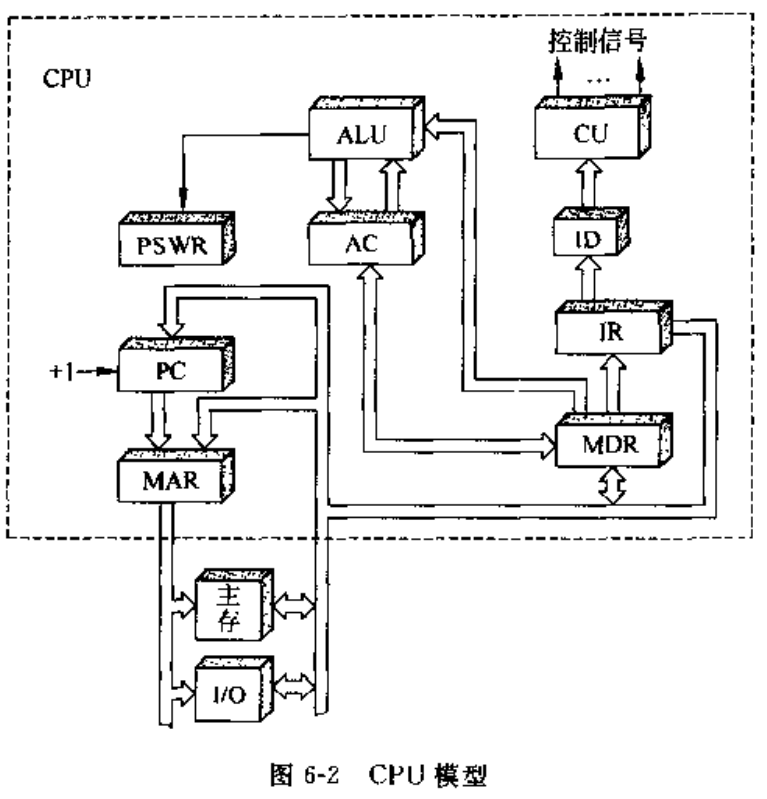
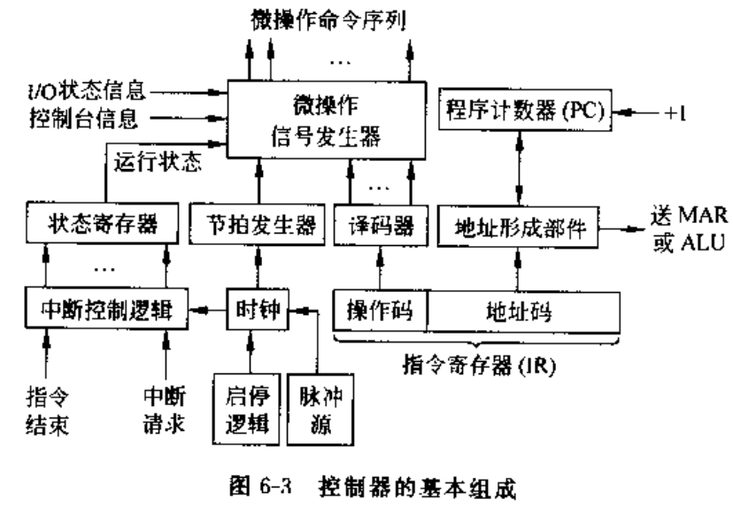
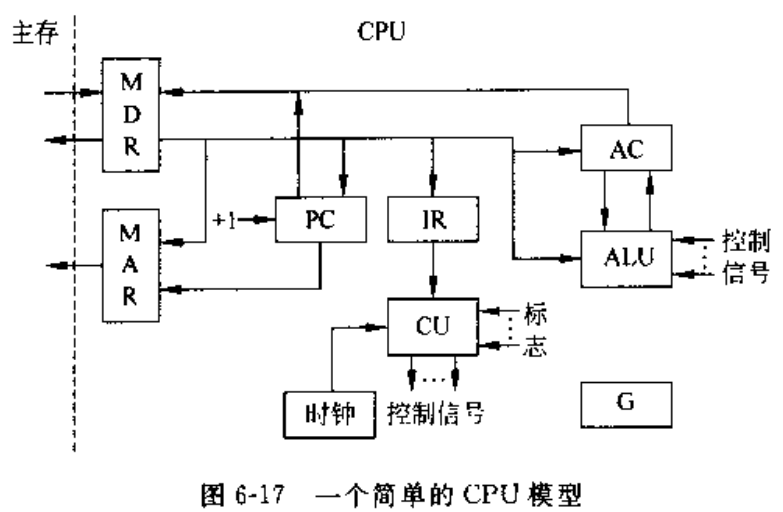

# 06 中央处理器

## 6.1 CPU的功能和组成

- CPU功能
  - 使用指令流驱动数据流，取指令、取数据、执行指令
- CPU中的主要寄存器
  - 通用寄存器
    - 存放原始数据和计算结果
    - 累加器寄存器Acc
  - 专用寄存器
    - 程序计数器PC
      > 指令计数器，用于存放正在执行的指令地址或者要执行的下条指令的地址
    - 指令寄存器IR
      > 存放从存储器取出的指令
    - 存储器地址寄存器MAR
      > 保存当前CPU锁访问的主存单元地址
    - 存储器数据寄存器MDR
      > 暂时存放由主存储器读出(或者CPU写入主存)的一条指令或者数据 
    - 状态标识寄存器PSWR
      > 存放程序状态字PSW,PSW表征程序和机器的运行状态 
      > 两部分内容：状态标志（进位标志C、结果为零标志Z）、控制标志（中断标志、陷阱标志）
- CPU的组成
  - CPU=运算器+控制器
  - 控制器功能
    - 1.取指令，指出下一条指令主存位置
    - 2.指令译码、测试，产生控制信号，
    - 3.控制CPU、主存、输入输出设备间数据流动
  - 运算器功能
    - 1.执行所有算术运算
    - 2.执行所有的逻辑运算、逻辑测试

- CPU的主要技术参数
  - 1.字长 - 单位时间内同时处理的二进制数据的位数
  - 2.内部工作频率（内频、主频） - 主频倒数为时钟周期
  - 3.外部工作频率（工作频率、前端总线频、系统总线频）
    - 主板为CPU提供的基准时钟频率，通常与主存总线频率相同，CPU与主存交换数据的频率
    - 倍频技术：$内频 = 外频 \times 倍频$
  - 4.片内Cache容量和速率
  - 5.工作电压
  - 6.地址总线宽度 - 决定CPU可以访问的最大物理地址空间
  - 7.数据总线宽度
    - 决定CPU与外部Cache、主存、输入输出设备一次数据传输的信息量
  - 8.制造工艺

## 6.2 控制器的组成和实现

- 控制器的基本组成

  - 1.指令部件 - 取指令 分析指令
    - 程序计数器
    - 指令寄存器
    - 指令译码器
    - 地址形成部件
  - 2.时序部件 - 产生时序信号
    - 脉冲源
    - 启停控制逻辑
    - 节拍信号发生器
  - 3.微操作信号发生器（控制单元CU）
  - 4.中断控制逻辑
- 控制器的硬件实现
  - 控制器的核心是CU
    - 输入：时序信号、机器指令操作码（译码器输出）、各部件状态反馈信号
    - 输出：微操作控制信号（CPU内控制信号、主存或外设控制信号）
  - 控制器分类：组合逻辑型、存储逻辑型、组合逻辑与存储逻辑结合型
  - 1.组合逻辑型
    - 常规控制器，采用组合逻辑技术实现，控制单元为复制的门电路
    - 特点：速度快、难以修改
  - 2.存储逻辑型
    - 微程序控制器，采用存储逻辑实现
  - 3.组合逻辑与存储逻辑结合型
    - 可编程逻辑阵列控制器PLA

## 6.3 时序系统与控制方式

- 时序系统为指令的执行提供定时信号
- 时序系统
  - 1.指令周期和机器周期
    - 指令周期：指令从取指令、分析指令、取数据到指令执行完成所需的全部时间
    - 机器周期（CPU周期），
    - $指令周期 = i \times 机器周期$
    - 周期状态触发器
  - 2.节拍
    - 节拍电位信号：将一个机器周期划分为多个相等的时间段，每一个时间段对应一个节拍电位信号
    - 节拍的选取
      - 统一节拍法、分散节拍法、延长节拍法、时钟周期插入
  - 3.工作脉冲
    - 位于节拍末尾，用于同步定时脉冲
  - 4.多级时序系统
    - 三级时序系统：机器周期、节拍、脉冲
  - 5.节拍电位与工作脉冲的时间配合关系
- 控制方式
  - CPU的控制方式
  - 1.同步控制方式
    - 采用固定时序控制方式，以最复杂指令的操作时间为统一的时间间隔
  - 2.异步控制方式
    - 可变时序控制方式，应答方式，开始-结束信号保证指令连续执行
  - 3.联合控制方式
    - 同步+异步，在功能部件内部采用同步方式，在功能部件间采用异步方式
- 指令运行的基本过程
  - 1.取指令阶段
  - 2.分析取数阶段
  - 3.指令执行阶段
- 指令的微操作序列

## 6.4 微程序控制原理

- 基本概念
  - 1.微程序设计的提出与发展
  - 2.基本术语
    - 微命令与微操作：控制序列的最小单位
    - 微指令：控制字，控制存储器中的一个单元的内容，包含：操作控制字段、顺序控制字段
    - 微地址：存放控制字的单元的地址
    - 微周期：从控制存储器读取一个微指令到执行完成该微指令的全部时间
    - 微程序：一系列微指令的集合
- 微指令编码法
  - 指微指令的操作控制字段的编码方法
  - 1.直接控制法（不编码）
    - 微指令的操作控制字段的各位直接控制计算机，无需译码
  - 2.最短编码法
    - 将所有微指令进行统一编码，每条微指令定义一个微命令，编码长度：$L \geq \log_2{N}$
  - 3.字段编码法
    - 将操作控制字段分为多个小段，每个小段内采用最短编码法，小段间采用直接控制法
    - a.字段直接编码法
      > 各个字段独立编码译码
    - b.字段间接编码法
      > 在字段直接编码的基础上，进一步微缩指令字长，一个字段的某些编码需要与其他字段编码联合定义
- 微程序控制器的组成和工作原理
  - 基本组成
    - 控制存储器CM
    - 微指令寄存器$\mu IR$
    - 微地址形成部件
    - 微地址寄存器$\mu MAR$
  - 工作过程
    - 执行取指令公共操作
    - 由机器指令的操作码通过微地址形成部件 产生该机器指令对应的微程序入口放入$\mu MAR$
    - 从CM中取出微指令并执行
    - 执行完成后，回到取指令微程序入口，重复取指令执行
  - 机器指令对应的微程序
    - 通常一条机器指令对应一个微程序
- 微程序入口地址的形成
  - 由机器指令操作码指定该指令的微程序入口地址，即 机器指令===》微程序入口地址
  - 1.一级功能转换
    - 适用于机器指令操作的位数和位置固定的情况，方式：直接使操作码与入口地址部分位对应即可
  - 2.二级功能转换
    - 分两次区分指令，第一次按照指令类型分类，第二次按照具体指令指定入口地址
  - 3.通过PLA电路实现功能转换
- 后继微地址的形成
  - 每条指令执行完成后，需要形成后继微地址开始下一指令的取指令和执行
  - 1.增量方式(顺序——转移型微地址)
    - 现行微地址加上一个增量形成下一个微地址，通常将$\mu MAR改为具有计数功能的微程序计数器 \mu PC$
  - 2.断定方式
    - 由微程序设计者指定或者微指令规定的测试结果直接指定
      - 非测试段：设计者指定（通常为高位部分）
      - 测试段：根据有关状态的测试结果确定地址（通常为低位部分）
- 微程序设计
  - 1.微程序设计方法
    - 设计考量因素：尽量缩短微指令的字长、减少微程序长度、提高微程序执行速度
    - 水平型微指令以及水平型微指令设计
      - 一次能并行执行多个微命令的微指令
    - 垂  直型微指令以及垂直型微指令设计
      - 一次行执行一个微命令的微指令
    - 混合型微指令
  - 2.微指令的执行方式
    - Step 1:取微指令（对于垂直型微指令需要译码）
    - Step 2:执行微指令
    - 1.串行方式执行微指令
      - 取微指令和执行微指令是顺序的，eg:取微指令1-->执行微指令1-->取微指令2...
    - 2.并行方式执行微指令
      - 将执行微指令和取微指令(下一个微指令)并行，提高微指令执行速度
  - 3.微程序仿真
    - 用一台计算的微指令模拟另一台计算机的指令系统，目的：程序兼容
  - 4.动态微程序设计
    - 计算机根据不同的应用目标改变微指令
  - 5.用户微程序设计

## 6.5 控制单元的设计

- 控制单元的主要功能：根据需要发送不同的微操作控制信号
- 1.简单的CPU模型

  - 简单指令类型：
    - 非访存指令
    - 访存指令
    - 转移类指令
  - 完整的指令周期：
    - 取指：取指令
    - 间址：获取有效地址
    - 执行：取操作数
    - 中断：保存程序断点
- 2.组合逻辑控制单元设计
  - a.微操作的节拍安排
    - 规定，同步控制，每个机器周期为3个节拍
    - 取指周期微操作节拍：
      - $T_0 \qquad (PC) \rightarrow MAR,Read$
      - $T_1 \qquad M(MAR) \rightarrow MDR,(PC) +1 \rightarrow PC$
      - $T_2 \qquad (MDR) \rightarrow IR$
    - 间址周期微操作节拍：
      - $T_0 \qquad (MDR) \rightarrow MAR,Read$
      - $T_1 \qquad M(MAR) \rightarrow MDR$
      - $T_2 \qquad (MDR) \rightarrow MAR$
    - 执行周期微操作节拍
      - 。。。
  - b.组合逻辑设计步骤
    - 列出微操作命令的操作时间表
    - 进行微操作信号综合
      - $微操作控制信号 = 机器周期 \cdot 节拍 \cdot 脉冲 \cdot 操作码 \cdot 机器状态条件$
    - 画出微操作命令逻辑图
- 3.微程序控制单元设计
  - 设计步骤
  - 设计举例

## 6.6 流水线技术

- 指令执行的控制方式：顺序方式、重叠方式、先行方式、流水线方式
- 顺序方式：
  - 执行n条指令所需时间：$T = 3nt = n\sum{(t_{取指} +t_{分析} +t_{执行})}$
- 重叠方式：
  - 一次重叠：取指K+1和执行K重叠
    - $T = 3t+(n-1)2t - (2n+1)t$
    - 需要增加一个指令缓冲器
  - 二次重叠：取指K+1、分析K+1、执行K重叠
    - $T=(2+n)t$
    - 需要将CPU内的控制器分解为：存储控制器、指令控制器、运算控制器
    - 访存冲突问题解决：
      - 1.指令和数据独立编址，两个存储器
      - 2.多体交叉存储结构
      - 3.指令缓冲器
- 先行控制原理
  - 重叠控制的改进，解决执行和分析的时间不等导致的间断等待问题
  - $T = t_{分析1} +\sum_{k=2}^n{[max\{t_{分析k},t_{执行k-1}\}}+t_{执行n}$
  - 使各阶段的部件工作时不间断
  - $T_{先行}=t_{分析1} + \sum_{i=1}^n{t_{执行i}}$
- 流水线工作原理
  - 基于重叠和先行控制
  - 1.流水线
    - 将复杂的处理过程分解为m个子过程，每个子过程由独立部件执行

