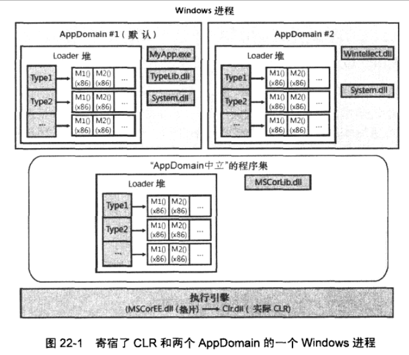

# CH22 CLR寄宿和AppDomain

- 寄宿hosting：允许是任务应用程序能利用CLR的功能，允许享有的应用程序部分使用托管代码编写；
- AppDomain：允许第三方的不受信任的代码在一个现有的进程中允许，CLR保证数据结构 代码 安全上下文不会被滥用或破坏；
- [参考文档](https://www.cnblogs.com/foman/archive/2009/10/18/1585655.html)

## 1.CLR寄宿

- 为什么所有托管代码和程序集文件必须使用Windows PE文件格式(EXE文件或者DLL文件)？
- .net Framework构建在Windows平台顶部，Miscrosoft将CLR实现为一个包含在DLL中的COM服务器，即：为CLR定义标准COM接口，然后分配GUID，
- 参照：MetaHost.h头文件，该文件中定义了GUID和ICLRMetaHost接口；
- 如何创建CLR COM服务实例？
- 应该调用MetaHost.h文件中声明的CLRCreateInstance函数（返回ICLRMetaHost接口），该函数在MSCorEE.dll(shim)文件中实现，其本身不包含CLR COM服务器；
  - MSCorEE.dll只有一个版本，与最新版本的CLR一致，对于x64 Windows 会有两个版本的MSCorEE.dll x86版本在SysWOW64下另一个在System32下；
  - CLR代码位置：
    - 1.0和2.0在MSCorWks.dll
    - 4.0 在Clr.dll
- ICLRMetaHost中函数GetRuntime指定宿主创建的CLR版本，然后垫片MSCorEE.dll将CLR加载到宿主进程中
- 对于启动的托管程序，垫片会提前应用程序的CLR版本信息，可以在XML文件中修改：requiredRuntime以及supportRuntime覆盖默认行为
- GetRuntime返回一个ICLRRuntimeInfo指针，使用该指针的GetInstance方法获取ICLRRuntimeHost接口：
  - ICLRRuntimeHost接口：
    - 1.设置宿主管理器
    - 2.获取CLR管理器
    - 3.初始化并启动CLR
    - 4.加载一个程序集并执行其中代码
    - 5.停止CLR
- 创建CLR COM服务实例
> 使用 MetaHost.h->调用 CLRCreateInstance(MSCorEE.dll) -> 返回 接口ICLRMetaHost -> 调用 GetRuntime(传入CLR版本) -> 返回指针ICLRRuntimeInfo
> -> 调用方法 GetInstance -> 获取ICLRRuntimeHost接口 ->该接口定义CLR相关操作
- 使用ClrVer.exe检测给定进程中的加载的CLR版本
- CLR加载到进程中后，不能卸载，除非终止进程
- 一个进程中可以加载多个版本CLR，兼容运行
- CLR宿主使用 参考: Customizing the Microsoft .Net Framework Common Language Runtime --- by Steven Pratschners

## 2.AppDomain

- AppDomain功能：
  - 1.不能直接访问其他AppDomain中的代码，按引用封送，按值封送；
  - 2.AppDomain可以卸载；
  - 3.AppDomain可以单独保护，可以设置最大权限集；
  - 4.AppDomain可以单独实施配置：加载程序集的方式；
- 为什么不支持卸载程序集？
> [参考文档](https://blogs.msdn.microsoft.com/jasonz/2004/05/31/why-isnt-there-an-assembly-unload-method/)
>> 1.可能正在应用程序域中运行该程序集内的代码，在程序集级别跟踪代码引用太昂贵
>> 2.即使已经跟踪了所有的代码引用，但是释放程序集也只能释放原数据和IL，JIT中的代码还在保留在AppDomain的Loader Heap内，JIT申请的代码在调用buffer内是连续的；
>> 3.

  

- 每个AppDomain都有自己的Loader堆，每个Loader堆记录自AppDomain创建后已访问过的类型。Loader堆中每个类型对象都有一个方法表，方法表中的每个记录项指向JIT编译的本地代码（方法至少执行过一次）
- 多个AppDomain中加载同一个DLL，使用该DLL中同一个类型时
  - 不共享类型对象，每个AppDomain都会为同一个类型分配类型对象
  - 不共享本地代码，调用同一个类型的方法时，由IL代码经过JIT编译后生产的本地代码（native code）与每个AppDomain相关联
  - 不共享类型静态字段，由多个AppDomain使用的类型在每个AppDomain中都有一组静态字段
- AppDomain中立，特例：MSCorLib.dll，该DLL提供CLR基础类型库，所有AppDomain共享该程序集中的类型，以AppDomain中立方式进行加载，该AppDomain维护一个特殊的Loader堆，代价：永远不能被卸载，除非终止进程
- 跨AppDomain边界访问对象
  - 按引用封送 Marshal-by-Reference ,跨边界的类需继承自MarshalByRefObject
  - 按值封送 Marshal-by-Value,跨边界的类或者结构体需可序列化 即添加Serializable特性
  - 完全不能封送
- 线程与AppDomain无关
  
***

- 使用引用封送跨AppDomain进行通信
  - System.Security.Policy.Evidence:CLR用来计算AppDomain权限集的证据
  - System.Security.PermissionSet:权限集合对象
  - System.AppDomainSetup:CLR为AppDomain使用的配置设置，
  - 按引用将一个对象从一个AppDomain封送到另一个AppDomain：
    - 源AppDomain向目标AppDomain发送或者返回一个对象引用时，
    - 1.CLR在目标AppDomain的Loader堆中定义一个代理类型，该类型用原始类型的元数据定义，即与原始类型完全一样；
    - 2.在代理类型中定义了几个自己的实例字段，该字段指出哪个AppDomain拥有真实对象，以及如何在拥有的AppDomain中找到真实对象，内部使用GCHandle实例引用真实对象
    - 3.定义好代理类型后，CreateInstanceAndUnwarp会创建该代理类型的一个实例，初始化时标识源AppDomain和真实对象
    - 4.将代理对象的引用返回目标AppDomain，该代理对象并非真实对象而是一个透明的代理（判断System.Runtime.Remoting.RemotingServices.IsTransparentproxy(object)），但是CLR的GetType会返回真实对象的类型；
    - 5.引用程序使用代理调用代理类内定义的方法，代理实现中将AppDomain切换到新AppDomain；
    - 6.线程使用代理对象的GCHandle在新AppDomain中查找真实对象，使用真实对象调用该方法；（调用堆栈中显示跨AppDomain边界）；
    - 7.真实对象方法执行完返回后，返回到代理方法中，代理类将线程切换到调用方的AppDomain；
    - [x] 注意：
      - a.跨AppDomain边界的方法调用是同步执行的；
      - b.线程在那个AppDomain内执行代码会用该AppDomain的安全和配置设置来执行代码；
    - 卸载AppDomain后，再调用代理对象的方法会抛出AppDomainUnloadedException异常
    - 代理对象的实例字段：
      - 1.这些实例字段不会成文代理类型的一部分，也不会包含在代理对象中；
      - 2.对这些实例字段进行读写时，JIT自动生成代码，调用System.Object.FieldGetter或者FieldSetter方法使用代理对象，即使用反射的方式获取或设置字段的值；
      - 3.即使在默认AppDomain中，同样具有性能损失(即对于普通对象和继承自MarshalRefObject的对象)；
      - 4.避免在MarshalByRefObject派生类中定义任何静态成员：静态成员总是在调用AppDomain的上下文中访问，静态成员没有代理类；
    - 租约管理器 - lease manager 如何管理代理对象引用的原始对象
      - 1.原始对象创建好后，CLR保持对象存活固定时间(5 minutes)；
      - 2.若固定时间内没有代理发出调用，对象失效，下次被GC释放；
      - 3.每发出一次对原始对象的调用，租约管理器就会续订对象的租期（2 minutes）；
      - 4.租约过期后，该对象被调用就会抛出System.Runtime.Remoting.RemotingException异常；
      - 5.租期时间，可以在MarshalByRefObject的虚方法InitializeLifetimeServices的重写中进行修改；

```C#
/// <summary>
/// 修改对象的租期时间
/// </summary>
/// <returns></returns>
[SecurityPermission(SecurityAction.Demand,Flags = SecurityPermissionFlag.Infrastructure)]
public override object InitializeLifetimeService()
{
    ILease lease = (ILease)base.InitializeLifetimeService();
    if (lease.CurrentState == LeaseState.Initial)
    {
        lease.InitialLeaseTime = TimeSpan.FromMinutes(1);
        lease.SponsorshipTimeout = TimeSpan.FromMinutes(2);
        lease.RenewOnCallTime = TimeSpan.FromSeconds(2);
    }
    return lease;
}
```

***

- 使用按值封送跨AppDomain通信
- 按值将一个对象从一个AppDomain封送到另一个AppDomain：
  - 1.CLR将对象的实例字段序列化成一个字节数组；
  - 2.将字节数组从源AppDomain复制到目标AppDomain；
  - 3.CLR在目标AppDomain中反序列化字节数组，强制将被反序列化的类型的程序集加载到目标AppDomain中；
  - 4.CLR创建类型的一个实例，并使用字节数组初始化对象字段；
  - 5.CreateInstanceAndUnwarp方法返回对这个副本的引用；
  - 6.返回真实对象,在调用方法时不会跨AppDomain；
  - 7.因此卸载AppDomain后，对默认
  - [x] 提示:
    - 加载程序集时，CLR使用目标AppDomain的策略和配置设置；
  
## 卸载AppDomain

- 卸载AppDomain：卸载AppDomain内所有的程序集，是否Loader堆；
  - 1.CLR挂起进程中所有执行过托管代码的所有线程；
  - 2.CLR检查所有线程栈，若线程栈上存在准备卸载的AppDomain，就会抛出ThreadAbortException异常，恢复线程执行，导致线程展开-unwind,会执行finally代码；
    - [x] 提示
    - 若线程在执行finally，catch，类构造器，临界执行区域，非托管代码中时，CLR不会立即终止该线程，等待执行完毕后，CLR再抛出异常；
  - 3.所有线程都离开AppDomain后，CLR遍历堆，为所有引用AppDomain对象的代理对象设置失效标识；
  - 4.CLR强制垃圾回收；
  - 5.CLR恢复剩余所有线程执行；
    - [x] 提示
    - 当一个线程调用AppDomain.Unload时，针对AppDomain中的线程，CLR会提供10S的时间离开，10秒后，若调用AppDomain.Unload的线程没有返回，CLR会抛出CannotUnloadAppDomainException异常
    - 若调用AppDomain.Unload的线程在要卸载的AppDomain中，CLR会创建另一个线程来卸载AppDomain，第一个线程会强制抛出ThreadAbortException

## 监视AppDomain

- 设置：AppDomain静态属性MonitoringEnable设置为true

## AppDomain异常通知

- 处理异常：
  - 1.异常首次抛出时，CLR回调抛出异常的AppDomain登记的FirstChanceException回调方法；
  - 2.CLR查找栈上在同一个AppDomain中的任何Cache块；
  - 3.若有一个cache能处理异常，则异常处理完成；
  - 4.若AppDomain没有cache处理异常，则CLR沿着栈向上找到AppDomain，再次抛出异常（经过按值封送）；
  - 5.AppDomain调用当前FirstChanceException回调方法，一直到栈顶部，若异常仍未处理，CLR将终止进程；

## 宿主使用AppDomain

- 可执行应用程序
  - 1.Windows使用托管Exe初始化进程；
  - 2.加载垫片（dim）MSCorEE.dll;
  - 3.dim检测Exe中的CLR头信息，选择加载的CLR版本；
  - 4.dim加载CLR（CorClr.dll）；
  - 5.dim检测CLR头，找到程序入口方法Main;
  - 6.CLR调用Main方法；
  - 7.CLR访问类型时，根据类型定位程序集，将程序集加载到AppDomain；
  - 8.CLR调用Main方法退出后，Windows进程终止（System.Environment.Exit()）；
- Microsoft Silverlight
- ASP.Net Web窗体和XML Web服务应用程序
- Microsoft SQL Server

## 高级宿主控制

- 使用托管代码管理CLR
  - System.ApppDomainManager:允许宿主使用托管代码覆盖CLR的默认行为
  - System.ApppDomainManager派生类：重新控制的任何虚方法，允许宿主保存控制权
    - 告诉CLR使用字节的AppDomainManager派生类：AppDomainSetup实例中初始化AppDomainManagerAssembly和AppDomainManagerType；
    - 在应用程序XML配置文件中使用，appDomainManagerAssembly和appDomainManagerType元素
    - 本地宿主查找ICLRControl接口
- 真对临界区的线程终止问题
  - 临界区内的线程出现异常，CLR尝试将异常升级为得体的AppDomain卸载，若在规定时间内未卸载，则升级为粗鲁的AppDomain卸载
- 宿主取回线程
  - [x] Thread的Abort方法说明
    - 1.异步方法；
    - 2.调用后，设置目标线程的AbortRequest标识，并立即返回；
    - 3.CLR检测目标线程的标识后，尝试将目标线程放（通过线程劫持）到安全点 safe place（非安全点：类构造器，cache块，finally块，CER代码块，非托管代码）；
    - 4.当线程在安全点后，CLR检测线程标识，后抛出ThreadAbortException，该异常被CLR特殊处理；
  - 在cach块尾部，CLR自动重新抛出ThreadAbortException
  - Thread的ResetAbort方法要求被调用者被授予SecurityPermission权限，而且ControlThread标识为true；