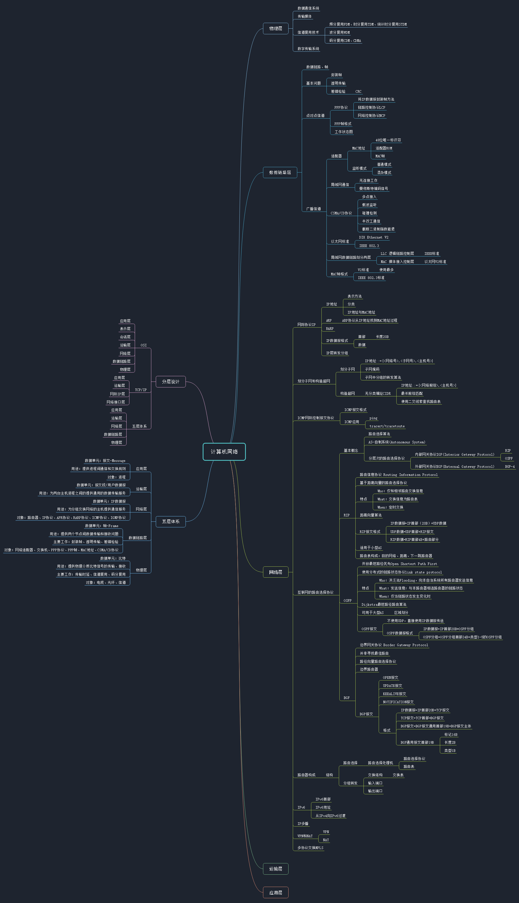

# 计算机网络 - 谢希仁

## Chapter 01 概述

- Glossary
- ISP Internet Service Provider 因特网服务提供者
- C/S -Client Server  客户端服务器
- P2P - peer-to-peer 对等连接
- 带宽 - bandwidth
- 吞吐量 - throughput
- 时延 - delay latency
- 发送时延 -  transmission delay
- 传播时延 - propagation delay
- 总时延 = 发送时延 + 传播时延 + 处理时延 + 排队时延
- 网络协议的三要素：
  - 1.语法 - 数据和控制信息的结构或格式；
  - 2.语义 - 发送的控制信息、接收响应、接收动作；
  - 3.同步 - 事件实现顺序；
- 分层后功能：
  - 1.差错控制
  - 2.流量控制
  - 3.分段和重装
  - 4.复用和分用
  - 5.连接建立和释放

| OSI协议    | TCP/IP     | 五层协议模型 |
| ---------- | ---------- | ------------ |
| 应用层     | 应用层     | 应用层       |
| 表示层     | 应用层     | 应用层       |
| 会话层     | 应用层     | 应用层       |
| 运输层     | 运输层     | 运输层       |
| 网络层     | 网际层     | 网络层       |
| 数据链路层 | 网络接口层 | 数据链路层   |
| 物理层层   | 网络接口层 | 物理层       |

- OSI - 七层协议体系：物理层》》数据链路层》》网络层》》运输层》》会话层》》表示层》》应用层
- TCP/IP - 四层协议：网络接口层》》网际层》》运输层》》应用层
- 五层协议模型：物理层》》数据链路层》》网络层》》运输层》》应用层
- 每一层大致作用：
  - 物理层 physical layer ：

| 层名称     | 英文              | 传输单位       | 作用                      | 其他                        |
| ---------- | ----------------- | -------------- | ------------------------- | --------------------------- |
| 应用层     | application layer | 数据           | 为用户提供服务            | HTTP SMTP DNS RTP H.323 SIP |
| 运输层     | transport layer   | 报文段 segment | 提供复用和分用 TCP UDP    | TCP UDP   SCTP              |
| 网络层     | network layer     | IP数据报       | 将上层数据封装分组或包    | IP                          |
| 数据链路层 | data link layer   | 帧 frame       | 控制数据传输，将上层数据封装帧+控制信息 | IP                          |
| 物理层     | physical layer    | byte流         | 物理传输信号              |                             |

## chapter 02 物理层

- 数据通信系统模型
  - 源系统----传输系统----目的系统
- 信道 channel
  - 定义：向某一方向传送信息的媒体，一条通信电路包含：一条发送信道、一条接收信道
  - 通信方式：
    - 1.单向通信 - 单工通信
    - 2.双向交替通信 - 半双工通信
    - 3.双向同时通信 - 全双工通信
  - 基带信号、调制（modulation）、载波carrier
  - 基带调制：对基带信号进行波形变换
  - 带通调制：把基带信号频率范围移动到较高频段
    - 1.调幅AM 2.调频FM 3.调相PM
  - 信道的极限容量：
    - 1.信道能够通过的频率范围；
    - 2.信噪比
- 物理层传输媒体：
  - 1.双绞线、光缆、卫星
- 信道复用技术
  - 频分复用FDM、时分复用、统计时分复用
  - 波分复用WDM
  - 码分复用CDM - CDMA码分多地址

## chapter 03 数据链路层

- 目的：在物理层的基础上，控制数据的传输（发送、接收）；
- 具体工作：发送：将网络层的数据包装成帧发送到数据链路上，接收：从数据链路上接收到的帧的数据交给网络层；
- 步骤：1.封装成帧（发送）；2.透明传输（发送）；3.差错校验（发送/接收）；
- 硬件设备：网络适配器(网卡)
- 两种类型：
  - 点对点信道
  - 广播信道
- 点对点信道
  - 封装帧：`SOH [数据]EOT`，SOH - 0x01,EOT - 0x04
  - 透明传输：解决数据中出现SOH EOT的问题  - 字符填充（字节填充）- 加ESC转义字符，若出现ESC转义字符则再添加一个ESC,ESC - 0x1B
  - 差错校验：解决传输过程中比特差错问题，误码率EBR - 采用CRC 循环冗余检验（待发送数据后添加n位校验码）
- PPP - 点对点协议
  - 组成：
    - 1.将IP数据报封装到串行链路的方法；
    - 2.链路控制协议LCP：建立、配置、测试数据链路；
    - 3.网络控制协议NCP：
  - PPP协议帧格式

## chapter 04 网络层

